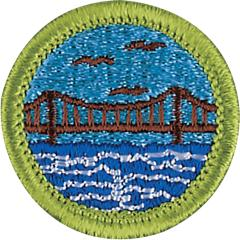

# Engineering Merit Badge

## Overview

Engineers use both science and technology to turn ideas into reality, devising all sorts of things, ranging from a tiny, low-cost battery for your cell phone to a gigantic dam across the mighty Yangtze River in China.

## Requirements

* NOTE:  The official merit badge pamphlets are now free and downloadable  [HERE](https://filestore.scouting.org/filestore/Merit_Badge_ReqandRes/Pamphlets/Engineering.pdf) or can be purchased at the [Scout Shop.](https://www.scoutshop.org/)
* (1) Select a manufactured item in your home (such as a toy or an appliance) and, under adult supervision and with the approval of your counselor, investigate how and why it works as it does. Find out what sort of engineering activities were needed to create it. Discuss with your counselor what you learned and how you got the information. Resource: [How to Fix Small Appliances (video)](https://youtu.be/pa9EO7GKt5Q?si=62hF_Zwm6WU8MDLA)
* (2) Select an engineering achievement that has had a major impact on society. Using resources such as the internet (with your parent or guardian's permission), books, and magazines, find out about the engineers who made this engineering feat possible, the special obstacles they had to overcome, and how this achievement has influenced the world today. Tell your counselor what you learned. Resources: [Engineering the Brooklyn Bridge in 1883 (video)](https://youtu.be/dyckL6HuLRU?si=9yxhxhYxVAw_kgyN) [Engineering America (website)](https://www.popularmechanics.com/technology/infrastructure/g35589790/most-impressive-feats-of-engineering-in-america/)
* (3) Explain the work of six types of engineers. Pick two of the six types and explain how their work is related to engineering. Resources: [Solve Problems: Be an Engineer (video)](https://youtu.be/D9I35Rqo04E?si=LWsUw9GGXaJiqgT4)  [What is Engineering? (video)](https://youtu.be/WcD8ii2ftAw?si=LoM2V67R25_hZgGG)
* (4) Visit with an engineer (who may be your counselor, parent or guardian) and do the following:
    * (a) Discuss the work this engineer does and the tools the engineer uses.
    * (b) Discuss with the engineer a current project and the engineer's particular role in it.
    * (c) Find out how the engineer's work is done and how results are achieved.
    * (d) Ask to see the reports that the engineer writes concerning the project.
    * (e) Discuss with your counselor what you learned about engineering from this visit.

* (5) Use the systems engineering approach to design an original piece of patrol equipment, a toy or a useful device for the home, office or garage. Resource: [The Engineering Process (video)](https://youtu.be/fxJWin195kU?si=oNshjNfLvbcZl-mg)
* (6) Do TWO of the following:
    * (a) Transforming motion. Using common materials or a construction set, make a simple model that will demonstrate motion. Explain how the model uses basic mechanical elements like levers and inclined planes to demonstrate motion. Describe an example where this mechanism is used in a real product. Resource: [Transforming Motion - Rube Goldberg Machines (video)](https://youtu.be/9_6TUgWmP6I?si=p3-RxRPDUsmow5VY)
    * (b) Using electricity. Make a list of 10 electrical appliances in your home. Find out approximately how much electricity each uses in one month. Learn how to find out the amount and cost of electricity used in your home during periods of light and heavy use. List five ways to conserve electricity. Resources: [AMAZING Ways to Save Electricity at Home (video)](https://youtu.be/37kLS0uW16I?si=EI9d_Hv_X07lnzGz) [Understanding Home Energy Electric Use (video)](https://youtu.be/zRYESRObKqA?si=dnJOPUp_Cb4LhVpp)
    * (c) Understanding electronics. Using an electronic device such as a smartphone or tablet computer, find out how sound, video, text or images travel from one location to another. Explain how the device was designed for ease of use, function, and durability. Resource: [How Does Your Mobile Phone Work? (video)](https://youtu.be/1JZG9x_VOwA?si=lk5rLp6spECckVag)
    * (d) Using materials. Do experiments to show the differences in strength and heat conductivity in wood, metal, and plastic. Discuss with your counselor what you have learned. Resource: [Engineering Material Properties (video)](https://youtu.be/tGfLhPslEjQ?si=o7MiNTtvYjIKf9m4)
    * (e) Converting energy. Do an experiment to show how mechanical, heat, chemical, solar, and/or electrical energy may be converted from one or more types of energy to another. Explain your results. Describe to your counselor what energy is and how energy is converted and used in your surroundings. Resources: [STEM Experiment: Energy Conversion (video)](https://youtu.be/Z_DXxUbOkSk?si=r7ZuOV99AW1jzPdB) [1st place Mousetrap Car Ideas (video)](https://youtu.be/b7zWwo9dbiU) [Chemical Powered Cars (video)](https://youtu.be/brIzBE6bzFc) [2018 Official Chem-E-Car Competition® Video (video)](https://youtu.be/uQCmr1DlUqk?list=PLQAdAOMAl_nHN-CJ2rqO-HhGxVZMF6VcI)
    * (f) Moving people. Find out the different ways people in your community get to work. Make a study of traffic flow (number of vehicles and relative speed) in both heavy and light traffic periods. Discuss with your counselor what might be improved to make it easier for people in your community to get where they need to go. Resources: [Moving People Can Be Complicated (video)](https://youtu.be/erYf6NNw8Ec?si=WJWYMhjisgEdtpWp) [Engineering Traffic (video)](https://youtu.be/iHzzSao6ypE?si=XdiQikXkWIX8rj-5)
    * (g) Building an engineering project. Enter a project in a science or engineering fair or similar competition. (This requirement may be met by participation on an engineering competition project team.) Discuss with your counselor what your project demonstrates, the kinds of questions visitors to the fair asked you, and how well you were able to answer their questions.

* (7) Explain what it means to be a registered Professional Engineer (P.E.). Name the types of engineering work for which registration is most important. Resource: [How to Become an Engineer & Types of Engineering Careers (video)](https://youtu.be/PUBAxUkMcr8?si=gbNgbsuYrLQo0fzr)
* (8) Study the Engineer's Code of Ethics. Explain how it is like the Scout Oath and Law. Resources: [Ethics and Conduct for Professional Engineers (video)](https://youtu.be/qVV684jvJV4?si=3_ZOiqnCPOeJZm1d)  [Engineering Code of Ethics (website)](https://www.nspe.org/career-growth/nspe-code-ethics-engineers)  [Engineering Ethics (video)](https://youtu.be/5KZx81crb48?si=F4ufLBrtg09FTAFM)
* (9) Find out about three career opportunities in engineering. Pick one and research the education, training, and experience required for this profession. Discuss this with your counselor, and explain why this profession might interest you. Resource: [How to Become an Engineer (video)](https://youtu.be/77xMVKOEZ5g?si=0S6EGyT8giw78chg)

## Resources

- [Engineering merit badge page](https://www.scouting.org/merit-badges/engineering/)
- [Engineering merit badge PDF](https://filestore.scouting.org/filestore/Merit_Badge_ReqandRes/Pamphlets/Engineering.pdf) ([local copy](files/engineering-merit-badge.pdf))
- [Engineering merit badge pamphlet](https://www.scoutshop.org/bsa-engineering-merit-badge-pamphletboy-scouts-of-america-660201.html)

Note: This is an unofficial archive of Scouts BSA Merit Badges that was automatically extracted from the Scouting America website and may contain errors.