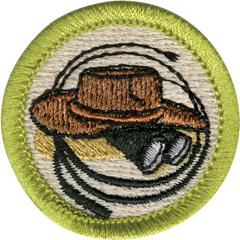

# Exploration Merit Badge

## Overview

Discover the history and importance of various kinds of exploration by earning the Exploration Merit Badge. Scouts will study real-life explorers who made their mark either in the wild or in a scientific lab, then plan, prepare and go on an expedition that could be nearby or far away.

## Requirements

* Note: As you work on the Exploration merit badge, remember to always use the buddy system. Whether you are out in the field or meeting with your counselor, having a buddy will help ensure everyone's safety. You and your buddy can watch out for each other wherever you may be or whatever you may be doing.
* NOTE:  The official merit badge pamphlets are now free and downloadable  [HERE](https://filestore.scouting.org/filestore/Merit_Badge_ReqandRes/Pamphlets/Exploration.pdf) or can be purchased at the [Scout Shop.](https://www.scoutshop.org/)
* (1) General Knowledge. Do the following:
    * (a) Define exploration and explain how it differs from adventure travel, trekking or hiking, tour-group trips, or recreational outdoor adventure trips. Resource: [What's the Difference Between Adventure and Exploration? (website)](https://medium.com/@idee-explores/whats-the-difference-between-adventure-and-exploration-eb1a4628f925)
    * (b) Explain how approaches to exploration may differ if it occurs in the ocean, in space, in a jungle, or in a science lab in a city. Resource: [What Is Exploration (video)](https://www.youtube.com/watch?v=7u2QqMSjroQ)

* (2) History of Exploration. Discuss with your counselor the history of exploration.  Select a field of study with a history of exploration to illustrate the importance of exploration in the development of that field (for example, aerospace, oil industry, paleontology, oceanography, etc.). Resources:  [50 Years of Space Exploration (video)](https://youtu.be/Bj3n1BIq_5I?si=v6V_FbNTqTU5P4FF)  [Into the Abyss: How Humans Became the Astronauts of the Deep Sea (video)](https://youtu.be/-7xB6BT13nw?si=guCs4QMUPYQPiixG)  [The Age of Exploration (video)](https://www.youtube.com/watch?v=sGeXtUZQScc)  [How the Higgs Boson Was Discovered (video)](https://youtu.be/1XpCnCVfuYk?si=XrohO26RBxWr9Epg)
* (3) Importance of Exploration. Explain to your counselor why it is important to explore. Discuss the following:
    * (a) Why it is important for exploration to have a scientific basis Resource: [What It Takes to Be an Adventurer (video)](https://www.youtube.com/watch?v=aoq6jNBtNtw)
    * (b) How explorers have aided in our understanding of our world Resource: [Why We Explore (video)](https://www.youtube.com/watch?v=6_SRZiU9EuI)
    * (c) What you think it takes to be an explorer. Resource: [Why Great Scientists Ask Great Questions? w/ Neil deGrasse Tyson (video)](https://youtu.be/1B9q2eS78Tw?si=BM2e4T2u7pBcTTXq)

* (4) Real-Life Exploration. Do ONE of the following:
    * (a) Learn about a living explorer. Create a short report or presentation (verbal, written, or multimedia slide presentation) on this individual's objectives and the achievements of one of the explorer's expeditions. Share what you have learned with your counselor and unit. Resources: [50 Years of Discovery | Jane Goodall and The Leakey Foundation (video)](https://www.youtube.com/watch?v=I4ivrfIOKjw) [The World's Greatest Living Explorer | Ranulph Fiennes (video)](https://youtu.be/ePOa2OpRQ2g?si=uN7djyhK_Zylurjq) [Levison Wood / Walking the Nile / Himalayas / Americas / Arabia Badlands & Beyond (video)](https://youtu.be/MkOV5Ex6puA?si=aq81Mw_U2hC6LRnl) [Unsung Heroes of Everest | Nat Geo Live (video)](https://youtu.be/ihmfkdEcDyk?si=2aIG3YmL5YzTaVhC)
    * (b) Learn about an actual scientific exploration expedition. Gather information about the mission objectives and the expedition's most interesting or important discoveries. Share what you have learned with your counselor and unit. Tell how the information gained from this expedition helped scientists answer important questions. Resources: [Mars 2020: Perseverance Rover (website)](https://science.nasa.gov/mission/mars-2020-perseverance/) [Expedition Amazon - Into the Waters | National Geographic (video)](https://youtu.be/Tg27pdTvG4s?si=5MzaADOB_JRPdB2B)
    * (c) Learn about types of exploration that may take place in a laboratory or scientific research facility (medicine, biology, chemistry, physics, astronomy, etc.). Explain to your counselor how laboratory research and exploration are similar to field research and exploration. Resources: [Research Scientist (video)](https://www.youtube.com/watch?v=uRreC41dGz4) [Inside the World's Largest Science Experiment (video)](https://youtu.be/nrXhK3Gh5EE?si=xSgNbNGvMNmaBl22) Day in the Life of a [Research Scientist (video)](https://www.youtube.com/watch?v=uRreC41dGz4)

* (5) Exploration in Lab and Field. Do ONE of the following, and share what you learn with your counselor:
    * (a) With your parent or guardian's permission and counselor's approval, visit either in person or via the internet an exploration sponsoring organization (such as The Explorers Club, National Geographic Society, Smithsonian Institution, American Alpine Club, World Wildlife Fund, or similar organization). Find out what type(s) of exploration the organization supports. Resources: [The Explorers Club (website)](https://www.explorers.org/) [National Geographic Society (website)](https://www.nationalgeographic.org/society/) [Smithsonian Institution (website)](https://www.si.edu/) [World Wildlife Federation (website)](https://www.worldwildlife.org/)
    * (b) With permission and approval, visit either in person or via the internet a science lab, astronomical observatory, medical research facility, or similar site. Learn what exploration is done in this facility.

* (6) Expedition Planning. Discuss with your counselor each of the following steps for conducting a successful exploration activity. Explain the need for each step.
    * (a) Identify the objectives (establish goals). Resource: [EXPEDITIONS | How to Get Started! (video)](https://www.youtube.com/watch?v=80_ltIRYjd0)
    * (b) Plan the mission. Create an expedition agenda or schedule. List potential documents or permits needed. Resources: [How to Plan an Expedition (video)](https://www.youtube.com/watch?v=qcLKcFrnzlk&t=8s) [Plan Your DREAM ADVENTURE: Expert Tips From a Pro Expedition Leader (video)](https://youtu.be/WahqTpIFAhs?si=lGt65nOwLExTvtbJ) [How to Plan an Adventure | Plan a Camping Trip (video)](https://youtu.be/79WYqkiExZU?si=eSNcCQUrJ53JlcRL)
    * (c) Budget and plan for adequate financial resources. Estimate costs for travel, equipment, accommodations, meals, permits or licenses, and other expedition expenses. Resource: [How to Plan for Permits and Reservations (video)](https://youtu.be/nup-uvbAfuU?si=CeutkSlZvOuJ81hU)
    * (d) Determine equipment and supplies required for personal and mission needs for the length of the expedition.
    * (e) Determine communication and transportation needs. Plan how to keep in contact with your base or the outside world, and determine how you will communicate with each other on-site.
    * (f) Establish safety and first aid procedures (including planning for medical evacuation). Identify the hazards that explorers could encounter on the expedition, and establish procedures to prevent or avoid those hazards. Resource: [Wilderness Primary Care Kit Walkthrough | Essential Expedition Essentials Medical Kit Guide (video)](https://www.youtube.com/watch?v=A-pbC5aDBY0)
    * (g) Determine team selection. Identify who is essential for the expedition to be successful and what skills are required by the expedition leader. Resource: [Flight of the Osprey Media Team Selection (video)](https://youtu.be/pDJHtE3BB_c?si=W6oyFePTcGnXQSM1)
    * (h) Establish detailed recordkeeping (documentation) procedures. Plan the interpretation and sharing of information at the conclusion of the expedition. Resource: [The 7 Fundamentals of Documenting Your Travels (website)](https://matadornetwork.com/notebook/the-7-fundamentals-of-documenting-your-travels/)

* (7) Prepare for an Expedition. With your parent or guardian's permission and counselor's  approval, prepare for an actual expedition to an area you have not previously explored; the place may be nearby or far away. Do the following:
    * (a) Make your preparations under the supervision of a trained expedition leader, expedition planner, or other qualified adult experienced in exploration (such as a school science teacher, museum representative, or qualified instructor).
    * (b) Use the steps listed in requirement 6 to guide your preparations. List the items of equipment and supplies you will need. Discuss with your counselor why you chose each item and how it will be of value on the expedition. Determine who should go on the expedition.
    * (c) Conduct a pre-expedition check, covering the steps in requirement 6, and share the results with your counselor. With your counselor, walk through the Scouting America SAFE Checklist for your expedition. Ensure that all foreseeable hazards for your expedition are adequately addressed.

* (8) Go on an Expedition. Complete the following:
    * (a) With your parent or guardian's permission and under the supervision of your counselor or a counselor-approved qualified person, use the planning steps you learned in requirement 6 and the preparations you completed in requirement 7 to personally undertake an actual expedition to an area you have not previously explored.
    * (b) Discuss with your counselor what is outdoor ethics and its role in exploration and enjoying the outdoors responsibly. Resources: [Leave No Trace Basics (video)](https://vimeo.com/1115216743/63b20c0b33?share=copy) [Leave No Trace Outdoor Ethics (video)](https://www.youtube.com/watch?v=jXO1uY0MvmQ)
    * (c) After you return, compile a report on the results of your expedition and how you accomplished your objective(s). Include a statement of the objectives, note your findings and observations, include photos, note any discoveries, report any problems or adverse events, and have a conclusion (whether you reached your objective or not). The post-expedition report must be at least one page and no more than three; one page can be photos, graphs, or figures.

* (9) Career Opportunities. Identify three career opportunities in exploration. Pick one and explain to your counselor how to prepare for such a career. Discuss what education and training are required, and why this profession  might interest you. Resources:  [Ocean Exploration Careers (website)](https://oceanexplorer.noaa.gov/careers/opportunities/)  [Unlocking Space Careers: Beyond Astronauts and Rocket (video)](https://youtu.be/ljlpqd1Mjjs?si=V3Yaz18BvlIVnDpQ)  [How I Became a Researcher (video)](https://youtu.be/vOhyZ8FYCmw?si=9XLnEqu1IJIin0CH)

## Resources

- [Exploration merit badge page](https://www.scouting.org/merit-badges/exploration/)
- [Exploration merit badge PDF](https://filestore.scouting.org/filestore/Merit_Badge_ReqandRes/Pamphlets/Exploration.pdf) ([local copy](files/exploration-merit-badge.pdf))
- [Exploration merit badge pamphlet](https://www.scoutshop.org/exploration-merit-badge-pamphlet-622522.html)

Note: This is an unofficial archive of Scouts BSA Merit Badges that was automatically extracted from the Scouting America website and may contain errors.