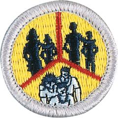

# Family Life Merit Badge

## Overview

**Eagle required**

The family is the basic unit of society and is important to both individuals and communities. The world is rapidly changing, making today’s society much more complex than ever before. As Scouts earn this merit badge, they will realize why it is important to know more about family life and how to strengthen their families.

## Requirements

* (1) Prepare an outline on what a family is and discuss this with your counselor. Tell why families are important to individuals and to society. Discuss how the actions of one member can affect other members. Resources:  [Why Family Matters in Shaping Teens' Passions and Identity (podcast)](https://youtu.be/Ag5jWg4QBUQ?si=WJVd1UyHAZVP_mgJ)  [Introduction to Family Life (video)](https://vimeo.com/1114227663)  [What Is a Family (video)](https://vimeo.com/1114227555)
* (2) List several reasons why you are important to your family and discuss this with your parent or guardian and with your counselor. Resource:  [Families and Family Relationships (video)](https://www.youtube.com/watch?v=2SkuK8j54UE)
* (3) Prepare a list of your regular home duties or chores (at least five) and do them for 90 days. Keep a record of how often you do each of them. Discuss with your counselor the effect your chores had on your family. Resources:  [10 Chores for Teens That Teach Them to Be Responsible Lifelong (video)](https://www.youtube.com/watch?v=1Hqchiy7qW4)  [Family Chores (video)](https://vimeo.com/1114227688)  [Create a Household Chore Checklist in Word - Quick and Easy (video)](https://www.youtube.com/watch?v=XmA6tCO_3MM)
* (4) With the approval of your parent or guardian and your counselor, decide on and carry out an individual project that you would do around the home that would benefit your family. After completion, discuss the objective or goal and the results of the project with your family and then your counselor. Resources:  [Handy Teen Finishes House (video)](https://www.youtube.com/watch?v=q9mhk1wPefA)  [How to Start a Project (video)](https://www.youtube.com/watch?v=h1ooM4vaOaU)
* (5) Plan and carry out a project that involves the participation of your family. After completing the project, discuss the following with your  counselor: Resource:  [Time Management (video)](https://vimeo.com/1114227585)
    * (a) The objective or goal of the project
    * (b) How individual members of your family participated
    * (c) The results of the project.

* (6) Do the following: Note: Some of the issues surrounding requirement 6 for the family meeting could be considered of a personal nature. Use discretion when reviewing this requirement with the Scout. Discussion of each of these subjects will very likely carry over to more than one family meeting.
    * (a) Discuss with your counselor how to plan and carry out a family meeting. Resource: [Conflict Resolution (video)](https://vimeo.com/1114227738)
    * (b) Prepare a meeting agenda that includes the following topics, review it with your parent or guardian, and then carry out one or more family meetings: Resource: [Family Meeting (video)](https://vimeo.com/1114227645)
        * (1) How living the principles of the Scout Oath and Scout Law contributes to your family life Resource: [Scout Oath and Law (video)](https://www.youtube.com/watch?v=U3XNcj94nhg)
        * (2) The greatest dangers and addictions facing youth in today's society (examples include mental health challenges, use of tobacco products, alcohol, or drugs and other items such as debts, social media, etc.) Resources: [What Causes Addiction, and Why Is It So Hard to Treat? (video)](https://youtu.be/hBC7i-vHWsU?si=wpVHlg5gMVe_RLhe) [Teens and Social Media (video)](https://youtu.be/XE95C5yGKvM?si=mtau10v7S5kwAI1c) [ Electronic Cigarettes and Vaping (video)](https://youtu.be/9dZS_Rniak0?si=V6A0VHuwIyUIe8ew) [How to Identify the Signs of an Unhealthy Relationship (podcast)](https://youtu.be/nS8snkkUC-U?si=Ts3YDh_yRfjw-d8u) [How Do I Start a Conversation About Mental Health? (podcast)](https://youtu.be/cGH95B7c-eM?si=KIWkpoWQIauoa-Eu)
        * (3) The growing-up process and how the body changes, and making responsible decisions dealing with sex. This conversation may take place with only one parent or guardian.
        * (4) Personal and family finances Resources: [Money Management (video)](https://vimeo.com/1114227609) [The 50-30-20 Rule - Budgeting for Needs, Wants, and Savings (video)](https://youtu.be/OZQQMYfaBT4?si=1f9kNb_OVcyxd4NB)
        * (5) A crisis situation within your family and whom you can turn to for support during these situations. Resource: [Family Bonding (video)](https://vimeo.com/1114227697)
        * (6) The effect of technology on your family Resource: [Evolving Technology: Will Family Life Ever Be the Same Again? (video)](https://www.youtube.com/watch?v=sFc_q9-KD8c)
        * (7) Good etiquette and manners. Resource: [Etiquette (video)](https://vimeo.com/1114227718)

* (7) Discuss with your counselor your understanding of what makes an effective parent or guardian and why, and your thoughts on the parent or guardian's role and responsibilities in the family. Resources:  [What Makes a Good Parent (video)](https://www.youtube.com/watch?v=wZkYTSFB5Dw)  [How to Parent a Teen From a Teen's Perspective (video)](https://youtu.be/0vdPxLfAsqo?si=sWQl5BCmV-KKourD)  [Being a Parent (video)](https://vimeo.com/1114227774)

## Resources

- [Family Life merit badge page](https://www.scouting.org/merit-badges/family-life/)
- [Family Life merit badge PDF](https://filestore.scouting.org/filestore/Merit_Badge_ReqandRes/Pamphlets/Family%20Life.pdf) ([local copy](files/family-life-merit-badge.pdf))
- [Family Life merit badge pamphlet](https://www.scoutshop.org/bsa-family-life-merit-badge-pamphlet-esboy-scouts-ofamerica-660410.html)

Note: This is an unofficial archive of Scouts BSA Merit Badges that was automatically extracted from the Scouting America website and may contain errors.