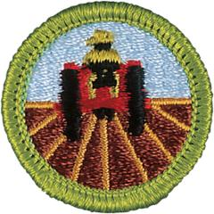

# Farm Mechanics Merit Badge

## Overview

From the mattock and hoe to the horse and mule, the cotton gin and reaper, the tractor and air seeder—this is the story of farm equipment. Today, most farms are mechanized and farmers can do most of their own maintenance work and make the adjustments needed on their many intricate farm implements.

## Requirements

* NOTE:  The official merit badge pamphlets are now free and downloadable  [HERE](https://filestore.scouting.org/filestore/Merit_Badge_ReqandRes/Pamphlets/Farm%20Mechanics.pdf) or can be purchased at the [Scout Shop.](https://www.scoutshop.org/)
* (1) Do the following:
    * (a) Discuss with your counselor the safety equipment, tools, and clothing used while checking or repairing farm equipment. Use this equipment, tools, and/or clothing (when needed or called for) in meeting the requirements for this merit badge.
    * (b) Draw a plan showing a well-equipped farm shop. Point out the shop's mandatory safety devices and features.
    * (c) Find all the universal warning and safety symbols on a piece of equipment and explain what they mean.
    * (d) Describe what a safety data sheet (SDS) is and tell why it is used. Obtain the SDS for any engine coolant, oil, grease, fuel, hydraulic or transmission fluid, or other flammable or hazardous materials you use in meeting the requirements for this merit badge.

* (2) Explain how power is produced or transferred in a:
    * (a) Diesel engine
    * (b) Hydraulic system
    * (c) Transmission or any other power system.

* (3) Do TWO of the following:
    * (a) Replace the handle of any tool found on the farm.
    * (b) Organize a tool rack or a storage system for nails, bolts, nuts, and washers.
    * (c) Using a hand file, properly dress the mushroomed head of a chisel or punch.
    * (d) Using a hand file, correctly dress a screwdriver tip.

* (4) Do ONE of the following:
    * (a) On an engine-powered machine: Grease all fittings, change the oil and oil filter, clean the air filter, clean the radiator fins, and replace the fuel filters.
    * (b) For any engine-powered machine, create a preoperational checklist; include checking the engine coolant, engine oil, hydraulic and/or transmission fluid, and battery voltage (using a voltmeter). Using your checklist, conduct a preoperational check of that machinery or equipment.
    * (c) Prepare any farm machine for winter storage.

* (5) Visit an implement dealer. Interview the dealer technician or service manager for hints on good preventive maintenance. Ask why it is important, the costs, and what causes wear or damage. Report what you learn.
* (6) Explain each step in ONE of the following maintenance procedures:
    * (a) Tightening hydraulic fittings.
    * (b) Checking the air filter.
    * (c) Cleaning a work piece with a wire-brush wheel.

* (7) Find out about three career opportunities in farm mechanics. Pick one and find out the education, training, and experience required for this profession. Discuss this with your counselor, and explain why this profession might interest you.

## Resources

- [Farm Mechanics merit badge page](https://www.scouting.org/merit-badges/farm-mechanics/)
- [Farm Mechanics merit badge PDF](https://filestore.scouting.org/filestore/Merit_Badge_ReqandRes/Pamphlets/Farm%20Mechanics.pdf) ([local copy](files/farm-mechanics-merit-badge.pdf))
- [Farm Mechanics merit badge pamphlet](https://www.scoutshop.org/bsa-farm-mechanics-merit-badge-pamphlet-661046.html)

Note: This is an unofficial archive of Scouts BSA Merit Badges that was automatically extracted from the Scouting America website and may contain errors.