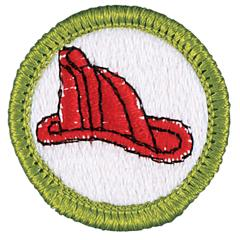

# Fire Safety Merit Badge

## Overview

The ability to use fire safely is essential to human survival. By earning this merit badge, Scouts will learn to uses fire safely and responsibly, how to prevent home fires, and how to handle fire safely, as well as burn prevention, and camping safety.

## Requirements

- (1) **Science of and Hazards of Fire.** Do the following:
  - (a) Explain the concept of fire.
  - (b) Name the parts of the fire tetrahedron and the products of combustion.
  - (c) Describe the life cycle of a fire.
  - (d) Explain the three methods of heat transfer.

- (2) **Fire Extinguishers.** Do the following:
  - (a) Explain the different classes of fires.
  - (b) Identify the different classes of fire extinguishers and which should be used for each class of fire.
  - (c) Demonstrate how to use a fire extinguisher and a fire blanket.

- (3) **Fire-related Injuries.** Do the following:
  - (a) Explain and demonstrate the technique of stop, drop, roll, cool, and call.
  - (b) Describe how clothing fires occur, how to prevent them, and how clothing can prevent or contribute to burn injuries.
  - (c) Identify the most frequent causes of burn injuries and how to prevent them.
  - (d) Review the prevention of, symptoms and signs of, and treatment of airway burns and carbon monoxide (CO) poisoning.

- (4) **Origins of Fires.** Do the following:
  - (a) Explain the four classifications of fire origin (natural, accidental, incendiary, or undetermined) and give an example of each.
  - (b) Describe how a fire classified as incendiary might lead to criminal prosecution of a person charged with arson.

- (5) **Fire Safety at Home.** Do the following:
  - (a) Describe how to prevent the frequent causes of home fires, including unattended cooking, electricity, smoking, clothes dryers, and rechargeable batteries.
  - (b) Describe how to prevent frequent causes of seasonal and holiday-related home fires, including fires related to home heating, holiday trees, candles, and fireworks.
  - (c) Demonstrate how to safely light and extinguish a candle. Discuss with your counselor, then with your family, how to safely use candles.
  - (d) Using the Home Fire Safety Checklist in the *Fire Safety* merit badge pamphlet or one approved by your counselor, and with the help of an adult, inspect a home (or a similar building near where you live or at a camp) for fire safety hazards. Present your completed checklist to your counselor and discuss your findings.
  - (e) Determine if, and what types of, smoke and CO alarms are required in homes in your community. List what types of smoke and CO alarms your home has, their locations, and their expiration dates.
  - (f) Demonstrate maintenance of smoke and CO alarms to your counselor and review plans to replace expired alarms.
  - (g) Develop a home fire-escape plan and a fire-drill schedule with your family, draw a floor plan of your home with exits marked and a map showing your family meeting point, and conduct a home fire drill.
  - (h) Explain what to do and what not to do if you smell natural gas and if you smell smoke.
  - (i) Explain how you would report a fire to have the fire department respond.

- (6) **Safety with Flammable and Combustible Liquids.** Do the following:
  - (a) Explain what flammable and combustible liquids are commonly used in homes and how to safely store them.
  - (b) Describe the safe way to refuel a liquid-fueled engine, such as a lawn mower, outboard motor, farm machine, or automobile with fuel from an approved container.
  - (c) Describe the options available for safely disposing of unwanted flammable, combustible, and hazardous substances in your community.

- (7) **Fire Safety in Public Buildings.** Do the following:
  - (a) Explain how public buildings are designed for fire safety.
  - (b) Explain what fire safety systems and equipment can be found in public buildings.
  - (c) Explain what fire safety precautions you should take when you are in a public building.

- (8) **Fire Safety at Camp.** Do the following:
  - (a) Explain how the Leave No Trace Seven Principles apply to camping fires.
  - (b) Demonstrate lighting a match safely, the proper way to extinguish it, and to dispose of it. Explain the similarities and differences between safety matches and strike-anywhere matches.
  - (c) Explain and demonstrate making sparks with flint and steel or with a ferro rod and catching a spark to create a flame. Extinguish the flame safely using one of principles of the fire tetrahedron.
  - (d) Demonstrate the safe way to start a charcoal fire.
  - (e) Describe three common campsite fire lays. Collect, prepare, and set up tinder, kindling, and fuel for a campfire following the Leave No Trace Seven Principles. Ignite your fire lay and safely extinguish your fire.
  - (f) Demonstrate using a camp stove.
  - (g) Explain how to set up and keep a campsite safe from fire.
  - (h) Develop a lesson plan to teach a fire safety skill or topic, such as lighting a candle or a match or a charcoal fire or a lantern or a camp stove or using flint and steel or setting up a fire lay. Review your lesson plan with your counselor. Teach your skill or topic to one or more Scouts using the EDGE method.

- (9) **Wildland Fires.** Do the following:
  - (a) List causes of wildland fires and ways to prevent them.
  - (b) Explain the social, economic, and environmental consequences of wildland fires.

- (10) **Careers.** Do ONE of the following:
  - (a) Visit a fire station in-person. Identify the various types of fire service vehicles. From the firefighters you meet during your visit, learn about the fire prevention activities in your community and about their careers. Discuss with your counselor what you learned during your tour and interviews.
  - (b) Identify three career opportunities that would use skills and knowledge in the field of fire safety. Pick one and research the training, education, certification requirements, experience, and expenses associated with entering the field. Research the prospects for employment, starting salary, advancement opportunities and career goals associated with this career. Discuss what you learned with your counselor and whether you might be interested in this career.

## Resources

- [Fire Safety merit badge page](https://www.scouting.org/merit-badges/fire-safety/)
- [Fire Safety merit badge PDF](https://filestore.scouting.org/filestore/Merit_Badge_ReqandRes/Pamphlets/FireSafety.pdf) ([local copy](files/fire-safety-merit-badge.pdf))
- [Fire Safety merit badge pamphlet](https://www.scoutshop.org/fire-safety-merit-badge-pamphlet-662386.html)
- [Fire Safety merit badge workbook PDF](http://usscouts.org/mb/worksheets/Fire-Safety.pdf)
- [Fire Safety merit badge workbook DOCX](http://usscouts.org/mb/worksheets/Fire-Safety.docx)

Note: This is an unofficial archive of Scouts BSA Merit Badges that was automatically extracted from the Scouting America website and may contain errors.