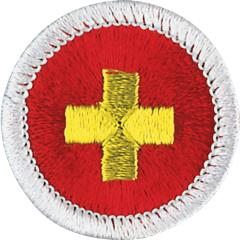

# First Aid Merit Badge

## Overview

**Eagle required**

First aid—caring for injured or ill persons until they can receive professional medical care—is an important skill for every Scout. With some knowledge of first aid, a Scout can provide immediate care and help to someone who is hurt or who becomes ill. First aid can help prevent infection and serious loss of blood. It could even save a limb or a life.

## Requirements

- (1) **Handling a First Aid Emergency.** Do the following:
  - (a) Explain the steps necessary to assess and handle a first aid emergency, including a safety evaluation of the scene.

    **Resources:** [The 3 C's of First Aid: Check, Call, Care (website)](https://www.redcross.org/take-a-class/resources/articles/the-three-cs-of-first-aid-check-call-care), [Check for Scene Safety (video)](https://youtu.be/nrNAhMg-uS4?si=ylunwA5D8hAqAOcu)
  - (b) Tell how you would obtain emergency medical assistance from your home and from a remote location on a wilderness camping trip.

    **Resources:** [What to Say When You Call 911 (video)](https://youtu.be/spGJ9Ii5W3o), [What Happens When You Call 911 (video)](https://youtu.be/J3efgWPPp4k), [Preparing for a Medical Emergency at Home (website)](https://www.medstarhealth.org/blog/preparing-for-medical-emergencies-at-home), [Calling for Help for a Wilderness Emergency (website)](https://ncoae.org/blog/when-to-call-or-not-call-for-help-during-a-wilderness-emergency/)
  - (c) Demonstrate the precautions you must take to reduce the risk of transmitting an infection between you and the victim while administering first aid, including the safe disposal of used first aid supplies.

    **Resources:** [Standard Precautions (video)](https://youtu.be/rdKWvw8CZLg), [How to Remove Disposable Gloves (video)](https://youtu.be/kesQF_G3pQ8?si=89uHvaZRRuoy3mBu), [Using Personal Protective Equipment in First Aid (video)](https://youtu.be/tpovFysp4IE)
  - (d) Demonstrate evaluation of and management of a patient's airway and breathing.

    **Resources:** [Head Tilt, Chin Lift, Jaw Thrust (video)](https://youtu.be/7NNe_Qje3yg?si=2hoWHZGQutU5Q2GD), [Look, Listen, Feel (video)](https://youtu.be/hk1_Bcp3Gc0?si=V1kVr9paHb3O8jDJ)
  - (e) Demonstrate a thorough examination of an accident victim.

    **Resources:** [Head to Toe Exam (video)](https://youtu.be/7xANZ0IjgEs?si=qAupHu1rGfl0bqas)
  - (f) Discuss why shock is an emergency.

    **Resources:** [Recognizing Shock (video)](https://youtu.be/4-cPuXaZACg), [Shock From Bleeding (video)](https://youtu.be/He1RQ9STCHc), [Shock and Bleeding (video)](https://youtu.be/V4R9GSah93g)
  - (g) Define the term triage and describe examples of triage situations that you may encounter.

    **Resources:** [Multiple Casualties in a Remote Location (video)](https://youtu.be/_IdJD7UDN2w), [Triage (video)](https://youtu.be/zeC2hFcziZI?si=YRyMCxm9qKxLbiZv)

- (2) **Preparing for First Aid Emergencies.** Do the following:
  - (a) Obtain a copy of the Scout Annual Health and Medical Record and discuss the importance of the form including information on immunizations, allergies, medications, health history, and medical examinations to providing first aid at Scouting events.

    **Resources:** [Scout Health Forms (website)](https://www.scouting.org/health-and-safety/safety-moments/annual-health-and-medical-record/)
  - (b) Using checklists provided in the *First Aid* merit badge pamphlet or ones approved by your counselor, do the following:
  - (1) Assemble a personal first-aid kit for hiking and backpacking. Demonstrate the proper use of each item in your first-aid kit to your counselor.

    **Resources:** [Personal, Family, and Troop First Aid Kit Checklist (PDF)](https://filestore.scouting.org/filestore/Merit_Badge_ReqandRes/Requirement%20Resources/First%20Aid/Personal%20Family%20Troop%20First%20Aid%20Kit%20Checklist.pdf), [First Aid KIt Checklists (website)](https://scoutlife.org/video-audio/4937/first-aid-kit-buying-guide/)
  - (2) With your counselor, inspect a unit, home, vehicle, or camp first-aid kit and discuss your findings.

- (3) **Wounds with No External Bleeding.** Describe the symptoms and signs of, show first aid for, and explain prevention of these wounds:

  **Resources:** [The Science of Skin (video)](https://youtu.be/OxPlCkTKhzY), [How a Wound Heals Itself (video)](https://youtu.be/TLVwELDMDWs), [How Wounds Heal (video)](https://youtu.be/7qgyBZFaIds?si=cQfOGccpFn-nXeYR)

  - (a) Closed wounds, such as a bruise (contusion) or a hematoma

    **Resources:** [Bruise: What to Do (video)](https://www.youtube.com/watch?v=DkOmr3BEkvE), [First Aid for Bruises (website)](https://www.mayoclinic.org/first-aid/first-aid-bruise/basics/art-20056663), [First Aid for a Hematoma (video)](https://www.youtube.com/watch?v=Bc28m7Ryumg), [How Bruises Change Color (video)](https://www.youtube.com/shorts/l-HUjlBMuNU)
  - (b) Superficial, partial thickness, and full thickness thermal (heat) burns or scalds

    **Resources:** [Types of Burns (video)](https://www.youtube.com/watch?v=_kkPXV3l4-M), [Thermal, Chemical and Electrical Burns (video)](https://www.youtube.com/watch?v=xTu2WdTJgPA)
  - (c) Chemical burns

    **Resources:** [Chemical Burns (website)](https://my.clevelandclinic.org/health/diseases/22350-chemical-burns)
  - (d) Electrical burns

    **Resources:** [Electrical Burns (website)](https://www.mayoclinic.org/first-aid/first-aid-electrical-burns/basics/art-20056687)
  - (e) Sunburn

    **Resources:** [Sunburn (video)](https://youtu.be/DCNUwuNTtGg), [Sunburn, Causes, Signs and Symptoms, Diagnosis and Treatment (video)](https://youtu.be/-KzTvagnpfU?si=WsU5V3PV1KLY8xSo)
  - (f) Snow blindness

    **Resources:** [Snow Blindness (video)](https://youtu.be/6MRQBMFlFTU)
  - (g) Immersion foot, frostnip, frostbite, and ice burns

    **Resources:** [Immersion (Trench) Foot (video)](https://youtu.be/b8Th0JIDBW4?si=IM7GWkbOAiKPVESh), [Immersion (Trench) Foot (website)](https://my.clevelandclinic.org/health/diseases/24392-trench-foot), [Frostbite (video)](https://youtu.be/tPEj-0sKZyo?si=yXzecc6nE9GArjg8), [Frostbite (website)](https://www.mayoclinic.org/diseases-conditions/frostbite/symptoms-causes/syc-20372656)
  - (h) Abrasions, such as chafing and rope burns

    **Resources:** [How To Prevent Chafing While Hiking (website)](https://hilltoppacks.com/pages/how-do-i-prevent-chafing-while-hiking), [Treatment of Rope Burns (website)](https://www.healthline.com/health/rope-burn)
  - (i) Blisters on the hands, feet, buttocks, and shoulders

    **Resources:** [How to Prevent and Treat Blisters (website)](https://www.aad.org/public/everyday-care/injured-skin/burns/prevent-treat-blisters)
  - (j) Puncture wounds from splinters, rope splinters, nails, and fish hooks

    **Resources:** [Splinters (video)](https://youtu.be/L6crQ3nMLkI?si=xCGK0gMdSkprXr0s&t=20), [Tips for Removing Splinters, Including Tape and White Glue (website)](https://www.homedepot.com/c/ah/how-to-get-a-splinter-out/9ba683603be9fa5395fab9013594e8c7), [Puncture Wounds on the Feet (website)](https://www.urgentcareforfeet.com/infection-warning-key-signs-to-monitor-after-a-foot-puncture-injury/), [Removing a Fishhook (video)](https://youtu.be/AmT3T_9Guq0)
  - (k) Rash from poisonous plants

    **Resources:** [Poisonous Plants (video)](https://www.youtube.com/watch?v=P6aBc4OAD0g), [Poisonous Plants (website)](https://my.clevelandclinic.org/health/diseases/10655-poison-plants-poison-ivy--poison-oak--poison-sumac)
  - (l) Bug bites of chiggers, ticks, mosquitoes, and biting gnats

    **Resources:** [First Aid for Chigger Bites (video)](https://youtu.be/tcbNBdPRxk8?si=CHF4hwiFywBxs8-U), [Removing a Tick and Preventing Tick Bites (website)](https://www.aad.org/public/everyday-care/injured-skin/bites/remove-a-tick), [Preventing and Treating Mosquito Bites (website)](https://www.aad.org/public/everyday-care/injured-skin/bites/prevent-treat-bug-bites), [Biting Gnats (video)](https://youtu.be/QazaIwbtZHs?si=zNRtO24W_yqUixr7)
  - (m) Bee stings

    **Resources:** [How to Treat a Bee Sting (video)](https://www.youtube.com/watch?v=01Po5RTNfhs), [What if a Bee Stings You? (video)](https://youtu.be/H_wj50ox8OY?si=iInuTacBOgFekPmc), [Never Pinch a Bee Sting (video)](https://www.youtube.com/shorts/I-LqoDOAX8M)
  - (n) Bites of spiders

    **Resources:** [Black Widow vs Brown Recluse Spider Bites (video)](https://www.youtube.com/watch?v=cfh7XOc_hgc), [Spider Bites (website)](https://my.clevelandclinic.org/health/diseases/16639-spider-bites)
  - (o) Sting of a scorpion

    **Resources:** [How Scorpion Stings Work (video)](https://youtu.be/YFI2VMy6mT0?si=G-ooMuchiOcxEYQt), [Scorpion Stings (website)](https://www.mayoclinic.org/diseases-conditions/scorpion-stings/symptoms-causes/syc-20353859)
  - (p) Bite of a pet or wild mammal or human

    **Resources:** [Treatment of Animal and Human Bites (video)](https://youtu.be/RSJzuk226RI)
  - (q) Bite of a venomous snake

    **Resources:** [First Aid for Snake Bites (website)](https://www.snakebitefoundation.org/blog/how-to-treat-snakebites-for-first-responders-in-the-united-states), [First Aid for Snake Bites (video)](https://youtu.be/yyicCyoEpPM?si=66KVn6Myp25BkpZG), [Venomous Snakes (website)](https://www.cdc.gov/niosh/outdoor-workers/about/venomous-snakes.html)

- (4) **Bleeding Wounds.** Describe the symptoms and signs of, show first aid for, and explain prevention of these wounds:
  - (a) A nosebleed.

    **Resources:** [Nosebleed (video)](https://youtu.be/rF8aXjRFu_I)
  - (b) An open wound with mild or moderate bleeding, such as a scratch or a scrape (abrasions), or a shallow cut (laceration).

    **Resources:** [Care of Minor Wounds (video)](https://youtu.be/7bTVimEqkKo?si=Qpro1vC8l4Z42Sx5)
  - (c) An open wound with severe bleeding such as a deep cut on an arm or leg.

    **Resources:** [Using Direct Pressure to Control Life-Threatening Bleeding (video)](https://www.youtube.com/watch?v=YJB3fI3T1oo)
  - (d) Explain when it is appropriate and is not appropriate to use one or more tourniquets. List some of the benefits and dangers of using a tourniquet. Demonstrate the application of a tourniquet without tightening it.

    **Resources:** [How to Use a Tourniquet (video)](https://youtu.be/k98ilfQmUWw?si=3e6zkvJz517hfiE5), [Tourniquet Mistakes (video)](https://www.youtube.com/shorts/mZTgQikH1sQ)

- (5) **Breathing Emergencies.** Describe the symptoms and signs of, show first aid for, and explain prevention of these conditions affecting breathing:
  - (a) Choking

    **Resources:** [Back Blows and Abdominal Thrusts for Choking (video)](https://youtu.be/8R3RWC-xx1I), [First Aid for an Unresponsive Choking Adults (video)](https://youtu.be/9pTnepZd5as)
  - (b) Asthmatic attack

    **Resources:** [What is Asthma? (video)](https://youtu.be/batzSytA1Y0), [Using Albuterol for an Asthma Attack (video)](https://youtu.be/VyqzylUADp0), [Pursed Lip Breathing for Asthma (video)](https://youtu.be/wcKgqYXF2gA)
  - (c) Anaphylaxis from an insect bite or sting or from food or product allergy

    **Resources:** [Food Allergy with Anaphylaxis (video)](https://youtu.be/veHAMX6vukY?si=jtG07MJUuoWZVQfU), [How to Inject an EpiPen (video)](https://youtu.be/K7QyCMNDHAs?si=T0eBEn7GpbW9BjQa)
  - (d) Inhalation injuries

    **Resources:** [Airway Burns (video)](https://youtu.be/YJVGTJPQMEw?si=_HQifwBCjA3Lzgh8), [Carbon Monoxide Poisoning (video)](https://youtu.be/PqiAtelp-Qc?si=Q2Klj56m0pB95pEm)
  - (e) Altitude sickness

    **Resources:** [High Altitude Illness Treatment and Prevention (video)](https://youtu.be/8D9dwH16GLw?si=HDHXNT8t1mw5QijT)

- (6) **Loss of Consciousness.** Describe the symptoms and signs of, show first aid for, and explain prevention of these conditions causing loss of consciousness:
  - (a) Fainting

    **Resources:** [Fainting (video)](https://youtu.be/7lTWGG2ZvK4)
  - (b) Hypoglycemia

    **Resources:** [Diabetic Emergencies (video)](https://www.youtube.com/watch?v=ASqdE2sqHgM)
  - (c) Seizure

    **Resources:** [First Aid for a Seizure (video)](https://www.youtube.com/watch?v=nnpttMlAG_w)
  - (d) Drug overdose and alcohol poisoning

    **Resources:** [Naloxone Treatment of an Opioid Overdose (video)](https://youtu.be/8eUUf5ssH_4), [Alcohol Poisoning (video)](https://youtu.be/UqY7DZ46prA?si=BB3yLWOqqxd-jhsG)
  - (e) Underwater hypoxic blackout

    **Resources:** [Underwater Blackout (website)](https://underwaterhypoxicblackout.org/)
  - (f) Cold water shock and drowning

    **Resources:** [Understanding Cold Water Shock (video)](https://youtu.be/RypLau65Wa0?si=c25FnmssnqvQqecU), [How to Perform CPR for a Drowning Victim (video)](https://youtu.be/mnfhnyY-Udk?si=hDJw11X7ejwN54WI)
  - (g) Lightning strike and electric shock

    **Resources:** [First Aid for Electrical Shocks and Lightning Strikes (video)](https://youtu.be/oFLAKfjEjcg?si=GCT03PYYxBdE4jNd)

- (7) **Heart Attack.** Do the following:
  - (a) Explain what a heart attack is.

    **Resources:** [What Happens During a Heart Attack (video)](https://youtu.be/3_PYnWVoUzM?si=FlnFcSGpYJuxGIo5), [Heart Attack vs. Cardiac Arrest (video)](https://youtu.be/psx-QcxL1A8)
  - (b) Describe the symptoms and signs of a heart attack and first aid for this condition.

    **Resources:** [Symptoms & Signs of a Heart Attack in Women & Men (video)](https://youtu.be/jouwrfr7_S0?si=By1f--Oq9UPUcHkd)
  - (c) Describe the conditions that must exist before performing CPR on a person.

    **Resources:** [Responding to Cardiac Arrest (video)](https://youtu.be/DByqyhLV1zg?si=RO4saCDlfXZu2TN6)
  - (d) Demonstrate proper CPR technique using a training device approved by your counselor.

    **Resources:** [Hands-Only CPR (video)](https://youtu.be/A5PnI4I-vd8?si=ERt7HtnwcmqFJmQA)
  - (e) Explain the use of an automated external defibrillator (AED).

    **Resources:** [Using an AED (video)](https://youtu.be/in8j2Q2z3HE)
  - (f) Demonstrate or simulate the proper use of an AED, using an AED training device if available.

    **Resources:** [AEDs in Scouting (website)](https://blog.scoutingmagazine.org/2024/06/13/does-your-scout-unit-have-an-aed/)
  - (g) Identify the typical location(s) of one or more AED(s) at public facilities in your community, such as, your school, place of worship, unit meeting place, sports facilities, and/or camp or by using a smart phone app. Discuss the reasons for choosing locations like these.

    **Resources:** [Where to Place AEDs (website)](https://cpr.heart.org/en/-/media/CPR-Files/Training-Programs/AED-Implementation/2023-updates/KJ1683-AED-Guide.pdf)

- (8) **Muscle and Bone Injuries.** Do the following:
  - (a) Explain the similarities and differences in a strain, a muscle tear, a tendon rupture, a sprain, a dislocation, a simple fracture, and a compound fracture.

    **Resources:** [Understanding Limb Injuries: Strains, Sprains, Dislocations, Fractures (video)](https://www.youtube.com/watch?v=qi0YYFt5RCY), [Muscle Strains and Tears (video)](https://www.youtube.com/watch?v=uyxcdJkFvrw), [Dislocations and Types of Fractures (video)](https://www.youtube.com/watch?v=Xulug1uqisM)
  - (b) Describe the symptoms and signs of and first aid for a muscle strain, a muscle tear, and a tendon rupture.

    **Resources:** [Muscle Strains and Tears (video)](https://www.youtube.com/watch?v=IM7BIO_kdk8)
  - (c) Describe the symptoms and signs of, and potential complications of, a sprain, a fracture, and a dislocation.

    **Resources:** [Fractures and Dislocations (video)](https://www.youtube.com/watch?v=sPzXAVNVJr0)
  - (d) Demonstrate bandages for these injuries:
  - (1) Arm slings for forearm or upper arm or collarbone fractures

    **Resources:** [Bandages for Sprained Ankle, Head, Upper Arm, Collarbone (video)](https://youtu.be/ybpr7nCelK0?si=2SjPp8f4iMAzfVBv)
  - (2) Elastic wrap and cravat bandages for ankle sprain

    **Resources:** [Elastic Wrap for Ankle Sprain (video)](https://youtu.be/KRyaemlcJAM?si=_A2ie3PNfdiH1n-0)
  - (3) Elastic wrap and cravat bandages for wrist sprain or hand injury.

    **Resources:** [Wrist Wrap (video)](https://youtu.be/tdRMJIu2E08)
  - (e) Demonstrate the proper procedures for handling and splinting of suspected closed or open fractures or dislocations of the:
  - (1) Finger and toe

    **Resources:** [Buddy Taping Toes (video)](https://youtu.be/P-D0njmVMVA)
  - (2) Forearm or wrist

    **Resources:** [Splints for Arms and Legs (video)](https://youtu.be/jhXWT4UpC-8)
  - (3) Upper leg

    **Resources:** [Upper Leg Splint (video)](https://youtu.be/5KJIojnNAPU?si=qfwme0YazWPIMn0c)
  - (4) Lower leg or ankle

    **Resources:** [Leg Splints (video)](https://youtu.be/TacM-3A5Ozk)

- (9) **Head and Spine Injuries.** Do the following:
  - (a) Describe the symptoms and signs of, relationships between, possible complications of, and prevention of head, neck, and back injuries.

    **Resources:** [Head, Neck, and Spine Injuries (video)](https://youtu.be/x-YYjkokQ6U?si=m2OLxLuy7hoS7Yiq), [Assessing a Head Injury (video)](https://youtu.be/9hEjyLabTRE)
  - (b) Describe the symptoms and signs of and first aid for a concussion.

    **Resources:** [What Is a Concussion? (video)](https://youtu.be/xvjK-4NXRsM), [First Aid for Concussions (video)](https://youtu.be/mlWaByoT24s)
  - (c) Demonstrate first aid for an open head wound with a triangular or other bandage.

    **Resources:** [Forehead Cravat Bandage (video)](https://youtu.be/FvAWy4mCm7U?si=lQPX3DLPLhYK1r1Q)
  - (d) Demonstrate first aid for someone with a suspected neck or back injury.

    **Resources:** [Head, Neck, and Spine Injuries During Sports (video)](https://youtu.be/D_ZKcO8Ww_c)

- (10) **Moving a Patient.** Do the following:
  - (a) Describe the conditions under which an injured person should and should not be moved.

    **Resources:** [When to Move an Injured Person (website)](https://www.firstaidbristol.co.uk/blog/2024/09/10/when-is-it-okay-to-move-a-casualty/)
  - (b) If a sick or an injured person must be moved, tell how you would decide the best method. Demonstrate these methods.

    **Resources:** [Lifts and Carries (website)](https://www.cert-la.com/cert-training-education/lifts-carries/)
  - (c) By yourself and with a partner, demonstrate how to transport a person from a smoke-filled room.

    **Resources:** [Fire and EMS Training | Moving a Victim | Moving a Patient (video)](https://youtu.be/dC8dC8-ZAoU?si=wQlOwOobpXhJD_3_)
  - (d) By yourself and with a partner, demonstrate how to transport a person with a sprained ankle for at least 25 yards.

    **Resources:** [Human Crutch Techniques (video)](https://youtu.be/U0yDJ0udMkg?si=dB8YruPw7vFL8YC4)
  - (e) With helpers under your supervision, improvise a stretcher and move a presumably unconscious person for at least 25 yards.

    **Resources:** [Improvised Stretchers (video)](https://youtu.be/EYfgxODBlwY?si=dNtz-3lO0Lronu8G)

- (11) **Heat- and Cold-Related Conditions.** Describe the symptoms and signs of, show first aid for, and explain prevention of these conditions associated with exertion and/or heat or cold exposure:
  - (a) Dehydration and over-hydration

    **Resources:** [What is Dehydration? (video)](https://youtu.be/KahsIEbFROI?si=6m37jPgHqsLiRl_2), [Overhydration (video)](https://youtu.be/sD6j5sNo5Zk)
  - (b) Heat cramps and muscle pain after exertion

    **Resources:** [Heat Cramps, Heat Exhaustion, and Heat Stroke (video)](https://youtu.be/KOQJB3jlln4?si=F-O0xr3ak9Hk-rbg), [Muscle Damage from Over-exercising (video)](https://youtu.be/6nZOTJ_8guI?si=UgozPCQZg125bGoC)
  - (c) Heat exhaustion

    **Resources:** [Heat Exhaustion vs Heat Stroke (video)](https://youtu.be/8gn3DEYOPuE)
  - (d) Heat stroke

    **Resources:** [Diagnosis and Treatment of Heat Stroke (video)](https://youtu.be/PpHM4DfPZQU?si=mb_BftAlZP8amve9)
  - (e) Chest pains associated with cold exposure

    **Resources:** [Heart Attacks from Shoveling Snow (video)](https://youtu.be/xP6Nya7nH_g?si=Lk2KfMloGzl6ZgPk)
  - (f) Hypothermia

    **Resources:** [Hypothermia (video)](https://youtu.be/my6JB41apTw), [C.O.L.D. Guidelines for Staying warm (website)](https://www.scouting.org/health-and-safety/safety-moments/winter-activity/), [Frostbite and Hypothermia (website)](https://health.mo.gov/living/healthcondiseases/hypothermia/index.php), [Recognize the "Umbles"  and Avoid Hypothermia (video)](https://youtu.be/aDAqWLpHXXU)

- (12) **Mental Health Conditions.** Describe the following:
  - (a) Reactions associated with at least three stressful situations, such as mountain backpacking, rappelling, a ropes course, speaking before an audience, making a phone call to an adult, taking a swim test, missing home, lighting a match, trying out for a sports team, meeting someone for the first time, or other stressful circumstances.

    **Resources:** [3 Tools for Situational Anxiety (video)](https://youtu.be/_H5QFfiU0s0), [Overcoming Social Anxiety (video)](https://youtu.be/BmX6GXDvlLM), [Power of Self-Confidence (video)](https://www.youtube.com/watch?v=gTd6Lq1M9Tc), [Getting Ready for Tryouts (video)](https://youtu.be/a_dVK2EEWKE)
  - (b) The actions that you and others should take to prepare for and manage these situations.

    **Resources:** [Techniques to Manage Stress (video)](https://youtu.be/h2zWopNUUJE), [Box Breathing | The Breathing Exercise Used By Navy SEALs (video)](https://youtu.be/UC6HUrneIWI), [Tips for Overcoming Phone Anxiety (video)](https://youtu.be/QcKbxaGpwf4), [How To STOP Letting Social Anxiety Control You (video)](https://youtu.be/wbroM1Di-bI)
  - (c) The indications that someone might be a danger to themselves or others.
  - (d) The actions that you should take if you suspect that someone might be a danger to themselves or others.

- (13) **Miscellaneous Conditions.** Describe the symptoms and signs of, show first aid for, and explain prevention of the following conditions:
  - (a) Object in the eye

    **Resources:** [5 Ways To Safely Remove Something Stuck In Your Eye (video)](https://youtu.be/uJFZPFsHcCE?si=YgmlNzHWSWm3iWWH), [Penetrating and Chemical Eye Injuries (video)](https://youtu.be/46UgImUrAG0)
  - (b) Broken, chipped, loosened, or knocked out tooth

    **Resources:** [Dental Emergencies (video)](https://youtu.be/eJnKf1jM6xY), [Dental Injuries (website)](https://my.clevelandclinic.org/health/diseases/16916-dental-injuries)
  - (c) Vomiting and diarrhea associated with food poisoning

    **Resources:** [First Aid for Vomiting and Diarrhea (video)](https://youtu.be/K5UxbbnSjxc?si=pf6WbrBictHhwad8)
  - (d) Abdominal pain

    **Resources:** [Causes of Abdominal Pain (website)](https://youtu.be/2RxEHcGpwnA), [Appendicitis (video)](https://youtu.be/pFCfQwYWxcM?si=r3inhA-IMeSBDkCz), [What Does Appendix Pain Feel Like? (video)](https://youtu.be/8CUEPNcGtWs?si=c7X8WPlAAwQvtPWC)
  - (e) Stroke

    **Resources:** [Types of Strokes (video)](https://youtu.be/EsshJLm5CN8), [First Aid for Stroke (video)](https://youtu.be/v0AqhXminV8), [FAST Symptoms and Signs of a Stroke (video)](https://youtu.be/mkpbbWZvYmw), [What Causes Strokes? (video)](https://youtu.be/-NJm4TJ2it0?si=Q1rK65yZDzBZ9V47)

- (14) With guidance from your counselor, develop a plan to teach a first-aid skill or topic using the EDGE method. Discuss your skill, topic, and plan with your counselor, and then teach your skill or topic to your family or to one or more Scouts.

  **Resources:** [The Teaching EDGE: The best way to teach someone a new skill (website)](https://blog.scoutingmagazine.org/2017/05/05/living-on-the-edge-this-is-the-correct-way-to-teach-someone-a-skill/)

- (15) Do ONE of the following:
  - (a) Visit an emergency medical station house or training center in person. From the medical first responders that you meet during your visit, learn about how they serve their community and about their careers. Discuss with your counselor what you learned during your tour and interviews.

    **Resources:** [EMS Training Center Virtual Tour (video)](https://youtu.be/p9s3agPQR4g?si=JBiBzZWsCnwz0J9D)
  - (b) Interview an emergency medical services professional about their work. Learn about how they chose this career and about their duties. Discuss what you learned with your counselor and whether you might be interested in this career.

    **Resources:** [A Day with a Paramedic (video)](https://www.youtube.com/watch?v=k0k6tWrISBM), [Female EMS Helicopter Pilot: A Day in a Life (video)](https://youtu.be/s9U0nwy9te4?si=_u3rRX4XniQToGka), [An ER Nurse (video)](https://www.youtube.com/watch?v=3GzBKoCK3Ik)
  - (c) Identify three career opportunities that would use skills and knowledge in emergency medical services. Pick one and research the training, education, certification requirements, experience, and expenses associated with entering the field. Research the prospects for employment, starting salary, advancement opportunities, and career goals associated with this career. Discuss what you learned with your counselor and whether you might be interested in this career.

    **Resources:** [5 Careers that Require CPR & First Aid Certification (video)](https://youtu.be/2MzVijGmUrk)
  - (d) Identify how you might use the skills and knowledge in the field of emergency medical services to pursue a personal hobby and/or healthy lifestyle. Research the additional training required, expenses, and affiliation with organizations that would help you maximize the enjoyment and benefit you might gain from it. Discuss what you learned with your counselor and share what short-term and long-term goals you might have if you pursued this.

    **Resources:** [EMS and Fire Volunteers in Washington State (video)](https://youtu.be/gEkzn15Jpzc)

## Resources

- [First Aid merit badge page](https://www.scouting.org/merit-badges/first-aid/)
- [First Aid merit badge PDF](https://filestore.scouting.org/filestore/Merit_Badge_ReqandRes/Pamphlets/First%20Aid.pdf) ([local copy](files/first-aid-merit-badge.pdf))
- [First Aid merit badge pamphlet](https://www.scoutshop.org/first-aid-merit-badge-pamphlet-660207.html)
- [First Aid merit badge workbook PDF](http://usscouts.org/mb/worksheets/First-Aid.pdf)
- [First Aid merit badge workbook DOCX](http://usscouts.org/mb/worksheets/First-Aid.docx)

Note: This is an unofficial archive of Scouts BSA Merit Badges that was automatically extracted from the Scouting America website and may contain errors.