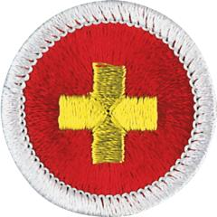

# First Aid Merit Badge

## Overview

**Eagle required**

First aid—caring for injured or ill persons until they can receive professional medical care—is an important skill for every Scout. With some knowledge of first aid, a Scout can provide immediate care and help to someone who is hurt or who becomes ill. First aid can help prevent infection and serious loss of blood. It could even save a limb or a life.

## Requirements

* (1) Handling a First Aid Emergency. Do the following:
    * (a) Explain the steps necessary to assess and handle a first aid emergency, including a safety evaluation of the scene.
    * (b) Tell how you would obtain emergency medical assistance from your home and from a remote location on a wilderness camping trip.
    * (c) Demonstrate the precautions you must take to reduce the risk of transmitting an infection between you and the victim while administering first aid, including the safe disposal of used first aid supplies.
    * (d) Demonstrate evaluation of and management of a patient's airway and breathing.
    * (e) Demonstrate a thorough examination of an accident victim.
    * (f) Discuss why shock is an emergency.
    * (g) Define the term triage and describe examples of triage situations that you may encounter.

* (2) Preparing for First Aid Emergencies. Do the following:
    * (a) Obtain a copy of the Scout Annual Health and Medical Record and discuss the importance of the form including information on immunizations, allergies, medications, health history, and medical examinations to providing first aid at Scouting events.
    * (b) Using checklists provided in the First Aid merit badge pamphlet or ones approved by your counselor, do the following:
        * (1) Assemble a personal first-aid kit for hiking and backpacking. Demonstrate the proper use of each item in your first-aid kit to your counselor.
        * (2) With your counselor, inspect a unit, home, vehicle, or camp first-aid kit and discuss your findings.

* (3) Wounds with No External Bleeding. Describe the symptoms and signs of, show first aid for, and explain prevention of these wounds:
    * (a) Closed wounds, such as a bruise (contusion) or a hematoma
    * (b) Superficial, partial thickness, and full thickness thermal (heat) burns or scalds
    * (c) Chemical burns
    * (d) Electrical burns
    * (e) Sunburn
    * (f) Snow blindness
    * (g) Immersion foot, frostnip, frostbite, and ice burns
    * (h) Abrasions, such as chafing and rope burns
    * (i) Blisters on the hands, feet, buttocks, and shoulders
    * (j) Puncture wounds from splinters, rope splinters, nails, and fish hooks
    * (k) Rash from poisonous plants
    * (l) Bug bites of chiggers, ticks, mosquitoes, and biting gnats
    * (m) Bee stings
    * (n) Bites of spiders
    * (o) Sting of a scorpion
    * (p) Bite of a pet or wild mammal or human
    * (q) Bite of a venomous snake.

* (4) Bleeding Wounds. Describe the symptoms and signs of, show first aid for, and explain prevention of these wounds:
    * (a) A nosebleed.
    * (b) An open wound with mild or moderate bleeding, such as a scratch or a scrape (abrasions), or a shallow cut (laceration).
    * (c) An open wound with severe bleeding such as a deep cut on an arm or leg.
    * (d) Explain when it is appropriate and is not appropriate to use one or more tourniquets. List some of the benefits and dangers of using a tourniquet. Demonstrate the application of a tourniquet without tightening it.

* (5) Breathing Emergencies. Describe the symptoms and signs of, show first aid for, and explain prevention of these conditions affecting breathing:
    * (a) Choking
    * (b) Asthmatic attack
    * (c) Anaphylaxis from an insect bite or sting or from food or product allergy
    * (d) Inhalation injuries
    * (e) Altitude sickness.

* (6) Loss of Consciousness. Describe the symptoms and signs of, show first aid for, and explain prevention of these conditions causing loss of consciousness:
    * (a) Fainting
    * (b) Hypoglycemia
    * (c) Seizure
    * (d) Drug overdose and alcohol poisoning
    * (e) Underwater hypoxic blackout
    * (f) Cold water shock and drowning
    * (g) Lightning strike and electric shock.

* (7) Heart Attack. Do the following:
    * (a) Explain what a heart attack is.
    * (b) Describe the symptoms and signs of a heart attack and first aid for this condition.
    * (c) Describe the conditions that must exist before performing CPR on a person.
    * (d) Demonstrate proper CPR technique using a training device approved by your counselor.
    * (e) Explain the use of an automated external defibrillator (AED).
    * (f) Demonstrate or simulate the proper use of an AED, using an AED training device if available.
    * (g) Identify the typical location(s) of one or more AED(s) at public facilities in your community, such as, your school, place of worship, unit meeting place, sports facilities, and/or camp or by using a smart phone app. Discuss the reasons for choosing locations like these.

* (8) Muscle and Bone Injuries. Do the following:
    * (a) Explain the similarities and differences in a strain, a muscle tear, a tendon rupture, a sprain, a dislocation, a simple fracture, and a compound fracture.
    * (b) Describe the symptoms and signs of and first aid for a muscle strain, a muscle tear, and a tendon rupture.
    * (c) Describe the symptoms and signs of, and potential complications of, a sprain, a fracture, and a dislocation.
    * (d) Demonstrate bandages for these injuries:
        * (1) Arm slings for forearm or upper arm or collarbone fractures
        * (2) Elastic wrap and cravat bandages for ankle sprain
        * (3) Elastic wrap and cravat bandages for wrist sprain or hand injury.

    * (e) Demonstrate the proper procedures for handling and splinting of suspected closed or open fractures or dislocations of the:
        * (1) Finger and toe
        * (2) Forearm or wrist
        * (3) Upper leg
        * (4) Lower leg or ankle.

* (9) Head and Spine Injuries. Do the following:
    * (a) Describe the symptoms and signs of, relationships between, possible complications of, and prevention of head, neck, and back injuries.
    * (b) Describe the symptoms and signs of and first aid for a concussion.
    * (c) Demonstrate first aid for an open head wound with a triangular or other bandage.
    * (d) Demonstrate first aid for someone with a suspected neck or back injury.

* (10) Moving a Patient. Do the following:
    * (a) Describe the conditions under which an injured person should and should not be moved.
    * (b) If a sick or an injured person must be moved, tell how you would decide the best method. Demonstrate these methods.
    * (c) By yourself and with a partner, demonstrate how to transport a person from a smoke-filled room.
    * (d) By yourself and with a partner, demonstrate how to transport a person with a sprained ankle for at least 25 yards.
    * (e) With helpers under your supervision, improvise a stretcher and move a presumably unconscious person for at least 25 yards.

* (11) Heat- and Cold-Related Conditions. Describe the symptoms and signs of, show first aid for, and explain prevention of these conditions associated with exertion and/or heat or cold exposure:
    * (a) Dehydration and over-hydration
    * (b) Heat cramps and muscle pain after exertion
    * (c) Heat exhaustion
    * (d) Heat stroke
    * (e) Chest pains associated with cold exposure
    * (f) Hypothermia.

* (12) Mental Health Conditions. Describe the following:
    * (a) Reactions associated with at least three stressful situations, such as mountain backpacking, rappelling, a ropes course, speaking before an audience, making a phone call to an adult, taking a swim test, missing home, lighting a match, trying out for a sports team, meeting someone for the first time, or other stressful circumstances.
    * (b) The actions that you and others should take to prepare for and manage these situations.
    * (c) The indications that someone might be a danger to themselves or others.
    * (d) The actions that you should take if you suspect that someone might be a danger to themselves or others.

* (13) Miscellaneous Conditions. Describe the symptoms and signs of, show first aid for, and explain prevention of the following conditions:
    * (a) Object in the eye
    * (b) Broken, chipped, loosened, or knocked out tooth
    * (c) Vomiting and diarrhea associated with food poisoning
    * (d) Abdominal pain
    * (e) Stroke.

* (14) With guidance from your counselor, develop a plan to teach a first-aid skill or topic using the EDGE method. Discuss your skill, topic, and plan with your counselor, and then teach your skill or topic to your family or to one or more Scouts.
* (15) Do ONE of the following:
    * (a) Visit an emergency medical station house or training center in person. From the medical first responders that you meet during your visit, learn about how they serve their community and about their careers. Discuss with your counselor what you learned during your tour and interviews.
    * (b) Interview an emergency medical services professional about their work. Learn about how they chose this career and about their duties. Discuss what you learned with your counselor and whether you might be interested in this career.
    * (c) Identify three career opportunities that would use skills and knowledge in emergency medical services. Pick one and research the training, education, certification requirements, experience, and expenses associated with entering the field. Research the prospects for employment, starting salary, advancement opportunities, and career goals associated with this career. Discuss what you learned with your counselor and whether you might be interested in this career.
    * (d) Identify how you might use the skills and knowledge in the field of emergency medical services to pursue a personal hobby and/or healthy lifestyle. Research the additional training required, expenses, and affiliation with organizations that would help you maximize the enjoyment and benefit you might gain from it. Discuss what you learned with your counselor and share what short-term and long-term goals you might have if you pursued this.

## Resources

- [First Aid merit badge page](https://www.scouting.org/merit-badges/first-aid/)
- [First Aid merit badge PDF](https://filestore.scouting.org/filestore/Merit_Badge_ReqandRes/Pamphlets/First%20Aid_2023.pdf) ([local copy](files/first-aid-merit-badge.pdf))
- [First Aid merit badge pamphlet](https://www.scoutshop.org/first-aid-merit-badge-pamphlet-660207.html)

Note: This is an unofficial archive of Scouts BSA Merit Badges that was automatically extracted from the Scouting America website and may contain errors.