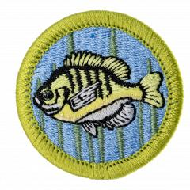

# Fishing Merit Badge

## Overview

Fishing is one of Scouting’s essential skills and teaches Scouts to feed themselves, their troops, and their families. In their pursuit of the Fishing Merit Badge, Scouts will demonstrate how to use fishing equipment properly, tie various fishing knots, identify natural fishing baits and artificial lures, and explain safety practices to follow while fishing.

## Requirements

* Note: Scouts should obey all local fishing regulations and property laws.
* NOTE:  The official merit badge pamphlets are now free and downloadable  [HERE](https://filestore.scouting.org/filestore/Merit_Badge_ReqandRes/Pamphlets/Fishing.pdf) or can be purchased at the [Scout Shop.](https://www.scoutshop.org/)
* (1) Do the following:
    * (a) Explain to your counselor the most likely hazards you may encounter while participating in fishing activities, and what you should do to anticipate, help prevent, mitigate, and respond to these hazards.
    * (b) Discuss the prevention of and treatment for the following health concerns that could occur while fishing: cuts and scratches, puncture wounds, insect bites, hypothermia, dehydration, heat exhaustion, heatstroke, and sunburn.
    * (c) Explain how to remove a barbed hook that is lodged in someone's arm.
    * (d) Name and explain five safety practices you should always follow while fishing.

* (2) Discuss the differences between two types of fishing outfits. Point out and identify the parts of several types of rods and reels. Explain how and when each would be used. Review with your counselor how to care for this equipment.
* (3) Demonstrate the proper use of two different types of fishing equipment.
* (4) Demonstrate how to tie the following knots: improved clinch knot, Palomar knot, uni knot, uni to uni knot, and arbor knot. Explain how and when each knot is used.
* (5) Name and identify five basic artificial lures and five natural baits and explain how to fish with them. Explain why baitfish are not to be released.
* (6) Do the following:
    * (a) Explain the importance of practicing Leave No Trace Seven Principles and the Outdoor Code. Discuss the positive effects of Leave No Trace Seven Principle and the Outdoor Code on fishing resources.
    * (b) Discuss the meaning and importance of catch and release. Describe how to properly release a fish safely to the water.

* (7) Obtain and review the regulations affecting gamefishing where you live. Explain why they were adopted and what  is accomplished by following them.
* (8) Explain what good outdoor sportsmanlike behavior is and how it relates to anglers. Tell how the Leave No Trace Seven Principles and the Outdoor Code relate to a fishing sports enthusiast, including the aspects of littering, trespassing, courteous behavior, and obeying fishing regulations.
* (9) Catch one fish and identify it.
* (10) If regulations and health concerns permit, clean and cook a fish you have caught. If you are unable to catch a fish for eating, acquire a fish, clean the fish you acquired, and cook the fish you acquired. Note: It is not required that you eat the fish.

## Resources

- [Fishing merit badge page](https://www.scouting.org/merit-badges/fishing/)
- [Fishing merit badge PDF](https://filestore.scouting.org/filestore/Merit_Badge_ReqandRes/Pamphlets/Fishing.pdf) ([local copy](files/fishing-merit-badge.pdf))
- [Fishing merit badge pamphlet](https://www.scoutshop.org/bsa-fishing-merit-badge-pamphletboy-scouts-of-america-660533.html)

Note: This is an unofficial archive of Scouts BSA Merit Badges that was automatically extracted from the Scouting America website and may contain errors.