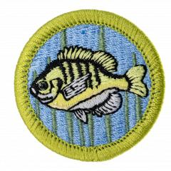

# Fishing Merit Badge

## Overview

Fishing is one of Scouting’s essential skills and teaches Scouts to feed themselves, their troops, and their families. In their pursuit of the Fishing Merit Badge, Scouts will demonstrate how to use fishing equipment properly, tie various fishing knots, identify natural fishing baits and artificial lures, and explain safety practices to follow while fishing.

## Requirements

- **NOTE: Scouts should obey all local fishing regulations and property laws.**

- (1) Do the following:
  - (a) Explain to your counselor the most likely hazards you may encounter while participating in fishing activities, and what you should do to anticipate, help prevent, mitigate, and respond to these hazards.

    **Resources:** [Fishing - Be Aware Of These Fishing Hazards (video)](https://youtu.be/DlReuRpGOtk?si=pPb6SVkfygAeiKvw), [Why is Fishing Dangerous? (website)](https://anglersadvantageguideservice.com/why-is-fishing-dangerous-dont-overlook-these-risks/)
  - (b) Discuss the prevention of and treatment for the following health concerns that could occur while fishing: cuts and scratches, puncture wounds, insect bites, hypothermia, dehydration, heat exhaustion, heatstroke, and sunburn.

    **Resources:** [How to Treat Cuts and Bruises (video)](https://youtu.be/0jp5FgLmKtk?si=JoP0J-4mQLgepwth), [Removing a Fishhook (video)](https://www.youtube.com/watch?v=AmT3T_9Guq0), [How to Treat an Insect Bite or Sting | First Aid Training (video)](https://youtu.be/YkUW3pquCF4?si=9ucB7jWL1cgIaHFo), [Hypothermia (video)](https://www.youtube.com/watch?v=my6JB41apTw), [What is Dehydration? (video)](https://www.youtube.com/watch?v=KahsIEbFROI), [Heat Exhaustion vs Heat Stroke (video)](https://www.youtube.com/watch?v=8gn3DEYOPuE), [Sunburn (video)](https://www.youtube.com/watch?v=-KzTvagnpfU)
  - (c) Explain how to remove a barbed hook that is lodged in someone's arm.

    **Resources:** [How to Remove a Hook (video)](https://youtu.be/52GLMQp52qg?si=lGfrvAY2RR2LBCO7)
  - (d) Name and explain five safety practices you should always follow while fishing.

    **Resources:** [Fishing Safety Tips (video)](https://youtu.be/mRQ0HHA3KAo?si=2bj_q6MXIj1KvTqX)

- (2) Discuss the differences between two types of fishing outfits. Point out and identify the parts of several types of rods and reels. Explain how and when each would be used. Review with your counselor how to care for this equipment.

  **Resources:** [Types of Fishing Reels and How to Use Them for Beginners - Spinning vs. Spincast vs. Baitcasting (video)](https://youtu.be/C7CWIywYmxk?si=RaRV3MXTIuB5dEf0), [Cane Pole Fishing (video)](https://youtu.be/E49ZEmiLEPo?si=nEQKsinBVH62ArCc)

- (3) Demonstrate the proper use of two different types of fishing equipment.

  **Resources:** [How to Cast and Use a Spincast Push Button Rod and Reel - Fishing Reels for Beginners (video)](https://youtu.be/cHxF6aZSrIw), [Fishing 101 Made Easy with Simple Spinning Reel Casting (video)](https://youtu.be/mZSIvpKVA4c), [How to Use a Baitcaster For Beginners! (video)](https://youtu.be/n6XApOOpfA8)

- (4) Demonstrate how to tie the following knots: improved clinch knot, Palomar knot, uni knot, uni to uni knot, and arbor knot. Explain how and when each knot is used.

  **Resources:** [Improved Clinch Knot (website)](https://www.animatedknots.com/improved-clinch-knot), [Palomar Knot (website)](https://www.animatedknots.com/palomar-knot), [Uni Knot (website)](https://www.animatedknots.com/uni-knot), [Uni-to-Uni / Double Uni Knot (website)](https://www.wired2fish.com/fishing-knots/how-to-tie-a-double-uni-knot?), [Arbor Knot (website)](https://www.animatedknots.com/arbor-knot), [Animated Knots (website)](https://www.animatedknots.com/)

- (5) Name and identify five basic artificial lures and five natural baits and explain how to fish with them. Explain why baitfish are not to be released.

  **Resources:** [Most Common Types of Fishing Lures (website)](https://fishingbooker.com/blog/most-common-types-of-fishing-lures-all-you-need-to-know/), [Fishing Lures for Beginners (video)](https://youtu.be/SamrdgVjpQk?si=ePU9bupYp0gi6Jvp), [What Are the Different Types Of Fishing Lures? (website)](https://sportfishingbuddy.com/fishing-lure-types-chart/), [Why Shouldn't Bait Fish Be Released Back Into the Water? (website)](https://farmerandthefishnyc.com/why-are-bait-fish-not-to-be-released/), [Motivations and Risks of Illegal Baitfish Release (video)](https://www.youtube.com/watch?v=nmOdusje6tY)

- (6) Do the following:
  - (a) Explain the importance of practicing Leave No Trace Seven Principles and the Outdoor Code. Discuss the positive effects of Leave No Trace Seven Principle and the Outdoor Code on fishing resources.

    **Resources:** [7 Principles of LNT (website)](https://lnt.org/why/7-principles/), [LNT Basics (video)](https://vimeo.com/1115216743/63b20c0b33?share=copy)
  - (b) Discuss the meaning and importance of catch and release. Describe how to properly release a fish safely to the water.

    **Resources:** [How to Safely Handle Fish for Catch & Release Fishing (video)](https://youtu.be/TzNjYoRpvb0?si=aHLXxtxmVecGaQ-D), [Ethical Catch and Release Fishing (video)](https://youtu.be/SMGO50R_lrA)

- (7) Obtain and review the regulations affecting gamefishing where you live. Explain why they were adopted and what is accomplished by following them.

  **Resources:** [Fishing Licenses, Rules, Regulations (website)](https://fishpiers.com/fishing-license-requirements-by-state-all-50-states/)

- (8) Explain what good outdoor sportsmanlike behavior is and how it relates to anglers. Tell how the Leave No Trace Seven Principles and the Outdoor Code relate to a fishing sports enthusiast, including the aspects of littering, trespassing, courteous behavior, and obeying fishing regulations.

  **Resources:** [Understanding Basic Fishing Rules and Etiquette (video)](https://youtu.be/54ImytCqbzI?si=hueVbET92MOl-dIg)

- (9) Catch one fish and identify it.

  **Resources:** [Fish Identification Apps (website)](https://freeappsforme.com/fish-identification-apps/), [FishBase Identification  (website)](https://www.fishbase.us/), [How to Identify Common Freshwater Fish (video)](https://youtu.be/mZ4M-AP6-iQ)

- (10) If regulations and health concerns permit, clean and cook a fish you have caught. If you are unable to catch a fish for eating, acquire a fish, clean the fish you acquired, and cook the fish you acquired. **Note:** It is not required that you eat the fish.

  **Resources:** [How to Clean and Care for Your Catch (video)](https://youtu.be/uBDYqh8p2fU?si=M9GBz5gWCTISdC5k), [How to Fillet a Fish (video)](https://www.youtube.com/shorts/hca5xiZbulY?feature=share), [How to Clean a Fish Before Cooking (short video)](https://www.youtube.com/shorts/u19fJ10kAVo?feature=share), [How to Cook a Fish (video)](https://youtu.be/BSQhEjSalwk), [5 Easy Ways to Cook Fish (video)](https://youtu.be/Tgv7tCx2NsA?si=NwsJpJx4rYU3qDOX)

## Resources

- [Fishing merit badge page](https://www.scouting.org/merit-badges/fishing/)
- [Fishing merit badge PDF](https://filestore.scouting.org/filestore/Merit_Badge_ReqandRes/Pamphlets/Fishing.pdf) ([local copy](files/fishing-merit-badge.pdf))
- [Fishing merit badge pamphlet](https://www.scoutshop.org/bsa-fishing-merit-badge-pamphletboy-scouts-of-america-660533.html)
- [Fishing merit badge workbook PDF](http://usscouts.org/mb/worksheets/Fishing.pdf)
- [Fishing merit badge workbook DOCX](http://usscouts.org/mb/worksheets/Fishing.docx)

Note: This is an unofficial archive of Scouts BSA Merit Badges that was automatically extracted from the Scouting America website and may contain errors.