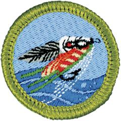

# Fly Fishing Merit Badge

## Overview

Fly-fishing is a specialized form of fishing that combines skill and artistry. Because it is so rich with tradition, it is a passion for millions of people. The beauty of the water, the solitude, and the skills that the sport requires have made fly-fishing very important in the lives of many notable people.

## Requirements

* NOTE:  The official merit badge pamphlets are now free and downloadable  [HERE](https://filestore.scouting.org/filestore/Merit_Badge_ReqandRes/Pamphlets/Fly-Fishing.pdf) or can be purchased at the [Scout Shop.](https://www.scoutshop.org/)
* (1) Do the following:
    * (a) Explain to your counselor the most likely hazards you may encounter while participating in fly-fishing activities and what you should do to anticipate, help prevent, mitigate, and respond to these hazards. Name and explain five safety practices you should always follow while fly-fishing.
    * (b) Discuss the prevention of and treatment for the following health concerns that could occur while fly-fishing: cuts and scratches, puncture wounds, insect bites, hypothermia, dehydration, heat exhaustion, heatstroke, sunburn.
    * (c) Explain how to remove a hook that has lodged in your arm.

* (2) Demonstrate how to match a fly rod, line, and leader to achieve a balanced system. Discuss several types of fly lines, and explain how and when each would be used. Review with your counselor how to care for this equipment.
* (3) Demonstrate how to tie proper knots to prepare a fly rod for fishing:
    * (a) Tie backing to the arbor of a fly reel spool using an arbor knot.
    * (b) Tie backing to the fly line using a nail (tube) knot.
    * (c) Attach a leader to the fly line using a nail (tube) knot or a loop-to-loop connection.
    * (d) Add a tippet to a leader using a surgeon's knot or a loop-to-loop connection.
    * (e) Tie a fly onto the terminal end of the leader using an improved clinch knot.

* (4) Explain how and when each of the following types of flies is used: dry flies, wet flies, nymphs, streamers, bass bugs, poppers, and saltwater flies. Tell what each one imitates. Tie at least two types of the flies mentioned in this requirement.
* (5) Demonstrate the ability to cast a fly 30 feet consistently and accurately using both overhead and roll cast techniques.
* (6) Go to a suitable fishing location and observe what fish may be eating both above and beneath the water's surface. Explain the importance of matching the hatch.
* (7) Do the following:
    * (a) Explain the importance of practicing Leave No Trace Seven Principles and the Outdoor Code. Discuss the positive effects of the Leave No Trace Seven Principles and the Outdoor Code on fly-fishing resources.
    * (b) Discuss the meaning and importance of catch and release. Describe how to properly release a fish safely to the water.

* (8) Obtain and review a copy of the regulations affecting game fishing where you live or where you plan to fish. Explain why they were adopted and what is accomplished by following them.
* (9) Explain what good outdoor sportsmanlike behavior is and how it relates to anglers. Tell how the Leave No Trace Seven Principles and the Outdoor Code relate to a fishing sports enthusiast, including the aspects of littering, trespassing, courteous behavior, and obeying fishing regulations.
* (10) Catch one fish and identify it.
* (11) If regulations and health concerns permit, clean and cook a fish you have caught. If you are unable to catch a fish for eating, acquire a fish, clean the fish you acquired, and cook the fish you acquired. Note:  It is not required that you eat the fish.

## Resources

- [Fly Fishing merit badge page](https://www.scouting.org/merit-badges/fly-fishing/)
- [Fly Fishing merit badge PDF](https://filestore.scouting.org/filestore/Merit_Badge_ReqandRes/Pamphlets/Fly-Fishing.pdf) ([local copy](files/fly-fishing-merit-badge.pdf))
- [Fly Fishing merit badge pamphlet](https://www.scoutshop.org/fly-fishing-merit-badge-pamphlet-650715.html)

Note: This is an unofficial archive of Scouts BSA Merit Badges that was automatically extracted from the Scouting America website and may contain errors.