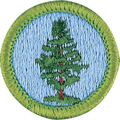

# Forestry Merit Badge

## Overview

In working through the Forestry merit badge requirements, Scouts will explore the remarkable complexity of a forest and identify many species of trees and plants and the roles they play in a forest’s life cycle.They will also discover some of the resources forests provide to humans and come to understand that people have a very large part to play in sustaining the health of forests.

## Requirements

* (1) Prepare a field notebook, make a collection, and identify 15 species of trees, wild shrubs, or vines in a local forested area. Write a description in which you identify and discuss the following:
    * (a) The characteristics of leaf, twig, cone, or fruiting bodies
    * (b) The habitat in which these trees, shrubs, or vines are found.
    * (c) The important ways each tree, shrub, or vine is used by humans or wildlife and whether the species is native or was introduced to the area. If it is not native, explain whether it is considered invasive or potentially invasive.

* (2) Do ONE of the following:
    * (a) Collect and identify wood samples of 10 species of trees. List several ways the wood of each species can be used.
    * (b) Find and examine three stumps, logs, or core samples that show variations in the growth rate of their ring patterns. In the field notebook you prepared for requirement 1, describe the location or origin of each example (including elevation, aspect, slope, and the position on the slope), and discuss possible reasons for the variations in growth rate. Photograph or sketch each example.
    * (c) Find and examine two types of animal, insect, or disease damage to trees. In the field notebook you prepared for requirement 1, identify the damage, explain how the damage was caused, and describe the effects of the damage on the trees. Photograph or sketch each example.

* (3) Do the following:
    * (a) Describe the contributions forests make to:
        * (1) Our economy in the form of products
        * (2) Our social well-being, including recreation
        * (3) Soil protection and increased fertility
        * (4) Clean water
        * (5) Clean air (carbon cycling, sequestration)
        * (6) Wildlife habitat
        * (7) Fisheries habitat
        * (8) Threatened and endangered species of plants and animals

    * (b) Tell which watershed or other source your community relies on for its water supply.

* (4) Describe what forest management means, including the following:
    * (a) Multiple-use management
    * (b) Sustainable forest management
    * (c) Even-aged and uneven-aged management and the silvicultural systems associated with each
    * (d) Intermediate cuttings
    * (e) The role of prescribed burning and related forest-management practices.

* (5) With your parent or guardian's and counselor's approval, do ONE of the following:
    * (a) Visit a managed public or private forest area with the manager or a forester who is familiar with it. Write a brief report describing the type of forest, the management objectives, and the forestry techniques used to achieve the objectives.
    * (b) With a knowledgeable individual, visit a logging operation or wood-using manufacturing plant. Write a brief report describing the following:  - The species and size of trees being harvested or used and the location of the harvest area or manufacturer - The origin of the forest or stands of trees being utilized (e.g., planted or natural) - The forest's successional stage. What is its future? - Where the trees are coming from (land ownership) or where they are going (type of mill or processing plant) - The products that are made from the trees - How the products are made and used - How waste materials from the logging operation or manufacturing plant are disposed of or utilized.
    * (c) Take part in a forest-fire prevention campaign in cooperation with your local fire warden, state wildfire agency, forester, or counselor. Write a brief report describing the campaign, how it will help prevent wildfires, and your part in it.

* (6) In your camp, local recreation area (park or equivalent), or neighborhood, inventory the trees that may be a hazard to structures or people. Make a list by area (campsite, road, trail, street, etc.). Note the species and hazardous condition, and suggest a remedy (removal or trimming). Make your list available to the proper authority or agency.
* (7) Do the following:
    * (a) Describe the consequences to forests that result from FIVE of the following elements: wildfire, absence of fire, destructive insects, loss of pollinating insect population, tree diseases, air pollution, overgrazing, deer or other wildlife overpopulation, improper harvest, urbanization.
    * (b) Explain what can be done to reduce the consequences you discussed in 7(a).
    * (c) Describe what you should do if you discover a forest fire and how a professional firefighting crew might control it. Name your state or local wildfire control agency.

* (8) Visit one or more local foresters and write a brief report about the person (or persons) OR write about a forester's occupation including the education, qualifications, career opportunities, and duties related to forestry.

## Resources

- [Forestry merit badge page](https://www.scouting.org/merit-badges/forestry/)
- [Forestry merit badge PDF](https://filestore.scouting.org/filestore/Merit_Badge_ReqandRes/Pamphlets/Forestry.pdf) ([local copy](files/forestry-merit-badge.pdf))
- [Forestry merit badge pamphlet](https://www.scoutshop.org/forestry-merit-badge-pamphlet-662389.html)

Note: This is an unofficial archive of Scouts BSA Merit Badges that was automatically extracted from the Scouting America website and may contain errors.