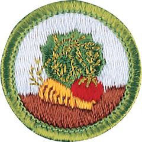

# Gardening Merit Badge

## Overview

Humans have been growing plants for thousands of years. Farmers and horticulturists make their living growing food and other plants, while other people grow gardens for pleasure. Becoming a good gardener requires a Scout to understand the science of growing plants—how to prepare the soil, how to select and plant seeds, and how to care for the growing plants.

## Requirements

* (1) Do the following:
    * (a) Explain to your counselor the most likely hazards associated with gardening and what you should do to anticipate, help prevent, mitigate, and respond to these hazards.
    * (b) Discuss the prevention of and treatment for health concerns that could occur while gardening, including cuts, scratches, puncture wounds, insect bites, anaphylactic shock, heat reactions, and reactions from exposure to pesticides and fertilizers.

* (2) Do the following, and discuss your observations throughout the process with your counselor:
    * (a) Grow six vegetables, three from seeds and three from seedlings, through harvest.
    * (b) Grow six flowers, three from seeds and three from seedlings, through flowering.

* (3) Give the nutritional value of the following:
    * (a) Three root or tuber crops
    * (b) Three vegetables that bear above the ground
    * (c) Three fruits.

* (4) Test 100 seeds for germination. Determine the percentage of seeds that germinate. Explain why you think some did not germinate.
* (5) Visit your county extension agent's office, local university, agricultural college, nursery, farm, or a botanical garden or arboretum. Report on what you learned.
* (6) Explain to your counselor how and why honeybees are used in pollinating food crops and the problems that face the bee population today.  Discuss what the impact to humanity would be if there were no pollinators.
* (7) Identify five garden pests (insects, diseased plants). Recommend two solutions for each pest. At least one of the two solutions must be an organic method.
* (8) Do ONE of the following and record weekly observations. Discuss the results of your project with your counselor.
    * (a) Build a compost bin and maintain it for 90 days.
    * (b) Build a vermipost bin (worm compost bin) and maintain it for 90 days.
    * (c) Build a hydroponic garden containing three vegetables or herbs, or three ornamental plants. Maintain this garden through harvest or flowering, or for 90 days.
    * (d) Build one water garden, either in a container (at least 12 by 6 inches and 6 inches deep), or in the ground as a small, decorative pond no larger than 6 by 3 feet and 24 inches deep. Maintain the water garden for 90 days.
    * (e) Prepare a honey super for use on a hive or colony. Remove a filled honey super from the hive or colony and prepare the honey for sale.
    * (f) Grow a garden of your own using soil from seed or plantings to harvest or for 90 days, whichever is earlier. This can be an outdoor garden or indoors using appropriate containers, and should include at least three types of plants approved by your counselor.

* (9) Do ONE of the following:
    * (a) Identify three career opportunities that would use skills and knowledge in gardening. Pick one and research the training, education, certification requirements, experience, and expenses associated with entering the field. Research the prospects for employment, starting salary, advancement opportunities and career goals associated with this career. Discuss what you learned with your counselor and whether you might be interested in this career.
    * (b) Identify how you might use the skills and knowledge in gardening to pursue a personal hobby and/or healthy lifestyle. Research the additional training required, expenses, and affiliation with organizations that would help you maximize the enjoyment and benefit you might gain from it. Discuss what you learned with your counselor and share what short-term and long-term goals you might have if you pursued this.

## Resources

- [Gardening merit badge page](https://www.scouting.org/merit-badges/gardening/)
- [Gardening merit badge PDF](https://filestore.scouting.org/filestore/Merit_Badge_ReqandRes/Pamphlets/Gardening_2024.pdf) ([local copy](files/gardening-merit-badge.pdf))
- [Gardening merit badge pamphlet](https://www.scoutshop.org/gardening-merit-badge-pamphlet-654566.html)

Note: This is an unofficial archive of Scouts BSA Merit Badges that was automatically extracted from the Scouting America website and may contain errors.