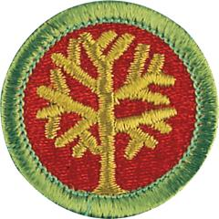

# Genealogy Merit Badge

## Overview

Exploring your roots—where your family name came from, why your family lives where it does, what your parents and grandparents did for fun when they were your age—can be fascinating. Discovering your ancestors back through history is what genealogy is all about.

## Requirements

* NOTE:  The official merit badge pamphlets are now free and downloadable  [HERE](https://filestore.scouting.org/filestore/Merit_Badge_ReqandRes/Pamphlets/Genealogy.pdf) or can be purchased at the [Scout Shop.](https://www.scoutshop.org/)
* (1) Do the following:
    * (a) Explain to your counselor what the words genealogy, ancestor, and descendant mean. Resource: [What Is Genealogy? Terminology (video)](https://www.youtube.com/watch?v=7V-nmASSPRk)
    * (b) Explain what a family tree is and what information would be kept there. Resource: [The Family Tree (video)](https://www.youtube.com/watch?v=PM79Epw_cp8)
    * (c) Explain what a family group record is and what information would be kept there. Resource: [What Are Family Group Sheets and Pedigree Charts? (video)](https://www.youtube.com/watch?v=mLJhNZk-BGg)

* (2) Do ONE of the following:
    * (a) Create a time line for yourself or for a relative. Then write a short biography based on that time line. Resource: [All About Timelines (video)](https://www.youtube.com/watch?v=_hKMBqEUE1w&t=95s)
    * (b) Keep a journal for six weeks. You must write in it at least once a week. Resource: [How to Journal (video)](https://www.youtube.com/watch?v=TKOrVpuvvMA&t=52s)

* (3) With your parent or guardian's help, choose a relative or a family acquaintance you can interview in person, by telephone, or by email or letter. Record the information you collect so you do not forget it. Resource:  [How to Master the Art of Interviewing With 5 Easy Journalist Techniques (video)](https://www.youtube.com/watch?v=NWDL_UYMc7Q)
* (4) Do the following:
    * (a) Name three types of physical genealogical resources and where you can find them, and explain how these resources can help you chart your family tree. Resource: [8 Places to Look for an Ancestor's Birth Record (video)](https://www.youtube.com/watch?v=vhCBJEAdzkM)
    * (b) Name three types of digital genealogical resources and where you can find them, and explain how these resources can help you chart your family tree.Resource: [7 Free Genealogy Websites (video)](https://www.youtube.com/watch?v=WQ6ELtmhnyQ)
    * (c) Obtain at least one genealogical document that supports an event that is or can be recorded on your pedigree chart or family group record.
    * (d) Tell how you found it and how you would evaluate the genealogical information you found for requirement 4(c).
    * (e) Tell a likely place to find these type of genealogical records: marriage record, census record, birth record, and burial information. Resource: [Vital Records (video)](https://www.youtube.com/watch?v=N5NT3-zvRhs)

* (5) Contact ONE of the following individuals or institutions. Ask what genealogical services, records, or activities this individual or institution provides, and report the results:
    * (a) A genealogical or lineage society Resource: [Why Join a Genealogical Society (video)](https://www.youtube.com/watch?v=bkMS7rfYK4s)
    * (b) A professional genealogist (someone who gets paid for doing genealogical research) Resource: [How to Hire a Professional Genealogist (video)](https://www.youtube.com/watch?v=qDSXuz8l9es)
    * (c) A surname organization, such as your family's organization Resource: [Facebook Surname Groups (video)](https://www.youtube.com/watch?v=fv9vpbktRhs)
    * (d) A genealogical educational facility or institution. Resource: [Getting Started With the Genealogy Center (video)](https://www.youtube.com/watch?v=Umga_tVIME8)
    * (e) A genealogical record repository of any type (courthouse, genealogical library, state or national archive, state library, etc.). Resource: [Where to Find Records for Family History Research (video)](https://www.youtube.com/watch?v=9HH-dtvTSOw)

* (6) Begin your family tree by listing yourself and include at least two additional generations. You may complete this requirement by using the chart provided in the Genealogy merit badge pamphlet or the genealogy software program of your choice. Resource:  [How to Make a Family Tree (on Paper, Not Online To Avoid Putting Private Information Online) (video)](https://www.youtube.com/watch?v=Ci55EXJtlDM)
* (7) Complete a family group record form, listing yourself and your brothers and sisters as the children. On another family group record form, show one of your parents and his or her brothers and sisters as the children. This requirement may be completed using the chart provided or the genealogy software program of your choice. Resource:  [How to Use Family Group Sheets (video)](https://www.youtube.com/watch?v=nb2C3z7C_R8)
* (8) Do the following:
    * (a) Explain the effect computers and the internet are having on the world of genealogy. Resource: [How to Use Internet Archive for Genealogy (video)](https://www.youtube.com/watch?v=Ltc0EjJzB5k)
    * (b) Explain how photography (including microfilming) has influenced genealogy. Resources: [Getting Involved: Quick Name Review (video)](https://www.youtube.com/watch?v=tP-m8IWX6vU&ab_channel=FamilyHistorywithChris)
    * (c) Explain how record indexing works and how that has influenced genealogy. Resources: [Getting Involved: Quick Name Review (video)](https://www.youtube.com/watch?v=tP-m8IWX6vU&ab_channel=FamilyHistorywithChris) [How to Get Involved with Family Search on your Phone (video)](https://www.youtube.com/watch?v=cFjbF7sGNoA) [Family Search: Get Involved Introduction (video)](https://www.youtube.com/watch?v=fzd619Xv7N8)

* (9) Discuss what you have learned about your family and your family members through your genealogical research.

## Resources

- [Genealogy merit badge page](https://www.scouting.org/merit-badges/genealogy/)
- [Genealogy merit badge PDF](https://filestore.scouting.org/filestore/Merit_Badge_ReqandRes/Pamphlets/Genealogy.pdf) ([local copy](files/genealogy-merit-badge.pdf))
- [Genealogy merit badge pamphlet](https://www.scoutshop.org/genealogy-merit-badge-pamphlet-660396.html)

Note: This is an unofficial archive of Scouts BSA Merit Badges that was automatically extracted from the Scouting America website and may contain errors.