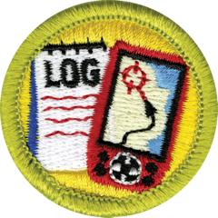

# Geocaching Merit Badge

## Overview

The word geocache is a combination of “geo,” which means “earth,” and “cache,” which means “a hiding place.” Geocaching describes a hiding place on planet Earth—a hiding place you can find using a GPS unit.

## Requirements

- (1) Do the following:
  - (a) Explain to your counselor the most likely hazards you may encounter while participating in geocaching activities, and what you should do to anticipate, help prevent, mitigate, and respond to these hazards.

    **Resources:** [GeoCaching Safety: 12 Critical Tips to Stay Safe While Treasure Hunting (website)](https://geocachingtoday.com/geocaching-safety-tips-to-stay-safe-while-treasure-hunting/), [Surviving the Wild—Essential Hiking Safety Tips (video)](https://youtu.be/YGQG0C0HBGw)
  - (b) Discuss first aid and prevention for the types of injuries or illnesses that could occur while participating in geocaching activities, including cuts, scrapes, snakebite, insect stings, tick bites, exposure to poisonous plants, heat and cold reactions (sunburn, heatstroke, heat exhaustion, hypothermia), and dehydration.

    **Resources:** [Backpacking First Aid (What To Carry + Foot Care, Snakes, Poison Plants, Hypothermia, etc) (video)](https://youtu.be/nxExCQiWa_U)
  - (c) Discuss how to properly plan an activity that uses GPS, including using the buddy system, sharing your plan with others, and considering the weather, route, and proper attire.

    **Resources:** [Geocaching Tips and Tricks (video)](https://youtu.be/0_wubfWGADo)

- (2) Discuss the following with your counselor:
  - (a) Why you should never bury a cache

    **Resources:** [Don't Bury Your Cache or Attach It to a Tree (website)](https://www.geocaching.com/help/index.php?pg=kb.chapter&id=128&pgid=905)
  - (b) How to use proper geocaching etiquette when hiding or seeking a cache, and how to properly hide, post, maintain, and dismantle a geocache

    **Resources:** [Geocaching Etiquette (video)](https://youtu.be/GXzIu7p82jg)
  - (c) The Leave No Trace Seven Principles and the Outdoor Code as they apply to geocaching

    **Resources:** [How To Geocache the Leave No Trace Way (video)](https://youtu.be/-OBCyHbYmmA)

- (3) Explain the following terms used in geocaching: waypoint, log, cache, accuracy, difficulty and terrain ratings, attributes, and trackable. Choose five additional terms to explain to your counselor.

  **Resources:** [Geocaching Acronyms and Terms (website)](https://www.hoagiesgifted.org/geocaching_acronyms.htm), [Geocaching Terms (website)](https://www.geocaching.com/about/glossary.aspx)

- (4) Explain how the Global Positioning System (GPS) works. Then, using Scouting's EDGE, demonstrate to your counselor the use of a GPS unit. Include marking and editing a waypoint, changing field functions, and changing the coordinate system in the unit.

  **Resources:** [How Does GPS Find Your Location (video)](https://youtu.be/jl2xQk-z4To), [How To Use a Garmin eTrex 10 GPS Receiver (video)](https://youtu.be/RNhtn71k-wA)

- (5) Do the following:
  - (a) Show you know how to use a map and compass and explain why this is important for geocaching.

    **Resources:** [Compass 101 (video)](https://youtu.be/7MQUIYsmQhc), [THIS Is How To Use a Compass and Map (video)](https://youtu.be/qGqLuqnvROg)
  - (b) Explain the similarities and differences between GPS navigation and standard map-reading skills and describe the benefits of each.

    **Resources:** [Using a GPS with a Map and Compass (video)](https://youtu.be/mK3pOU_x4jQ)

- (6) Describe to your counselor the four steps to finding your first cache. Then mark and edit a waypoint.

  **Resources:** [10 Things To Do When Playing Geocaching (video)](https://youtu.be/7LvnVdaw5sM)

- (7) With your parent or guardian's permission, go to www.geocaching.com. Type in your city and state to locate public geocaches in your area. Share with your counselor the posted information about three of those geocaches. Then, pick one of the three and find the cache.**Note:** To fulfill this requirement, you will need to set up a free user account with www.Geocaching.com. Before doing so, ask your parent or guardian for permission and help.

  **Resources:** [Geocaching.com (website)](https://www.geocaching.com/play), [How To Find Your First Geocache! (video)](https://youtu.be/-ddhwGsGDjs)

- (8) Do ONE of the following:
  - (a) If a Cache to Eagle® series exists in your council, visit at least three of the locations in the series. Describe the projects that each cache you visit highlights, and explain how the Cache to Eagle® program helps share our Scouting service with the public.

    **Resources:** [She Created a Geocaching Trail That Links Together 14 Eagle Scout Service Projects (website)](https://blog.scoutingmagazine.org/2021/02/12/she-created-a-geocaching-trail-that-links-together-14-eagle-scout-service-projects)
  - (b) Create a Scouting-related Travel Bug® that promotes one of the values of Scouting. Release your Travel Bug into a public geocache and, with your parent or guardian's permission, monitor its progress at www.geocaching.com for 30 days. Keep a log, and share this with your counselor at the end of the 30-day period.

    **Resources:** [What Is a Travel Bug in Geocaching (video)](https://youtu.be/Fwl8-pvwHJQ)
  - (c) Set up and hide a public geocache, following the guidelines in the *Geocaching* merit badge pamphlet. Before doing so, share with your counselor a three-month maintenance plan for the geocache where you are personally responsible for those three months. After setting up the geocache, with your parent or guardian's permission, follow the logs online for 30 days and share them with your counselor. You must archive the geocache when you are no longer maintaining it.

    **Resources:** [What To Do (and NOT Do) When Hiding a Geocache (video)](https://youtu.be/0018rkb_knA)
  - (d) Explain what Cache In Trash Out (CITO) means, and describe how you have practiced CITO at public geocaches or at a CITO event. Then, either create CITO containers to leave at public caches, or host a CITO event for your unit or for the public.

    **Resources:** [Cache In Cache Out Geocaching Events (video)](https://youtu.be/5eIwxTAaxKw), [Geocaching Capital of Canada Cleanup (video)](https://youtu.be/Brhs9gpCszE), [Event Caches (website)](https://www.geocaching.com/help/index.php?pg=kb.chapter&id=23&pgid=799)

- (9) Plan a geohunt for a youth group such as your troop or a neighboring pack, at school, or your place of worship. Choose a theme, set up a course with at least four waypoints, teach the players how to use a GPS unit, and play the game. Tell your counselor about your experience, and share the materials you used and developed for this event.

  **Resources:** [Geocaching—Setting up the Experience (video)](https://youtu.be/y69n3o3SAEA)

## Resources

- [Geocaching merit badge page](https://www.scouting.org/merit-badges/geocaching/)
- [Geocaching merit badge PDF](https://filestore.scouting.org/filestore/Merit_Badge_ReqandRes/Pamphlets/Geocaching.pdf) ([local copy](files/geocaching-merit-badge.pdf))
- [Geocaching merit badge pamphlet](https://www.scoutshop.org/geocaching-merit-badge-pamphlet-661777.html)
- [Geocaching merit badge workbook PDF](http://usscouts.org/mb/worksheets/geocaching.pdf)
- [Geocaching merit badge workbook DOCX](http://usscouts.org/mb/worksheets/geocaching.docx)

Note: This is an unofficial archive of Scouts BSA Merit Badges that was automatically extracted from the Scouting America website and may contain errors.