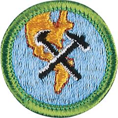

# Geology Merit Badge

## Overview

Geology is the study of Earth. It includes the study of materials that make up Earth, the processes that change it, and the history of how things happened, including human civilization, which depends on natural materials for existence.

## Requirements

- (1) Define geology. Discuss how geologists learn about rock formations. In geology, explain why the study of the present is important to understanding the past.

  **Resources:** [Defining Geology (video)](https://youtu.be/Kv_7jt0nvHQ), [Introduction to Geology (video)](https://youtu.be/qNiOXc6pSBQ)

- (2) Pick three resources that can be extracted or mined from Earth for commercial use. Discuss with your counselor how each product is discovered and processed.

  **Resources:** [Patterns of Mineral Extraction (video)](https://youtu.be/wQhFQFeYdJU)

- (3) Review a geologic map of your area or an area approved by your counselor, and discuss the different rock types and estimated ages of rocks represented. Determine whether the rocks are sedimentary, metamorphic, or igneous. Explain if the geologic map shows horizontal, folded, faulted, or intrusive rocks, and explain how you arrived at your conclusion.

  **Resources:** [State Geological Surveys (website)](https://www.stategeologists.org/surveys)

- (4) Do ONE of the following options:
  - **Option A—Surface and Sedimentary Processes.** Do ALL of the following:
    - (1) Conduct an experiment approved by your counselor that demonstrates how sediments settle from suspension in water. Explain to your counselor what the exercise shows and why it is important.

      **Resources:** [Stream Erosion and Stream Deposition (video)](https://youtu.be/YoZZZQ2lxOc), [Sediment Settlement Lab (video)](https://youtu.be/p4K5N6WuVoA), [Separate Soil! (video)](https://youtu.be/BVWIspB8qWk)
    - (2) Using topographical maps provided by your counselor, plot the stream gradients (different elevations divided by distance) for four different stream types (straight, meandering, dendritic, trellis). Explain which ones flow fastest and why, and which ones will carry larger grains of sediment and why.

      **Resources:** [How to Calculate the Gradient of a Slope (video)](https://youtu.be/3QFJ_uv2mGw)
    - (3) On a stream diagram, show areas where you will find the following features: cut bank, fill bank, point bar, medial channel bars, lake delta. Describe the relative sediment grain size found in each feature.

      **Resources:** [Point Bars and Cut Banks (video)](https://youtu.be/gjIrApP2tt8)
    - (4) Conduct an experiment approved by your counselor that shows how some sedimentary material carried by water may be too small for you to see without a magnifier.

      **Resources:** [Sediment in Streams (video)](https://youtu.be/-tDOu1vrNHY)
    - (5) Visit a nearby stream. Find clues that show the direction of water flow, even if the water is missing. Record your observations in a notebook, and sketch those clues you observe. Discuss your observations with your counselor.

      **Resources:** [How to Read Water (video)](https://youtu.be/jOQmN7EM5NE?si=bJIlc6F0lRcJR8oy)
  - **Option B—Energy Resources.** Do ALL of the following:
    - (1) List the top five Earth resources used to generate electricity in the United States.

      **Resources:** [Electric Power Monthly (website)](https://www.eia.gov/electricity/monthly/epm_table_grapher.php?t=table_es1a)
    - (2) Discuss source rock, trap, and reservoir rock—the three components necessary for the occurrence of oil and gas underground.

      **Resources:** [Formation of Reservoir Rock (video)](https://youtu.be/_PDOD_FEnNk)
    - (3) Explain how each of the following items is used in subsurface exploration to locate oil or gas: reflection seismic, electric well logs, stratigraphic correlation, offshore platform, geologic map, subsurface structure map, subsurface isopach map, and core samples and cutting samples.

      **Resources:** [Using 3D Seismic Exploration to Find and Drill for Oil and Natural Gas Sources (video)](https://youtu.be/8h35KsRD0c0)
    - (4) Using at least 20 data points provided by your counselor, create a subsurface structure map and use it to explain how subsurface geology maps are used to find oil, gas, or coal resources.
    - (5) Do ONE of the following:
      - (a) Make a display or presentation showing how oil and gas or coal is found, extracted, and processed. You may use maps, books, articles from periodicals, and research found on the internet (with your parent or guardian's permission). Share the display with your counselor or a small group (such as your class at school) in a five-minute presentation.
      - (b) With your parent or guardian's and counselor's permission and assistance, arrange for a visit to an operating drilling rig. While there, talk with a geologist and ask to see what the geologist does onsite. Ask to see cutting samples taken at the site.
  - **Option C—Mineral Resources.** Do ALL of the following:
    - (1) Define rock. Discuss the three classes of rocks including their origin and characteristics.

      **Resources:** [Rocks for Kids (video)](https://youtu.be/xsHPA2GNF9Q), [Types of Rocks (video)](https://youtu.be/KtbAEYwkC1E)
    - (2) Define mineral. Discuss the origin of minerals and their chemical composition and identification properties, including hardness, specific gravity, color, streak, cleavage, luster, and crystal form.

      **Resources:** [Rocks and Minerals (video)](https://youtu.be/24O79WgKZO8), [Identifying Rocks and Minerals - Using Physical Properties for Identification (video)](https://youtu.be/M4rzNUZFV4w?si=U7wiitA6iPA-bScM)
    - (3) Do ONE of the following:
      - (a) Collect 10 different rocks or minerals. Record in a notebook where you obtained (found, bought, traded) each one. Label each specimen, identify its class and origin, determine its chemical composition, and list its physical properties. Share your collection with your counselor.
      - (b) With your counselor's assistance, identify 15 different rocks and minerals. List the name of each specimen, tell whether it is a rock or mineral, and give the name of its class (if it is a rock) or list its identifying physical properties (if it is a mineral).
    - (4) List three of the most common road building materials used in your area. Explain how each material is produced and how each is used in road building.

      **Resources:** [Top Rock Types Used in Road Construction (website)](https://roblarquarryllc.com/top-rock-types-used-in-road-construction/)
    - (5) Do ONE of the following:
      - (a) With your parent or guardian's and counselor's approval, visit an active mining site, quarry, or sand and gravel pit. Tell your counselor what you learned about the resources extracted from this location and how these resources are used by society.
      - (b) With your counselor, choose two examples of rocks and two examples of minerals. Discuss the mining of these materials and describe how each is used by society.
      - (c) With your parent or guardian's and counselor's approval, visit the office of a civil engineer and learn how geology is used in construction. Discuss what you learned with your counselor.
  - **Option D—Earth History.** Do ALL of the following:
    - (1) Create a chart showing suggested geological eras and periods. Determine which period the rocks in your region might have been formed.

      **Resources:** [The Geological Timescale (video)](https://www.youtube.com/watch?v=5Prp5iYFu4w)
    - (2) Explain the theory of plate tectonics. Make a chart explaining, or discuss with your counselor, how the processes of plate tectonics work. Discuss how plate tectonics determines the distribution of most of the Earth's volcanoes, earthquakes, and mountain belts.

      **Resources:** [How Plate Tectonics Work (video)](https://www.youtube.com/watch?v=xhcovHLA90s)
    - (3) Explain to your counselor the processes of burial and fossilization, and discuss the concept of extinction.

      **Resources:** [Fossilization Process Simply Explained (video)](https://youtu.be/7loCEh2mhoU?si=arwh3KhBoNiKI_rm), [Fossils 101 (video)](https://youtu.be/bRuSmxJo_iA?si=5GieblR2ahkpJlA7), [Fossils and Paleontology (website)](https://www.nps.gov/subjects/fossils/significance.htm)
    - (4) Explain to your counselor how fossils provide information about ancient life, environment, climate, and geography. Discuss the following terms and explain how animals from each habitat obtain food: benthonic, pelagic, littoral, lacustrine, open marine, brackish, fluvial, eolian, and protected reef.

      **Resources:** [Fossils and Rock Layers for Kids! (video)](https://www.youtube.com/watch?v=TjYU7ImWUjI), [Divisions of the Marine Environment (video)](https://youtu.be/J4cIRTU_vD8), [Benthos: Intertidal Zone (video)](https://youtu.be/Tk_c5dT9OV8?si=JGIGxYu9M2Vm5jfm), [Pelagic Zone (video)](https://youtu.be/RfXrj0E7EUc?si=0MGPJgylaHttKNEE), [Pelagic Zone Facts (website)](https://kids.kiddle.co/Pelagic_zone), [What Is the Littoral Zone (video)](https://youtu.be/9bfzCsdScZQ?si=VZiOUGWnBI4aw7Ow), [Lacustrine Zone (video)](https://youtu.be/vHVbhHww0Iw?si=wLexq9xNjcEoMVCm), [Oceans 101 (video)](https://youtu.be/MfWyzrkFkg8?si=UU1WeNHU7RJe8Zog), [Brackish Water (website)](http://www.actforlibraries.org/what-is-brackish-water), [Fluvial Processes (video)](https://youtu.be/BhYDFg_BtSo?si=zL-GSJWaGfUC8PnG), [Weathering Environments Part 1: Fluvial Processes (video)](https://youtu.be/Ea47Gat0Oec?si=o48kIttwjrsHXCJl), [Weathering Environments Part 2: Aeolian Processes (video)](https://youtu.be/vOH7y-jKVSY?si=X-4o0WwjyzlU_LJo), [Coral Reef 101 (video)](https://youtu.be/ZiULxLLP32s?si=cf6ZuLcT8kpFd-DW)
    - (5) Collect 10 different fossil plants or animals OR (with your counselor's assistance) identify 15 different fossil plants or animals. Record in a notebook where you obtained (found, bought, traded) each one. Classify each specimen to the best of your ability, and explain how each one might have survived and obtained food. Tell what else you can learn from these fossils.
    - (6) Do ONE of the following:
      - (a) Visit a science museum or the geology department of a local university that has fossils on display. With your parent or guardian's and counselor's approval, before you go, make an appointment with a curator or guide who can show you how the fossils are preserved and prepared for display.

        **Resources:** [Geology Museums to Visit in the United States (website)](https://whichmuseum.com/place/united-states-2682/t-geology)
      - (b) Visit a structure in your area that was built using fossiliferous rocks. Determine what kind of rock was used and tell your counselor the kinds of fossil evidence you found there.
      - (c) Visit a rock outcrop that contains fossils. Determine what kind of rock contains the fossils, and tell your counselor the kinds of fossil evidence you found at the outcrop.
      - (d) Prepare a display or presentation on your state fossil. Include an image of the fossil, the age of the fossil, and its classification. You may use maps, books, articles from periodicals, and research found on the internet (with your parent or guardian's permission). Share the display with your counselor or a small group (such as your class at school). If your state does not have a state fossil, you may select a state fossil from a neighboring state.

- (5) Do the following:
  - (a) Discuss with your counselor the importance of the Leave No Trace Seven Principles and the Outdoor Code as they relate to the study of geology.

    **Resources:** [Leave No Trace (video)](https://vimeo.com/1115216743/63b20c0b33?share=copy)
  - (b) Explain how you practiced the Leave No Trace Seven Principles and the Outdoor Code while traveling in natural areas and while collecting rock and fossil specimens for this merit badge.

- (6) Do ONE of the following:
  - (a) Explore careers related to this merit badge. Research one career to learn about the training and education needed, costs, job prospects, salary, job duties, and career advancement. Your research methods may include—with your parent or guardian's permission—an internet or library search, an interview with a professional in the field, or a visit to a location where people in this career work. Discuss with your counselor both your findings and what about this profession might make it an interesting career.

    **Resources:** [20+ Geoscience Careers & How Much Geoscientists Make $ (Why You Should Study Geology!) (video)](https://youtu.be/d22wgbrwmzA), [Geology Jobs: What You Can Do With a Degree in Geology (video)](https://youtu.be/FPY1q6oPmN8)
  - (b) Explore how you could use knowledge and skills from this merit badge to pursue a hobby or healthy lifestyle. Research any training needed, expenses, and organizations that promote or support it. Discuss with your counselor what short-term and long-term goals you might have if you pursued this.

    **Resources:** [Why I'm So Obsessed With Geology (video)](https://www.youtube.com/shorts/sxTzwHxxEp8?feature=share), [What Is Geology and How Can Rock Collecting Become a Fascinating Hobby? (video)](https://youtu.be/oLomQG6P6tc), [Rockhounding 101: The Best Way to Find Minerals (video)](https://youtu.be/x4iptGa2eU4), [Michigan Geology Tourism Series (video)](https://youtu.be/75QB3OFbEi0)

## Resources

- [Geology merit badge page](https://www.scouting.org/merit-badges/geology/)
- [Geology merit badge PDF](https://filestore.scouting.org/filestore/Merit_Badge_ReqandRes/Pamphlets/Geology.pdf) ([local copy](files/geology-merit-badge.pdf))
- [Geology merit badge pamphlet](https://www.scoutshop.org/bsa-geology-merit-badge-pamphlet-boy-scouts-of-america-660059.html)
- [Geology merit badge workbook PDF](http://usscouts.org/mb/worksheets/Geology.pdf)
- [Geology merit badge workbook DOCX](http://usscouts.org/mb/worksheets/Geology.docx)

Note: This is an unofficial archive of Scouts BSA Merit Badges that was automatically extracted from the Scouting America website and may contain errors.