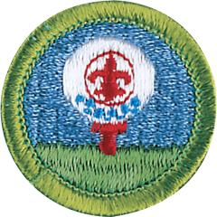

# Golf Merit Badge

## Overview

Golf is unique because the players police themselves. Other sports depend upon referees or umpires to apply penalties when there are infractions of the rules. In golf, every player is expected to act honorably, and the welfare and integrity of the game rely on every player’s honesty. This is why golf often is referred to as a “gentleman’s game.”

## Requirements

* NOTE:  The official merit badge pamphlets are now free and downloadable  [HERE](https://filestore.scouting.org/filestore/Merit_Badge_ReqandRes/Pamphlets/Golf.pdf) or can be purchased at the [Scout Shop.](https://www.scoutshop.org/)
* (1) Discuss safety on the golf course. Show that you know first aid for injuries or illnesses that could occur while golfing, including lightning, heat reactions, sunburn, dehydration, blisters, animal or bug bites, poison ivy exposure, sprains, and strains.
* (2) Complete ONE of the following options:
    * Option 1—Traditional Golf
        * (A) Study the USGA "Rules of Golf" now in use.
            * (1) Tell about the three categories of golf etiquette.
            * (2) Demonstrate that you understand the definitions of golf terms.
            * (3) Show that you understand the "Rules of Amateur Status."

        * (B) Tell about your understanding of the World Handicap System.
        * (C) Do the following:
            * (1) Tell about the early history of golf.
            * (2) Describe golf's early years in the United States.
            * (3) Tell about the accomplishments of a top golfer of your choice.

        * (D) Do the following:
            * (1) Tell how golf can contribute to a healthy lifestyle, mentally and physically.
            * (2) Tell how a golf exercise plan can help you play better. Show two exercises that would help improve your game.

        * (E) Show the following:
            * (1) The proper grip, stance, posture, and key fundamentals of a good swing
            * (2) Driver played from a tee
            * (3) The fairway wood shot
            * (4) The long iron shot
            * (5) The short iron shot
            * (6) The approach, chip-and-run, and pitch shots
            * (7) A recovery shot from a bunker or heavy rough
            * (8) A sound putting stroke.

        * (F) Play a minimum of two nine-hole rounds or one 18-hole round of golf with another golfer about your age and with your counselor, or an adult approved by your counselor. Do the following:
            * (1) Follow the "Rules of Golf."
            * (2) Practice good golf etiquette.
            * (3) Show respect to fellow golfers, committee, sponsor, and gallery.

        * (G) Find out about three careers related to traditional golf. Pick one and identify the education, training, and experience required for this profession. Discuss this with your counselor, and explain why this interests you.

    * Option 2—Disc Golf
        * (A) Study the "PDGA Official Rules of Disc Golf" now in use.
            * (1) Tell about the six areas of Courtesy (812).
            * (2) Describe the seven areas of Scoring (808).

        * (B) Tell about your understanding of the "PDGA Disc Golfer's Code."
        * (C) Do the following:
            * (1) Tell about the history of disc golf and why it is an inclusive game.
            * (2) Discuss with your counselor the contributions Ed Headrick made to the sport of disc golf.
            * (3) Describe the evolution of disc design.
            * (4) Tell about the accomplishments of a top disc golfer of your choice.

        * (D) Do the following:
            * (1) Tell how disc golf can contribute to a healthy lifestyle, mentally and physically.
            * (2) Tell how a disc golf exercise plan can help you play better. Show two exercises that would help improve your game.

        * (E) Show the following:
            * (1) A good throwing grip
            * (2) A good runup (X-step) when throwing a disc
            * (3) Backhand shot
            * (4) Forehand shot
            * (5) Overhand shot
            * (6) Rolling shot
            * (7) A good (in-line) putting stance
            * (8) A good straddle putting stance
            * (9) A good putting grip
            * (10) A good putting motion & follow through
            * (11) The proper use of a mini-marking disc.

        * (F) Play a minimum of 18-holes of disc golf with another disc golfer about your age and with your counselor, or an adult approved by your counselor. Do the following:
            * (1) Follow the "PDGA Official Rules of Disc Golf."
            * (2) Practice good disc golf etiquette.
            * (3) Show respect to fellow disc golfers and other people in the park along with any wildlife, trees, and plants on the property.

        * (G) Find out about three careers related to disc golf. Pick one and identify the education, training, and experience required for this profession. Discuss this with your counselor, and explain why this interests you.

## Resources

- [Golf merit badge page](https://www.scouting.org/merit-badges/golf/)
- [Golf merit badge PDF](https://filestore.scouting.org/filestore/Merit_Badge_ReqandRes/Pamphlets/Golf.pdf) ([local copy](files/golf-merit-badge.pdf))
- [Golf merit badge pamphlet](https://www.scoutshop.org/golf-merit-badge-pamphlet-662394.html)

Note: This is an unofficial archive of Scouts BSA Merit Badges that was automatically extracted from the Scouting America website and may contain errors.