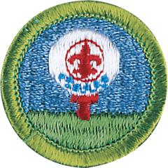

# Golf Merit Badge

## Overview

Golf is unique because the players police themselves. Other sports depend upon referees or umpires to apply penalties when there are infractions of the rules. In golf, every player is expected to act honorably, and the welfare and integrity of the game rely on every player’s honesty. This is why golf often is referred to as a “gentleman’s game.”

## Requirements

- (1) Discuss safety on the golf course. Show that you know first aid for injuries or illnesses that could occur while golfing, including lightning, heat reactions, sunburn, dehydration, blisters, animal or bug bites, poison ivy exposure, sprains, and strains.

  **Resources:** [First Aid on the Golf Course (video)](https://youtu.be/26c7909-iKg?si=ZUt8TQ5_jKrBFdJh)

- (2) Complete ONE of the following options:
  - **Option A—Traditional Golf.** Do ALL of the following:
    - (1) Study the USGA *Rules of Golf* now in use.

      **Resources:** [USGA Rules of Golf (website)](https://www.usga.org/rules/rules-and-clarifications/rules-and-clarifications.html#!ruletype=fr&section=rule&rulenum=1), [USGA Rules of Golf (Free Course) (website)](https://rules.usga.org/courses/rules-101/), [The Golf Clubs in Your Bag (video)](https://youtu.be/jbCekejTJXA?si=bsNNU6FHDV0kRcmb)
    - (a) Tell about the three categories of golf etiquette.

      **Resources:** [Three Categories of Golf Etiquette (PDF)](https://filestore.scouting.org/filestore/Merit_Badge_ReqandRes/Requirement%20Resources/Golf/three_categories_of_golf_etiquette.pdf)
    - (b) Demonstrate that you understand the definitions of golf terms.

      **Resources:** [Basic Golf Terminology (video)](https://youtu.be/3qWh2Wruokg?si=8wh6SORdQITXot0t)
    - (c) Show that you understand the *Rules of Amateur Status.*

      **Resources:** [Rules of Amateur Status (video)](https://youtu.be/TeMdMFFOaTo?si=v2Fu90PKhD6_ixkf)
    - (2) Tell about your understanding of the World Handicap System.

      **Resources:** [World Handicap System (video)](https://youtu.be/IGZ9IGOAWLw?si=2SS8GJeIHCLr5WRq)
    - (3) Do the following:
      - (a) Tell about the early history of golf.

        **Resources:** [History of Golf (video)](https://youtu.be/B8hKb4r0yh4?si=tVKbyMEubsrkD-Xx)
      - (b) Describe golf's early years in the United States.

        **Resources:** [The Incomplete History of Golf in America (video)](https://youtu.be/dlGT57kHEQs?si=fTnLU-rMoGewBsX3)
      - (c) Tell about the accomplishments of a top golfer of your choice.

        **Resources:** [LPGA Player Profiles (website)](https://www.lpga.com/athletes/directory), [PGA Player Profiles (website)](https://www.pgatour.com/players)
    - (4) Do the following:
      - (a) Tell how golf can contribute to a healthy lifestyle, mentally and physically.

        **Resources:** [Health Benefits of Golf (video)](https://youtu.be/5AIr-qbUpQo?si=ku6iDEKLyB3xyiHf)
      - (b) Tell how a golf exercise plan can help you play better. Show two exercises that would help improve your game.

        **Resources:** [Exercises to Improve Your Game (video)](https://youtu.be/02KhVJJEFvM?si=PqS213Jy6w1kVfjm)
    - (5) Show the following:
      - (a) The proper grip, stance, posture, and key fundamentals of a good swing

        **Resources:** [How to Swing a Golf Club: 5 Steps for Beginners (video)](https://youtu.be/Txjm1TjageQ?si=rXGhp-AOdEgGXYCV)
      - (b) Driver played from a tee

        **Resources:** [How to Hit a Driver from the Tee (video)](https://youtu.be/cia6EeHF7ZQ?si=ISZcQzXQSUXnpgo5), [How to Hit an Iron from the Tee (video)](https://youtu.be/JVsRCPjYTKQ?si=ErMm05iwjCb7DlMr)
      - (c) The fairway wood shot

        **Resources:** [How to Hit a Fairway Wood (video)](https://youtu.be/Fl-20OtZVoY?si=ReNADzqYp58hFvNT)
      - (d) The long iron shot

        **Resources:** [How to Hit a Long Iron Shot (video)](https://youtu.be/hoVIDS6UmFk?si=ubkrvt82P9QLD6lt)
      - (e) The short iron shot

        **Resources:** [How to Hit a Short Iron Shot (video)](https://youtu.be/AAOoy8PPlsY?si=TTb4MX_e1u-zkB56)
      - (f) The approach, chip-and-run, and pitch shots

        **Resources:** [How to Hit a Chip Shot (video)](https://youtu.be/dwubg2qgV0A?si=4oC8kpT64DEGCXjv)
      - (g) A recovery shot from a bunker or heavy rough

        **Resources:** [How to Hit a Bunker Shot (video)](https://youtu.be/ipY-LZUAYrY?si=Asanfyw1idi8Pe-u), [How to Hit from the Rough (video)](https://youtu.be/4DT-DAOfAHk?si=TvRiMY0-fHv48rE0)
      - (h) A sound putting stroke

        **Resources:** [How to Make Long Putts (video)](https://youtu.be/AuyVMXl5iYQ?si=HW_Mtm5l3jq35rE0), [How to Make Short Putts (video)](https://youtu.be/vexw6VaGZPM?si=fIs9fpc1p2J11teS)
    - (6) Play a minimum of two nine-hole rounds or one 18-hole round of golf with another golfer about your age and with your counselor, or an adult approved by your counselor. Do the following:

      **Resources:** [How to Play Your First Round of Golf (video)](https://youtu.be/RQv8w3kmwjo?si=IRz_DEL9yuh_Ehjo)

      - (a) Follow the *Rules of Golf.*
      - (b) Practice good golf etiquette.
      - (c) Show respect to fellow golfers, committee, sponsor, and gallery.
    - (7) Find out about three careers related to traditional golf. Pick one and identify the education, training, and experience required for this profession. Discuss this with your counselor, and explain why this interests you.

      **Resources:** [How to Become a Golf Professional (video)](https://youtu.be/aeSCbYugQAk?si=7YprTcdLuTWEaugk), [How to Become a Golf Instructor (video)](https://youtu.be/FV0vJxab0QI?si=ezjS41VOHd8kh4nD)
  - **Option B—Disc Golf.** Do ALL of the following:
    - (1) Study the *PDGA Official Rules of Disc Golf* now in use.

      **Resources:** [PDGA Rules of Disc Golf (website)](https://www.pdga.com/rules/official-rules-disc-golf), [PDGA Rules 1: Overview (video)](https://youtu.be/iYxbSRG7xjc), [PDGA Rules School (playlist)](https://www.youtube.com/playlist?list=PLo_ubqHIquFvqTqm8C8UkLT7dMzc2sd_d)
    - (a) Tell about the six areas of Courtesy (812).

      **Resources:** [Disc Course Etiquette (video)](https://youtu.be/8_80I2NenwQ?si=7tHglRmPTWy59pey)
    - (b) Describe the seven areas of Scoring (808).

      **Resources:** [Disc Golf Scoring Rules (website)](https://www.pdga.com/rules/official-rules-disc-golf/808)
    - (2) Tell about the history of disc golf and why it is an inclusive game.

      **Resources:** [PDGA Disc Golfer's Code (website)](https://www.pdga.com/files/disc-golfers-code-en-us_1.pdf)
    - (3) Do the following:

      **Resources:** [The History of Disc Golf (video)](https://youtu.be/U0sNVO5anuk?si=d_6UcMdJxIxfF98w)

      - (a) Tell about the history of disc golf and why it is an inclusive game.
      - (b) Discuss with your counselor the contributions Ed Headrick made to the sport of disc golf.
      - (c) Describe the evolution of disc design.
      - (d) Tell about the accomplishments of a top disc golfer of your choice.

        **Resources:** [Top Disc Golfers in the World (website)](https://www.pdga.com/world-rankings)
    - (4) Do the following:
      - (a) Tell how disc golf can contribute to a healthy lifestyle, mentally and physically.

        **Resources:** [Health Benefits of Disc Golf (video)](https://youtu.be/SkZaOSeLMZw?si=SXifoCdgqPr_99RM)
      - (b) Tell how a disc golf exercise plan can help you play better. Show two exercises that would help improve your game.

        **Resources:** [Disc Golf Exercise Plan (video)](https://youtu.be/Pe3rtET4RUs?si=Ys_Ni1kDwdws-Ra1)
    - (5) Show the following:
      - (a) A good throwing grip

        **Resources:** [A Throwing Disc (video)](https://youtu.be/hmlPfsFq82s?si=hNn-3ZonabKD7yB9)
      - (b) A good runup (X-step) when throwing a disc

        **Resources:** [The X-Step Runup (video)](https://youtu.be/rvwtWNsgGj0?si=4bdppuGc1eQuxcA0)
      - (c) Backhand shot

        **Resources:** [The Backhand Shot (video)](https://youtu.be/N00BfNwc7ng?si=_5avPATQ6y5cjGAZ)
      - (d) Forehand shot

        **Resources:** [Forehand Shot (video)](https://youtu.be/mjlBl3vHPLA?si=Mw3qNaYB5JSmB41L)
      - (e) Overhand shot

        **Resources:** [Overhand Shot (video)](https://youtu.be/Wf0EX0TlE3U?si=-rDr38GFC_-2Shi1)
      - (f) Rolling shot

        **Resources:** [The Rolling Shot (video)](https://youtu.be/SGzd4CddZuY?si=JmwcpKQ9JhhVdda6)
      - (g) A good (in-line) putting stance

        **Resources:** [The Putting Stance (video)](https://youtu.be/wTx5CzU-PMA?si=BFkyylCTMm9yMfXv)
      - (h) A good straddle putting stance

        **Resources:** [The Straddle Putt (video)](https://youtu.be/Z0-g3KGpkPU?si=YBT8H5FXfVTKUpjv)
      - (i) A good putting grip

        **Resources:** [Disc Golf Putting Grip (video)](https://youtu.be/hdMtc3Go2vU?si=bQ0rKOy3WYwXuTGU)
      - (j) A good putting motion & follow through

        **Resources:** [The Putt (video)](https://youtu.be/IKgE6q0YKC8?si=m2GdVwR8irfq4fHz)
      - (k) The proper use of a mini-marking disc

        **Resources:** [Using a Mini Marking Disc (video)](https://youtu.be/drip90Ta9XQ?si=VXT2OTYHY-tC0iII)
    - (6) Play a minimum of 18-holes of disc golf with another disc golfer about your age and with your counselor, or an adult approved by your counselor. Do the following:

      **Resources:** [Playing a Round of Disc Golf (video)](https://youtu.be/M4bcozlUX9g?si=X_Kwf7_PAcIjPgaq)

      - (a) Follow the *PDGA Official Rules of Disc Golf*.
      - (b) Practice good disc golf etiquette.
      - (c) Show respect to fellow disc golfers and other people in the park along with any wildlife, trees, and plants on the property.
    - (7) Find out about three careers related to disc golf. Pick one and identify the education, training, and experience required for this profession. Discuss this with your counselor, and explain why this interests you.

      **Resources:** [Disc Golf as a Career (video)](https://youtu.be/y64MQTh98j4?si=XygGG0xzsfpsQurS), [Being a Professional Disc Golfer (video)](https://youtu.be/rLiz9krymJk?si=wgL3oVMWKdQ5JxDe)

## Resources

- [Golf merit badge page](https://www.scouting.org/merit-badges/golf/)
- [Golf merit badge PDF](https://filestore.scouting.org/filestore/Merit_Badge_ReqandRes/Pamphlets/Golf.pdf) ([local copy](files/golf-merit-badge.pdf))
- [Golf merit badge pamphlet](https://www.scoutshop.org/golf-merit-badge-pamphlet-662394.html)
- [Golf merit badge workbook PDF](http://usscouts.org/mb/worksheets/Golf.pdf)
- [Golf merit badge workbook DOCX](http://usscouts.org/mb/worksheets/Golf.docx)

Note: This is an unofficial archive of Scouts BSA Merit Badges that was automatically extracted from the Scouting America website and may contain errors.