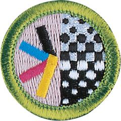

# Graphic Arts Merit Badge

## Overview

The field of graphic arts includes many kinds of work in the printing and publishing industries. Graphic arts professionals are involved in the creation of all kinds of printed communication, from business cards to books to billboards. The scope of printing communications is huge.

## Requirements

- (1) Review with your counselor the processes for producing printed communications: offset lithography, screen printing, electronic/digital, relief, and gravure. Collect samples of three products, each one produced using a different printing process, or draw diagrams to help you with your description.

  **Resources:** [Intro to Printmaking (video)](https://www.youtube.com/watch?v=lNoRrp17SJ4), [Learning About Printmaking (video)](https://www.youtube.com/watch?v=ns9_2SfhCtM%20)

- (2) Explain the differences between continuous tone, line, and halftone artwork. Describe how digital images can be created and/or stored in a computer.

  **Resources:** [Line Art, Continuous Tone and Halftone (website)](https://soma.sbcc.edu/users/Russotti/111/read_mes/111chpt6halftone.html), [Halftone Printing Explained for Screen Printers (video)](https://youtu.be/6u-1HjVQliY?si=rrlPTChjb_f5ya8b), [What Is a Digital Image?  (video)](https://www.youtube.com/watch?v=TVTn7mYKegY%20)

- (3) Design a printed piece (flyer, T-shirt, program, form, etc.). Explain your decisions for the typeface or typefaces you use and the way you arrange the elements in your design. Explain which printing process is best suited for printing your design. If desktop publishing is available, identify what hardware and software would be appropriate for outputting your design.

  **Resources:** [The Basics of Graphic Design (video)](https://www.youtube.com/watch?v=ZhTNQFWc_qg), [Best Graphic Designing Software (video)](https://www.youtube.com/watch?v=qtHong4fWT4)

- (4) Produce the design you created for requirement 3 using one of the following printing processes:

  **Resources:** [Prepress Tips - How to Set Up Your Digital Print Files Correctly (video)](https://www.youtube.com/watch?v=QxlB6rl8aNU%20)

  - (a) **Offset lithography** Make a layout, and produce a plate using a process approved by your counselor. Run the plate and print at least 50 copies.

    **Resources:** [Offset Lithography Demonstration (video)](https://youtu.be/e4GmiXXAvuA?si=OA6SjlwBdX0iURxc)
  - (b) **Screen printing** Make a hand-cut or photographic stencil and attach it to a screen that you have prepared. Mask the screen and print at least 20 copies.

    **Resources:** [The Basics of Screen Printing | Screen Printing Tutorial (video)](https://youtu.be/LB__fEeO6no?si=xnEBGmb6WHEazfXl)
  - (c) **Electronic/digital printing** Create a layout in electronic form, download it to the press or printer, and run 50 copies. If no electronic interface to the press or printer is available, you may print and scan a paper copy of the layout.

    **Resources:** [What Is Digital Printing? (video)](https://youtube.com/shorts/pxunJD8QqJI?si=gu4SKEaApL3YeDtw)
  - (d) **Relief printing** Prepare a layout or set the necessary type. Make a plate or lock up the form. Use this to print 50 copies.

    **Resources:** [Relief Printmaking (video)](https://youtu.be/vsMBA-1g-5U?si=MyzHQonzhXqkwloS)

- (5) **Postpress Operations.** Do the following:

  **Resources:** [Book Binding Options: What Type of Book Binding Should I Use? (website)](https://www.48hrbooks.com/publishing-resources/blog/138/book-binding-options-what-type-of-book-binding-should-i-use?), [Book Binding Types: Wire Coil, Saddle Stitching, Burst, Perfect Binding etc  (video)](https://youtu.be/t7eJKNFptzU?si=DDD-T90I4LBkQnM6)

  - (a) Discuss the finishing operations of padding, drilling, cutting, and trimming with your counselor.

    **Resources:** [Finishing in Printing (website)](https://www.colorvisionprinting.com/blog/finishing-in-printing-what-are-the-most-requested-options)
  - (b) Collect, describe, or identify examples of the following types of binding: perfect, spiral, plastic comb, saddle stitch, case.

- (6) Do ONE of the following, and then describe the highlights of your visit:
  - (a) Visit a newspaper printing plant: Follow a story from the editor to the press.

    **Resources:** [How The New York Times Is Made (video)](https://youtu.be/MrWP2z8I0Qk?si=zVnbTit-WqZa2BFD), [How Are Newspapers Made? (video)](https://www.youtube.com/watch?v=dEqMu7IVURE%20)
  - (b) Visit a retail, commercial, or in-plant printing facility. Follow a project from beginning to end.

    **Resources:** [Traditional Bookbinding | How It's Made (video)](https://youtu.be/DiCRx1_Ovok?si=B0uslGn7U9D6tGpI), [Flexographic Printing Basics (video)](https://www.youtube.com/watch?v=hTF_fgpWoTo%20)
  - (c) Visit a school's graphic arts program. Find out what courses are available and what the prerequisites are.

    **Resources:** [Study Graphic Arts | Winchester School of Art (video)](https://youtu.be/GsC6_Ibhpp8?si=rWPM21zZDOd728xX), [Top 50 Graphic Design Schools and Colleges in the U.S (website)](https://www.animationcareerreview.com/articles/top-50-graphic-design-schools-and-colleges-us-2023-rankings)
  - (d) With your parent or guardian's permission, visit three websites that belong to graphic arts professional organizations and/or printing-related companies (suppliers, manufacturers, printers). Print out or download product or service information from two of the sites.

    **Resources:** [GCEA - Graphic Communicators Education Association (website)](https://www.gceaonline.org/), [Book Arts Associations (website)](https://guildofbookworkers.org/book-arts-organization)

- (7) Find out about three career opportunities in graphic arts. Pick one and find out the education, training, and experience required for this profession. Discuss this with your counselor, and explain why this profession might interest you.

  **Resources:** [Desktop Publishing as a Career (video)](https://www.youtube.com/watch?v=tuP-G9wJxmY%20), [Printing Press Operators (video)](https://www.youtube.com/watch?v=hOArtAsYeP8%20), [Graphic Design and Printing Career Guide (website)](https://www.khake.com/page27.html)

## Resources

- [Graphic Arts merit badge page](https://www.scouting.org/merit-badges/graphic-arts/)
- [Graphic Arts merit badge PDF](https://filestore.scouting.org/filestore/Merit_Badge_ReqandRes/Pamphlets/Graphic%20Arts.pdf) ([local copy](files/graphic-arts-merit-badge.pdf))
- [Graphic Arts merit badge pamphlet](https://www.scoutshop.org/graphic-arts-merit-badge-pamphlet-648314.html)
- [Graphic Arts merit badge workbook PDF](http://usscouts.org/mb/worksheets/Graphic-Arts.pdf)
- [Graphic Arts merit badge workbook DOCX](http://usscouts.org/mb/worksheets/Graphic-Arts.docx)

Note: This is an unofficial archive of Scouts BSA Merit Badges that was automatically extracted from the Scouting America website and may contain errors.