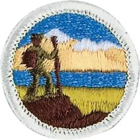

# Hiking Merit Badge

## Overview

**Eagle required**

Hiking is a terrific way to keep your body and mind in top shape, both now and for a lifetime. Walking packs power into your legs and makes your heart and lungs healthy and strong. Exploring the outdoors challenges you with discoveries and new ideas. Your senses will improve as you use your eyes and ears to gather information along the way.

## Requirements

- **NOTE: The required hikes for this badge may be used in fulfilling hiking requirements for rank advancement. However, these hikes cannot be used to fulfill requirements of other merit badges.**

- (1) Do the following:
  - (a) Explain to your counselor the most likely hazards you may encounter while hiking, and what you should do to anticipate, help prevent, mitigate and respond to these hazards.

    **Resources:** [Surviving the Wild - Essential Hiking Safety Tips (video)](https://youtu.be/YGQG0C0HBGw?si=aOL6J4mdZXt51LDC)
  - (b) Show that you know first aid for injuries or illnesses that could occur while hiking, including hypothermia, frostbite, dehydration, heat exhaustion, heatstroke, sunburn, hyperventilation, altitude sickness, sprained ankle, blisters, insect stings, tick bites, and snakebite.

    **Resources:** [Backpacking First Aid (What To Carry + Foot Care, Snakes, Poison Plants, Hypothermia, etc) (video)](https://youtu.be/nxExCQiWa_U?si=E-FC1vbHZYI0vxhb), [How to Apply a Compression Wrap for a Sprained Ankle (picture)](https://filestore.scouting.org/filestore/Merit_Badge_ReqandRes/Requirement%20Resources/Hiking/compression%20wrap%20graphic.jpeg)

- (2) Do the following:
  - (a) Explain and, where possible, show the points of good hiking practices including proper outdoor ethics, hiking safety in the daytime and at night, courtesy to others, choice of footwear, and proper care of feet and footwear.

    **Resources:** [The ONE Tip You Need to Choose Between Hiking Boots, Shoes, and Trail Runners (video)](https://youtu.be/liJtac-GvZw?si=ToQQv90HyVEIqwe_)
  - (b) Read aloud or recite the Leave No Trace Seven Principles, and discuss why each is important while hiking.

    **Resources:** [Principles of LNT (video)](https://youtu.be/Rpq01rO9ZR0?si=hjjnThExBUjG0aIW), [Principles of LNT (website)](https://lnt.org/why/7-principles/)
  - (c) Read aloud or recite the Outdoor Code, and give examples of how to follow it on a hike.

    **Resources:** [The Outdoor Code (website)](https://www.scouting.org/outdoor-programs/outdoor-ethics/outdoor-code/)

- (3) Explain how hiking is an aerobic activity. Develop a plan for conditioning yourself for 10-mile hikes, and describe how you will increase your fitness for longer hikes.

  **Resources:** [Planning and Training for a Hike (video)](https://youtu.be/XRaT-02V6_Q?si=KWpuleheaJYZVlBd), [Training for Elevation Gain (video)](https://youtu.be/wrAzopMgriU?si=POvk4jZLbzeTos5t)

- (4) Take four 10-mile hikes and one 20-mile hike, each on a different day, and each of continuous miles. Prepare a written hike plan before each hike and share it with your counselor or a designee for approval before starting the hike. Include map routes, a clothing and equipment list, and a list of items for a trail lunch. You may stop for as many short rest periods as needed, as well as one meal, during each hike, but not for an extended period such as overnight.

  **Resources:** [Maps and Ideas for Hikes (website)](https://www.hikingproject.com/)

  - (a) 10-mile hike #1
  - (b) 10-mile hike #2
  - (c) 10-mile hike #3
  - (d) 10-mile hike #4
  - (e) 20-mile hike.

- (5) After each of the hikes (or during each hike if on one continuous trek) in requirement 4, write a short report on your hike. For each hike, give the date and description (or map) of the route covered, the weather, any interesting things you saw, and any challenges you had and how you overcame them. It may include something you learned about yourself, about the outdoors, or about others you were hiking with. Share this with your counselor.

## Resources

- [Hiking merit badge page](https://www.scouting.org/merit-badges/hiking/)
- [Hiking merit badge PDF](https://filestore.scouting.org/filestore/Merit_Badge_ReqandRes/Pamphlets/Hiking.pdf) ([local copy](files/hiking-merit-badge.pdf))
- [Hiking merit badge pamphlet](https://www.scoutshop.org/scouts-bsa-hiking-merit-badge-pamphlet-es-662397.html)
- [Hiking merit badge workbook PDF](http://usscouts.org/mb/worksheets/Hiking.pdf)
- [Hiking merit badge workbook DOCX](http://usscouts.org/mb/worksheets/Hiking.docx)

Note: This is an unofficial archive of Scouts BSA Merit Badges that was automatically extracted from the Scouting America website and may contain errors.