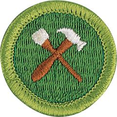

# Home Repairs Merit Badge

## Overview

Successfully completing this badge’s requirements can lead to a lifetime of personal and financial rewards: Doing basic home repairs provides a sense of personal pride in one’s achievements and increased self-confidence. In addition, safe and successful do-it-yourselfers can easily save a family thousands of dollars in repair bills over the years.

## Requirements

- **Note: A parent, guardian, or the counselor may supervise the Scout's work on any Home Repairs requirements.**

- (1) Do the following:
  - (a) Explain to your counselor the most likely hazards you may encounter while working on home repairs and what you should do to anticipate, mitigate and prevent, and respond to these hazards. Describe the appropriate safety gear and clothing that should be used when working on home repairs.

    **Resources:** [Avoid These 9 Worst DIY Injuries/Accidents From Common Tools! (video)](https://youtu.be/AjlWEb-xbhk?si=771ghgOjwxKPkH4K), [DIY Home Maintenance | Ladder Safety (video)](https://youtu.be/JL0hj-VAeBg?si=k6vPGJ6xmjspfCrr)
  - (b) Discuss general precautions related to home repairs. Name at least 10 safe practices that every home repairer should exercise.

    **Resources:** [10 Rules for Safety (video)](https://www.youtube.com/shorts/BVCmz9KnwWk)

- (2) Under the supervision of your parent, guardian, or counselor, do THREE of the following:
  - (a) Maintain or recondition a yard tool and show that you know how to clean up and properly store this equipment.

    **Resources:** [How to Clean & Sharpen Your Garden Tools (video)](https://www.youtube.com/watch?v=YzpKDkIOkJM)
  - (b) Weather strip a window or door.

    **Resources:** [How to Install Weatherstripping (video)](https://www.youtube.com/watch?v=E3JK2zMR53c)
  - (c) Caulk cracks or joints open to the weather.

    **Resources:** [The Secrets to Great Exterior Caulking (Windows, Doors, Trims)! (video)](https://www.youtube.com/watch?v=lS0wiWLFzMw)
  - (d) Repair a break in a concrete or asphalt surface.

    **Resources:** [How to Fill Asphalt Gaps and Cracks (video)](https://youtu.be/aI3ayjrVJl0?si=UictxFsIutZfuokV), [Repairing a Neglected Driveway Crack (video)](https://youtu.be/xk2lT9D_0wY?si=iclrw2XUIzZ0b5Di)
  - (e) Repair or replace the screen in a window or door.

    **Resources:** [How to Repair a Window Screen (video)](https://youtu.be/t7emMleueHg)
  - (f) Replace a pane of glass.

    **Resources:** [How to Replace a Broken Window Pane (video)](https://youtu.be/Dc67opK57sk?si=xnMQ0ueGHn6NUdtN)

- (3) Under the supervision of your parent, guardian, or counselor, do THREE of the following:
  - (a) Install or build equipment for storing tools.

    **Resources:** [80 Tool Storarge Ideas (video)](https://www.youtube.com/watch?v=txhES7lKfCI), [Easy Scrap Wood Yard Tool Organizer (video)](https://www.youtube.com/shorts/L0CgzmPzOeI)
  - (b) Build a workbench.

    **Resources:** [DIY Simple Workbench (video)](https://www.youtube.com/watch?v=TRp4FaT24BA)
  - (c) Repair a piece of furniture.

    **Resources:** [Sofa Leg Frame Repair (video)](https://www.youtube.com/watch?v=X_3jmub6U0g), [Fix Split Furniture with Wood Glue (video)](https://www.youtube.com/watch?v=66rQe_aB1v0)
  - (d) Paint or varnish a piece of furniture, a door, or trim on a house.

    **Resources:** [Refurbishing a Table  (video)](https://youtube.com/shorts/bIis1JZHoKI?si=OxxplR648XUIuUcE), [3 BIG Door Painting Mistakes DIYers Don't Know They're Making (video)](https://youtu.be/cKOgJmwtigA?si=boGzDnTPu5HUT2KE)
  - (e) Repair a sagging door or gate.

    **Resources:** [How to Fix a Sagging Door That's Rubbing or Won't Close!!! (video)](https://www.youtube.com/watch?v=ZcDj6g2UODw)
  - (f) Repair a loose step or railing.

    **Resources:** [How to Repair a Broken Stair Tread (video)](https://www.youtube.com/watch?v=b4ixXEoCMRw), [How to Repair a Loose Newel Post  (video)](https://youtu.be/u6_TNkcGL5I?si=IZ3WIUKz3Ldi2VXw)
  - (g) Repair a fence.

    **Resources:** [How to Repair a Fence (video)](https://www.youtube.com/watch?v=y1ZIZhl-Cik)

- (4) Under the supervision of your parent, guardian, or counselor, do TWO of the following:
  - (a) Locate a main electrical switch box and know how to replace a fuse or reset a circuit breaker.

    **Resources:** [How to Replace Fuses and Reset Breakers (video)](https://www.youtube.com/watch?v=bHQMCovwwAo), [How Fuses and Circuit Breakers Work (video)](https://youtu.be/gDBUqeqx5t4?si=mekwTqgiejSBx6OJ)
  - (b) Replace an electrical cord or repair a plug or lamp socket.

    **Resources:** [How to Replace a Lamp Cord (video)](https://youtu.be/SsvPe1bo2Qs?si=I7LQZlgGuur8XkG3)
  - (c) Install a single-pole light switch.

    **Resources:** [How to Replace a Light Switch (video)](https://www.youtube.com/watch?v=HreHB638a2g)
  - (d) Replace an electrical wall outlet.

    **Resources:** [How to Replace Outlets, Light Switches and GFCI Plugs (video)](https://youtu.be/drsaKC6_gYw?si=xfZ534IbYV6IsYgI), [How to Change an Outlet (video)](https://www.youtube.com/watch?v=OC-b-00d-R0)

- (5) Under the supervision of your parent, guardian, or counselor, locate and know how to turn off the main water source, including well pumps, and do TWO of the following:

  **Resources:** [Two Methods to Turn Off Your Homes Water Supply (video)](https://youtu.be/aDkaq8RKFAc?si=pLStQ8VDEfPAyLUX), [Main Water Shutoff Valve for Private Pumps and Wells (video)](https://youtu.be/QKUWWgr2kcQ), [How to Shut Off the Water Main to Your Home (video)](https://youtu.be/4RhYOAygA7I?si=FQPSokR-DPv43nQz)

  - (a) Clear a clogged drain or trap.

    **Resources:** [How to Unclog Any Drain (video)](https://www.youtube.com/watch?v=LpDLynrXln8)
  - (b) Repair a leaky water faucet.

    **Resources:** [How to Repair a Leaking Faucet (video)](https://www.youtube.com/watch?v=zMH61Yabdj0)
  - (c) Repair a flush toilet.

    **Resources:** [How to Fix a Running Toilet: The Two Most Common Causes (video)](https://www.youtube.com/watch?v=NQ2AXvqgfPM), [Fix a Running Toilet...Fill Valve Replacement (video)](https://www.youtube.com/watch?v=7K6pcLYrJJs)
  - (d) Repair a leaky hose or connector.

    **Resources:** [How to Repair a Garden Hose (video)](https://www.youtube.com/watch?v=aOmnHQMBEW4)
  - (e) Clean or replace a sprinkler head.

    **Resources:** [Replace a Sprinkler Head in 5 Minutes (video)](https://www.youtube.com/watch?v=Fu9rKGWbbMw), [How to Clean a Sprinkler Head (video)](https://www.youtube.com/watch?v=K6qXBbpL8VE)

- (6) Under the supervision of your parent, guardian, or counselor, do THREE of the following:
  - (a) Paint a wall or ceiling.

    **Resources:** [How to Paint a Wall (video)](https://www.youtube.com/watch?v=ftDSnccAx_Q)
  - (b) Repair or replace damaged tile, linoleum, or vinyl flooring.

    **Resources:** [How to Patch a Sheet Vinyl Floor (video)](https://www.youtube.com/watch?v=hPh6XEDUHeE)
  - (c) Install drapery or curtain rods and then hang drapes or curtains.

    **Resources:** [How to Hang Curtain Rods (video)](https://www.youtube.com/watch?v=bJr6jPYs5_I)
  - (d) Repair a hole in drywall.

    **Resources:** [How to Patch a Drywall Hole (video)](https://youtu.be/PLGmTzEGSIY)
  - (e) Secure a picture, plant hanger, or other object approved by your parent or guardian to drywall using anchors.

    **Resources:** [How to Use Drywall Anchors for Hanging Pictures and More (video)](https://youtu.be/WL7ha82XrxI)
  - (f) Reinforce a picture frame.

    **Resources:** [How to Reinforce Wood Picture Frame Corners (video)](https://www.youtube.com/watch?v=c7s3EVrUx78), [Reinforced Picture Frame (video)](https://www.youtube.com/watch?v=Q3e_kbg-EmM)
  - (g) Mend an object made of china, glass, or pottery.

    **Resources:** [How To Fix Broken Ceramics (video)](https://www.youtube.com/watch?v=Rg4q0g8zXi8), [The Best Trick for Fixing Broken Ceramics (video)](https://www.youtube.com/watch?v=M2vtfNxHVv0)
  - (h) Fix a drawer slide or fix/replace cabinet pulls.

    **Resources:** [How to Repair and Replace Broken Plastic Drawer Guides (video)](https://youtu.be/52B3gGZ_AtE?si=h9gz40ON9llrkClY), [How to Repair a Drawer Slide (video)](https://youtu.be/7Mp60UHj0Yw?si=gsV2wsY2K5NHg-G5)

- (7) Do ONE of the following:
  - (a) Explore careers related to this merit badge. Research one career to learn about the training and education needed, costs, job prospects, salary, job duties, and career advancement. Your research methods may include—with your parent or guardian's permission—an internet or library search, an interview with a professional in the field, or a visit to a location where people in this career work. Discuss with your counselor both your findings and what about this profession might make it an interesting career.

    **Resources:** [Maintenaince and Repair Workers Careers (video)](https://youtu.be/I_mhZjRcH5s)
  - (b) Explore how you could use knowledge and skills from this merit badge to pursue a hobby or healthy lifestyle. Research any training needed, expenses, and organizations that promote or support it. Discuss with your counselor what short-term and long-term goals you might have if you pursued this.

    **Resources:** [Mastering DIY Home Repairs (video)](https://www.youtube.com/shorts/Nj_S3xl2GYg)

## Resources

- [Home Repairs merit badge page](https://www.scouting.org/merit-badges/home-repairs/)
- [Home Repairs merit badge PDF](https://filestore.scouting.org/filestore/Merit_Badge_ReqandRes/Pamphlets/Home%20Repairs.pdf) ([local copy](files/home-repairs-merit-badge.pdf))
- [Home Repairs merit badge pamphlet](https://www.scoutshop.org/home-repairs-merit-badge-pamphlet-656899.html)
- [Home Repairs merit badge workbook PDF](http://usscouts.org/mb/worksheets/Home-Repairs.pdf)
- [Home Repairs merit badge workbook DOCX](http://usscouts.org/mb/worksheets/Home-Repairs.docx)

Note: This is an unofficial archive of Scouts BSA Merit Badges that was automatically extracted from the Scouting America website and may contain errors.