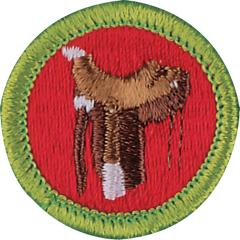

# Horsemanship Merit Badge

## Overview

In addition to learning how to safely ride and care for horses, Scouts who earn this merit badge will gain an understanding of the instincts and behaviors of horses and humane and effective methods for training horses.

## Requirements

* NOTE:  The official merit badge pamphlets are now free and downloadable  [HERE](https://filestore.scouting.org/filestore/Merit_Badge_ReqandRes/Pamphlets/Horsemanship.pdf) or can be purchased at the [Scout Shop.](https://www.scoutshop.org/)
* (1) Do the following:
    * (a) Describe the safety precautions you should take when handling and caring for a horse. Resource: [Safety Precautions When Handling Horses (video)](https://youtu.be/B5KeqtLZoUA?si=FD2BQR4jCnU4E6OS)
    * (b) Describe the fire safety precautions you should take in a barn and around horses. Resource: [Barn Fire Safety (video)](https://youtu.be/w-05f23oJVA)

* (2) Name 15 parts of a horse and discuss the function of each with your counselor. Resources: [Parts of a Horse (video)](https://youtu.be/y369q1jh8HQ)  [Parts of a Horse (filled) (PDF)](https://filestore.scouting.org/filestore/Merit_Badge_ReqandRes/Requirement%20Resources/Horsemanship/Parts%20of%20a%20Horse.jpg)  [Parts of a Horse (blank) (PDF)](https://filestore.scouting.org/filestore/Merit_Badge_ReqandRes/Requirement%20Resources/Horsemanship/Parts%20of%20a%20Horse%20-%20blank%20worksheet.pdf)
* (3) Name four breeds of horses. Explain the special features for which each breed is known. Resources: [Ten Popular Horse Breeds (video)](https://youtu.be/FiBBNX8WszQ)  [Six Popular Horse Breeds (video)](https://youtu.be/jwZj65SHdcw?si=hK8GTTDsRlUT5kAZ)
* (4) Describe the symptoms of colic. Name and describe four other horse health problems. Resource: [Health Problems in Horses (video)](https://youtu.be/_ZeUDXMmSXE?si=mw4HfkBBedTRvh5a)
* (5) Explain what conformation is and why it is important. Explain the difference between lameness and unsoundness. Resources: [Lameness vs. Unsoundness (video)](https://www.youtube.com/shorts/Ica4d4jK2eo)  [Signs of Lameness (video)](https://youtu.be/c9Mn9RP39lE?si=T2D88HPDsxFjWU8v)
* (6) Explain the importance of hoof care and why a horse might need to wear shoes. Resource: [How to Clean Horse Hooves (video)](https://youtu.be/whbZsicSv-k)
* (7) Demonstrate how to groom a horse, including picking hooves and caring for a horse after a ride. Resources: [Caring for a Horse (video)](https://youtu.be/fdGhd2phEHs)  [How to Groom a Horse (video)](https://youtu.be/9Leym8QeBM8)
* (8) Explain how to determine what and how much to feed a horse and why the amount and kind of feed are changed according to the activity level and the breed of horse. Resource: [What Do Horses Eat? (video)](https://youtu.be/AcgfzGhaoes)
* (9) Do the following:
    * (a) Name 10 parts of the saddle and bridle that you will use, and explain how to care for this equipment. Resource: [Parts of a Saddle (video)](https://www.youtube.com/watch?v=CXkV6LxGJF8)
    * (b) Show how to properly saddle and bridle a horse. Resources: [How to Saddle a Horse (video)](https://youtu.be/MZHl9zBHD10) [How to Bridle a Horse (video)](https://youtu.be/sI7A5aTFUnE)
    * (c) Demonstrate how to safely mount and dismount a horse. Resources: [Using a Mounting Block and Adjusting Tack (video)](https://youtu.be/a40XR220wd8?si=yAKM4J6yhQAYZufm) [Mounting and Dismounting a Horse (video)](https://youtu.be/p3T7tUwyNBg?si=Rnuup5QA8iw_DLlU) [How to Mount a Horse (video)](https://youtu.be/CafSxVC-1I8) [How to Ride a Horse  (video)](https://youtu.be/NC9Tr2hXfFk?si=-mIGi5Woskl7jBPn)

* (10) Explain and demonstrate how to approach and lead a horse safely from a stall, corral, or field and how to tie the horse securely. Resource: [How to Lead a Horse (video)](https://youtu.be/AsP38UPNHvI)
* (11) On level ground, continuously do the following movements after safely mounting the horse. Do them correctly, at ease, and in harmony with the horse. Resources: [How to Steer Your Horse (video)](https://youtu.be/uZ_5lxUyCdw)  [How to Ride a Horse (video)](https://youtu.be/fV7kuUrjutY)  [Riding Despite Physical Challenges (video)](https://youtu.be/oFy6FqQ_PXM?si=Qk7V2jJdKykcp9il)
    * (a) Walk the horse in a straight line for 60 feet.
    * (b) Walk the horse in a half-circle of not more than 16 feet in radius.
    * (c) Trot or jog the horse in a straight line for 60 feet. Resource: [How to Trot a Horse (video)](https://youtu.be/-3CMZSbQRgg)
    * (d) Trot or jog the horse in a half-circle of not more than 30 feet in radius. Resource: [Tips for Trotting (video)](https://youtu.be/KCSkmYEQxEg?si=ET5yK-3VM_Pjzae3)
    * (e) Halt straight. Resource: [How to Stop Your Horse (video)](https://youtu.be/GJ0Y_ZaCSmo)
    * (f) Back up straight four paces. Resource: [How to Back Up a Horse (video)](https://youtu.be/aolJGYfOZI0)
    * (g) Halt and dismount. Resource: [Mount and Dismount a Horse (video)](https://youtu.be/vBdXfiNXu7I?si=Cb12AYTlH2J_lbtg)

## Resources

- [Horsemanship merit badge page](https://www.scouting.org/merit-badges/horsemanship/)
- [Horsemanship merit badge PDF](https://filestore.scouting.org/filestore/Merit_Badge_ReqandRes/Pamphlets/Horsemanship.pdf) ([local copy](files/horsemanship-merit-badge.pdf))
- [Horsemanship merit badge pamphlet](https://www.scoutshop.org/horesemanship-merit-badge-pamphlet-662399.html)

Note: This is an unofficial archive of Scouts BSA Merit Badges that was automatically extracted from the Scouting America website and may contain errors.