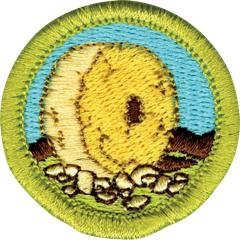

# Inventing Merit Badge

## Overview

Inventing involves finding technological solutions to real-world problems. Inventors understand the importance of inventing to society because they creatively think of ways to improve the lives of others. Explore the world of inventing through this new merit badge, and discover your inner inventiveness.

## Requirements

- (1) In your own words, define inventing. Then do the following:

  **Resources:** [What Is Invention (video)](https://youtu.be/n5h01jhICwQ)

  - (a) Explain to your counselor the role of inventors and their inventions in the economic development of the United States.

    **Resources:** [The Industrial Revolution: Inventions and Changes (video)](https://youtu.be/sSBq9A9GwAk), [What Is Economic Development (video)](https://youtu.be/FGwdpJrfTec)
  - (b) List three inventions and state how they have helped humankind.

    **Resources:** [Top 5 Inventions That Changed the World (video)](https://youtu.be/TepBC9dWQZM), [7 Inventions That Changed The World (video)](https://youtu.be/lcc-HnMmsXA)

- (2) Do ONE of the following:
  - (a) With your parent or guardian's permission and counselor's approval, interview an adult who has invented a useful item or process. Report what you learned to your counselor.

    **Resources:** [National Inventors Hall of Fame Inductees Have Changed the World (website)](https://www.invent.org/inductees)
  - (b) Read about three inventors. Select the one you find most interesting and tell your counselor what you learned.

- (3) Do the following:
  - (a) Define the term intellectual property. Explain which government agencies oversee the protection of intellectual property, the types of intellectual property that can be protected, how such property is protected, and why protection is necessary.

    **Resources:** [What Is Intellectual Property & Why Do I Care (video)](https://youtu.be/rDKxuTi2Cmk), [Intellectual Propert Law: The Basics of Patent Law (video)](https://youtu.be/Ay9fZMUPCnE), [Tips for Protecting Your Business's Intellectual Property (video)](https://youtu.be/bQbW_XEYibs)
  - (b) Explain the components of a patent and the different types of patents available.

    **Resources:** [What Are the Types of Patents? (video)](https://youtu.be/lERq71WVjgM)
  - (c) Examine your Scouting gear and find a patent number on a camping item you have used. With your parent or guardian's permission, use the internet to find out more about that patent. Compare the finished item with the claims and drawings in the patent. Report what you learned to your counselor.

    **Resources:** [US Patent and Trade Office Basic Search (website)](https://ppubs.uspto.gov/basic/)
  - (d) Explain to your counselor the term patent infringement.

    **Resources:** [Patent Infringement (video)](https://youtu.be/o5nlV9OSgyg)

- (4) Discuss with your counselor the types of inventions that are appropriate to share with others, and explain why. Tell your counselor about one unpatented invention and its impact on society.

  **Resources:** [Unlucky Inventors Who Never Got To Cash In (video)](https://youtu.be/B8PuOS0J6Ro)

- (5) Choose a commercially available product that you have used on an overnight camping trip with your troop. Make recommendations for improving the product, and make a sketch that shows your recommendations. Discuss your recommendations with your counselor.

- (6) Think of an item you would like to invent that would solve a problem for your family, troop, chartered organization, community, or a special-interest group. Then do the following, while keeping a notebook to record your progress.

  **Resources:** [Inventing 101 (video)](https://youtu.be/StdwWpbokcw), [Little Inventors: How To Think Up Invention Ideas (video)](https://youtu.be/ERFgorcRCJY), [Turning Imagination into Reality (video)](https://youtu.be/JJU_Echi2tk)

  - (a) Talk to potential users of your invention and determine their needs. Then, based on what you have learned, write a statement describing the invention and how it would help solve a problem. This statement should include a detailed sketch of the invention.

    **Resources:** [User Needs Statement in Design Thinking (video)](https://youtu.be/kT0ZqwdPYRM), [The Secret to Successfully Pitching an Idea (video)](https://youtu.be/l0hVIH3EnlQ), [How To Make a Virtual "Frankenstein" Prototype Feat (video)](https://youtu.be/ooBRwIDQRdw)
  - (b) Create a model of the invention using clay, cardboard, or any other readily available material. List the materials necessary to build a working prototype of the invention.

    **Resources:** [How To Make a Cardboard Prototype (video)](https://youtu.be/k_9Q-KDSb9o)
  - (c) Share the idea and the model with your counselor and potential users of your invention. Record their feedback in your notebook.

- (7) Build a working prototype of the item you invented for requirement 6. Test and evaluate the invention. Among the aspects to consider in your evaluation are cost, usefulness, marketability, appearance, and function. Describe how your original vision and expectations for your invention are similar or dissimilar to the prototype you built. Have your counselor evaluate and critique your prototype.**Note:** Before you begin building the prototype, you must have your counselor's approval, based on the design and building plans you have already shared.

  **Resources:** [How To Build Prototypes! (video)](https://youtu.be/k_9Q-KDSb9o)

- (8) Do ONE of the following:
  - (a) Participate with a club or team (robotics team, science club, or engineering club) that builds a useful item. Share your experience with your counselor.

    **Resources:** [About FIRST Robotics Competition (2021) (video)](https://youtu.be/Jd29kzjclV0), [About VEX Robotics (video)](https://youtu.be/Mi6E37oU8yc)
  - (b) Visit a museum or exhibit dedicated to an inventor or invention, and create a presentation of your visit to share with a group such as your troop or patrol.

    **Resources:** [National Museum's Database (website)](https://museumsdatabase.com/), [National Inventors Hall of Fame (website)](https://www.invent.org/museum/exhibits), [Smithsonian's Lemelson Center (website)](https://invention.si.edu/), [National Inventors Hall of Fame and Museum (website)](https://www.uspto.gov/about-us/uspto-locations/alexandria-va/national-inventors-hall-fame-and-museum)

- (9) Discuss with your counselor the diverse skills, education, training, and experience it takes to be an inventor. Discuss how you can prepare yourself to be creative and inventive to solve problems at home, in school, and in your community. Discuss three career fields that might utilize the skills of an inventor.

  **Resources:** [Meaningful Soft Skills for Inventors (video)](https://youtu.be/WErRJ581SIQ), [What Does It Take To Be an Inventor? (video)](https://youtu.be/3sUHYD728s0), [10 Best Companies for Inventors (website)](https://www.zippia.com/inventor-jobs/best-companies-for-inventors/), [Work of an Examinor (video)](https://youtu.be/ZKuNaN3Dqis), [Why a Career in Science Is for Me (video)](https://youtu.be/Jm2rB29enN4)

## Resources

- [Inventing merit badge page](https://www.scouting.org/merit-badges/inventing/)
- [Inventing merit badge PDF](https://filestore.scouting.org/filestore/Merit_Badge_ReqandRes/Pamphlets/Inventing.pdf) ([local copy](files/inventing-merit-badge.pdf))
- [Inventing merit badge pamphlet](https://www.scoutshop.org/inventing-merit-badge-pamphlet-654378.html)
- [Inventing merit badge workbook PDF](http://usscouts.org/mb/worksheets/Inventing.pdf)
- [Inventing merit badge workbook DOCX](http://usscouts.org/mb/worksheets/Inventing.docx)

Note: This is an unofficial archive of Scouts BSA Merit Badges that was automatically extracted from the Scouting America website and may contain errors.