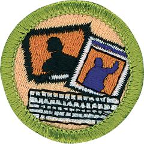

# Journalism Merit Badge

## Overview

One thing is for sure about journalism: It is never boring. For a reporter, almost every day is different from the last. One day you might interview the mayor of the city, the next day report on a car accident, and the day after that preview a new movie.

## Requirements

* NOTE:  The official merit badge pamphlets are now free and downloadable  [HERE](https://filestore.scouting.org/filestore/Merit_Badge_ReqandRes/Pamphlets/Journalism.pdf) or can be purchased at the [Scout Shop.](https://www.scoutshop.org/)
* (1) Explain what freedom of the press is and how the First Amendment  guarantees that you can voice your opinion. In your discussion, tell how  to distinguish between fact and opinion, and explain the terms libel,  slander, defamation, fair comment and criticism, public figure, privacy,  and malice. Discuss how these matters relate to ethics in journalism.
* (2) Do ONE of the following:
    * (a) Newspaper, magazine, and online journalism (with your parent or guardian's permission).
        * (1) On the same day, read a local news source or newspaper, a national news source or newspaper, a news magazine (online or printed) and a social media news feed. From each source, clip, read, and compare a story about the same event. Tell your counselor how long each story is and how fair and accurate the stories are in presenting different points of view. Tell how each source handled the story.
        * (2) Visit the office of a newspaper, magazine, or internet news site. Ask for a tour of the various divisions (editorial, business, and printing). During your tour, talk to an executive from the business side about management's relations with reporters, editors, and photographers and what makes a "good" newspaper, magazine, or internet news site.

    * (b) Radio and television journalism
        * (1) All on the same day, watch a local and national network newscast, listen to a radio newscast, and (with your parent or guardian's permission) view a national broadcast news source online. List the different news items and features presented, the different elements used, and the time in minutes and seconds and the online space devoted to each story. Compare the story lists and discuss whether the stories are fair and accurate. Explain why different news outlets treated the stories differently and/or presented a different point of view.
        * (2) Visit a radio or television station. Ask for a tour of the various departments, concentrating on those related to news broadcasts. During your tour, talk to the station manager or other station management executive about station operations, particularly how management and the news staff work together, and what makes a "good" station. If possible, go with a reporter to cover a news event.

* (3) Discuss the differences between a hard news story and a feature story. Explain what is the "five W's and H." Then do ONE of the following:
    * (a) Choose a current or an unusual event of interest to you, and write either a hard news article OR a feature article about the event. Gear the article for print OR audio OR video journalism. Share your article with your counselor.
    * (b) With your parent or guardian's permission and counselor's approval, interview someone in your community who is influential because of his or her leadership, talent, career, or life experiences. Then present to your counselor either a written or oral report telling what you learned about this person.
    * (c) With your parent or guardian's permission and counselor's approval, read an autobiography written by a journalist you want to learn more about. Write an article that tells what you learned about this person and the contributions this person has made to the field of journalism.
    * (d) Attend a Scouting event and write a 200-word article (feature or hard news) about the event. Use either the inverted pyramid style or the chronological style. Review the article with your counselor, then submit it to your community newspaper or Scouting America local council or district newsletter for consideration.

* (4) Attend a public event and do ONE of the following:
    * (a) Write two articles about the event, one using the inverted pyramid style and one using the chronological style.
    * (b) Using a radio, television, or podcasting style, write a news story, a feature story, and a critical review of the event.
    * (c) Take a series of photographs to help tell the story of the event in pictures. Include news photos and feature photos in your presentation. Write a brief synopsis of the event as well as captions for your photos.

* (5) Find out about three career opportunities in journalism. Pick one and find out the education, training, and experience required for this profession. Discuss this with your counselor, and explain why this profession might interest you.

## Resources

- [Journalism merit badge page](https://www.scouting.org/merit-badges/journalism/)
- [Journalism merit badge PDF](https://filestore.scouting.org/filestore/Merit_Badge_ReqandRes/Pamphlets/Journalism.pdf) ([local copy](files/journalism-merit-badge.pdf))
- [Journalism merit badge pamphlet](https://www.scoutshop.org/mbp-4c-journalism-629415.html)

Note: This is an unofficial archive of Scouts BSA Merit Badges that was automatically extracted from the Scouting America website and may contain errors.