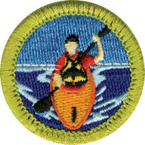

# Kayaking Merit Badge

## Overview

Kayaking has become one of the fastest-growing paddlesports in the United States. An estimated nine million Americans enjoy this sport. The most popular style of kayaking is recreational kayaking, followed by touring/sea kayaking, and whitewater kayaking. This merit badge will introduce you to recreational kayaking and help prepare you for advanced paddlesports such as tour/sea and whitewater kayaking.

## Requirements

* NOTE:  The official merit badge pamphlets are now free and downloadable  [HERE](https://filestore.scouting.org/filestore/Merit_Badge_ReqandRes/Pamphlets/Kayaking.pdf) or can be purchased at the [Scout Shop.](https://www.scoutshop.org/)
* (1) Do the following:
    * (a) Explain to your counselor the hazards you are most likely to encounter while participating in kayaking activities, including weather and water-related hazards, and what you should do to anticipate, help prevent, mitigate, and respond to these hazards.
    * (b) Review prevention, symptoms, and first-aid treatment for the following injuries or illnesses that can occur while kayaking: blisters, cold-water shock and hypothermia, heat-related illnesses, dehydration, sunburn, sprains, and strains.
    * (c) Review the Scouting America Safety Afloat policy. Explain to your counselor how this applies to kayaking.

* (2) Before doing requirements 3 through 8, successfully complete the Scouting America swimmer test: Jump feetfirst into water over the head in depth. Level off and swim 75 yards in a strong manner using one or more of the following strokes: sidestroke, breaststroke, trudgen, or crawl; then swim 25 yards using an easy, resting backstroke. The 100 yards must be completed in one swim without stops and must include at least one sharp turn. After completing the swim, rest by floating.
* (3) Do the following:
    * (a) Review the characteristics of life jackets most appropriate for kayaking and understand why one must always be worn while paddling. Then demonstrate how to select and fit a life jacket for kayaking.
    * (b) Review the importance of safety equipment such as a signal device, extra paddle, sponge, bilge pump, flotation bags, and throw bag.

* (4) Do the following:
    * (a) Name and point out the major parts of a kayak.
    * (b) Review the differences in the design between recreational, whitewater, and sea or touring kayaks. Include how length, width, stability, and rocker are involved in the design of each type.
    * (c) Explain the care, maintenance, and storage of a kayak.

* (5) Discuss the following:
    * (a) Correct methods for the use of a kayak paddle.
    * (b) Parts of a paddle.
    * (c) The care and maintenance of a paddle.

* (6) Using a properly equipped kayak with an open cockpit, a sit-on-top, or an inflatable kayak, do the following:
    * (a) Safely capsize and perform a wet exit.
    * (b) Reenter the kayak with assistance from a buddy boat.
    * (c) Demonstrate a kayak-over-kayak rescue.
    * (d) Demonstrate the HELP position.
    * (e) Capsize the kayak, swim it and the paddle to shore, and empty water from the kayak with assistance if needed.

* (7) As a solo paddler, use a properly equipped kayak to demonstrate the following:
    * (a) Forward stroke
    * (b) Backstroke
    * (c) Forward sweep
    * (d) Reverse sweep
    * (e) Draw stroke
    * (f) Stern draw.

* (8) As a solo paddler, use a properly equipped kayak to demonstrate the following:
    * (a) Paddle a straight line for 15 to 20 boat lengths using appropriate strokes while maintaining trim and balance of the kayak.
    * (b) Spin or pivot from a stationary position 180 degrees (half circle) to the right and left within two boat lengths.
    * (c) Move abeam to the right 10 feet and to the left 10 feet.
    * (d) Stop the boat in one boat length.
    * (e) While maintaining forward motion, turn the kayak 90 degrees to the right and left.
    * (f) Move the kayak backward three to four boat lengths using appropriate and effective reverse strokes.
    * (g) Paddle the kayak in a buoyed figure 8 course around markers three to four boat lengths apart.

## Resources

- [Kayaking merit badge page](https://www.scouting.org/merit-badges/kayaking/)
- [Kayaking merit badge PDF](https://filestore.scouting.org/filestore/Merit_Badge_ReqandRes/Pamphlets/Kayaking.pdf) ([local copy](files/kayaking-merit-badge.pdf))
- [Kayaking merit badge pamphlet](https://www.scoutshop.org/kayaking-merit-badge-pamphlet-650732.html)
- [Kayaking merit badge workbook PDF](http://usscouts.org/mb/worksheets/Kayaking.pdf)
- [Kayaking merit badge workbook DOCX](http://usscouts.org/mb/worksheets/Kayaking.docx)

Note: This is an unofficial archive of Scouts BSA Merit Badges that was automatically extracted from the Scouting America website and may contain errors.