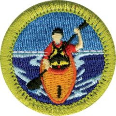

# Kayaking Merit Badge

## Overview

Kayaking has become one of the fastest-growing paddlesports in the United States. An estimated nine million Americans enjoy this sport. The most popular style of kayaking is recreational kayaking, followed by touring/sea kayaking, and whitewater kayaking. This merit badge will introduce you to recreational kayaking and help prepare you for advanced paddlesports such as tour/sea and whitewater kayaking.

## Requirements

- (1) Do the following:
  - (a) Explain to your counselor the hazards you are most likely to encounter while participating in kayaking activities, including weather and water-related hazards, and what you should do to anticipate, help prevent, mitigate, and respond to these hazards.

    **Resources:** [Kayaking Tips—Cold Water and Winter Paddling (Wear, Gear, and Risks) (video)](https://youtu.be/xUUX1VI7i1I), [Top 5 Kayak Safety Rules for Beginners (video)](https://youtu.be/WMU4jNmlCQA)
  - (b) Review prevention, symptoms, and first-aid treatment for the following injuries or illnesses that can occur while kayaking: blisters, cold-water shock and hypothermia, heat-related illnesses, dehydration, sunburn, sprains, and strains.

    **Resources:** [OSHA Heat Illness Prevention Campaign (video)](https://youtu.be/Kr2ouLj1oW0), [How To Treat a Sunburn (video)](https://youtu.be/u0sLzfq_w9s), [First Aid Kit for Kayaking—What's in It? (video)](https://youtu.be/iLbL7fffGAk), [Cold Water Shock—How To Deal With Cold Water Shock (video)](https://youtu.be/rH3gZuSr6Y8)
  - (c) Review the Scouting America Safety Afloat policy. Explain to your counselor how this applies to kayaking.

    **Resources:** [Safety Afloat (website)](https://www.scouting.org/health-and-safety/safety-moments/safety-afloat/)

- (2) Before doing requirements 3 through 8, successfully complete the Scouting America swimmer test. **Note:** See the *Swimming* merit badge pamphlet for details about the Scouting America swimmer test.

  **Resources:** [Swimming Merit Badge Pamphlet (PDF)](https://filestore.scouting.org/filestore/Merit_Badge_ReqandRes/Pamphlets/Swimming.pdf)

- (3) Do the following:
  - (a) Review the characteristics of life jackets most appropriate for kayaking and understand why one must always be worn while paddling. Then demonstrate how to select and fit a life jacket for kayaking.

    **Resources:** [How To Choose the Right Life Jacket (video)](https://youtu.be/4y9XPNy1L1U)
  - (b) Review the importance of safety equipment such as a signal device, extra paddle, sponge, bilge pump, flotation bags, and throw bag.

    **Resources:** [Essential Gear That All Paddlers Need To Carry On the Water (video)](https://youtu.be/L7DkmwqfcLI), [Kayak Safety: How To Use a Kayak Bilge Pump (How To Get Water out of Your Kayak) (video)](https://youtu.be/-z_h6ShvsHU), [Must Have Paddling Safety Gear \| How To Kayak or Canoe (video)](https://youtu.be/xcl4I8V2Pfg)

- (4) Do the following:
  - (a) Name and point out the major parts of a kayak.

    **Resources:** [Kayak Overview (video)](https://youtu.be/JJGYUG8Bfxc)
  - (b) Review the differences in the design between recreational, whitewater, and sea or touring kayaks. Include how length, width, stability, and rocker are involved in the design of each type.

    **Resources:** [How To Choose the Right Kayak for All Types of Flatwater Paddlers (video)](https://youtu.be/2xlCx8ckfR8)
  - (c) Explain the care, maintenance, and storage of a kayak.

    **Resources:** [How To Clean and Maintain Your Kayak (video)](https://youtu.be/DThGAXJ8hM8)

- (5) Discuss the following:
  - (a) Correct methods for the use of a kayak paddle

    **Resources:** [How To Hold a Kayak Paddle (video)](https://youtu.be/RZLtB7BmNAc), [Proper Technique for Paddling a Kayak (video)](https://youtu.be/v0-efrwppWQ)
  - (b) Parts of a paddle

    **Resources:** [Kayak Paddles (website)](https://www.boat-ed.com/paddlesports/paddlesports/studyGuide/Kayak-Paddles/11109901_52043/)
  - (c) The care and maintenance of a paddle

    **Resources:** [Kayak Paddle Maintenance (website)](https://floridasplendors.com/kayak-paddle-maintenance-essential-tips/)

- (6) Using a properly equipped kayak with an open cockpit, a sit-on-top, or an inflatable kayak, do the following:
  - (a) Safely capsize and perform a wet exit.

    **Resources:** [Kayak Wet Exit—How To Get Out of Your Kayak (video)](https://youtu.be/blJFzirv3-E)
  - (b) Reenter the kayak with assistance from a buddy boat.

    **Resources:** [How To Re-Enter a Sit Inside Kayak for Beginners (video)](https://youtu.be/O_-a5ngnRew), [Sea Kayak T-Rescue: Deep Water Rescue / How To Get Back in Your Kayak With Help (video)](https://youtu.be/YSRCAdCSj8Q), [Master the Sea Kayak Scoop Rescue for Injured Paddlers (video)](https://youtu.be/wE5y_DW2h04), [Heel Hook—Kayak Rescue (video)](https://youtu.be/j-zpJQeiaNc)
  - (c) Demonstrate a kayak-over-kayak rescue.

    **Resources:** [Sea Kayak T-Rescue: Deep Water Rescue / How To Get Back in Your Kayak With Help (video)](https://youtu.be/YSRCAdCSj8Q)
  - (d) Demonstrate the HELP position.

    **Resources:** [Help/Huddle Position (video)](https://youtu.be/Z5X1K1I8xEc)
  - (e) Capsize the kayak, swim it and the paddle to shore, and empty water from the kayak with assistance if needed.

    **Resources:** [White Water Kayak—Swim to Shore (video)](https://youtu.be/ykvS7iHeC_g)

- (7) As a solo paddler, use a properly equipped kayak to demonstrate the following:
  - (a) Forward stroke

    **Resources:** [Kayak Forward Stroke (video)](https://youtu.be/yz00070X04o)
  - (b) Backstroke

    **Resources:** [Kayak Reverse Stroke (video)](https://youtu.be/O-feCLPf-qw)
  - (c) Forward sweep

    **Resources:** [Kayak Sweep Strokes (video)](https://youtu.be/GWpaWh8AcZw)
  - (d) Reverse sweep

    **Resources:** [Kayak Reverse Stroke (video)](https://youtu.be/O-feCLPf-qw)
  - (e) Draw stroke

    **Resources:** [Kayak Draw Stroke—In Water Recovery (video)](https://youtu.be/H3G8Viju93I)
  - (f) Stern draw

    **Resources:** [Stern Draw (video)](https://youtu.be/0bWe37-jaD8)

- (8) As a solo paddler, use a properly equipped kayak to demonstrate the following:
  - (a) Paddle a straight line for 15 to 20 boat lengths using appropriate strokes while maintaining trim and balance of the kayak.

    **Resources:** [Paddling a Kayak in a Straight Line (video)](https://youtu.be/7CThukQ8b0s)
  - (b) Spin or pivot from a stationary position 180 degrees (half circle) to the right and left within two boat lengths.

    **Resources:** [Fast Sea Kayak Turn—Turning a Sea Kayak 180 Degrees Efficiently (video)](https://youtu.be/eKGsnIat1NQ)
  - (c) Move abeam to the right 10 feet and to the left 10 feet.

    **Resources:** [How To Turn a Kayak (video)](https://youtu.be/1j1DuKmZk1o)
  - (d) Stop the boat in one boat length.

    **Resources:** [Paddle Strokes, the Emergency Stopping Procedure (video)](https://youtu.be/kRUpSLUFMII)
  - (e) While maintaining forward motion, turn the kayak 90 degrees to the right and left.
  - (f) Move the kayak backward three to four boat lengths using appropriate and effective reverse strokes.

    **Resources:** [Reverse Stroke (video)](https://youtu.be/O-feCLPf-qw)
  - (g) Paddle the kayak in a buoyed figure 8 course around markers three to four boat lengths apart.

## Resources

- [Kayaking merit badge page](https://www.scouting.org/merit-badges/kayaking/)
- [Kayaking merit badge PDF](https://filestore.scouting.org/filestore/Merit_Badge_ReqandRes/Pamphlets/Kayaking.pdf) ([local copy](files/kayaking-merit-badge.pdf))
- [Kayaking merit badge pamphlet](https://www.scoutshop.org/kayaking-merit-badge-pamphlet-650732.html)
- [Kayaking merit badge workbook PDF](http://usscouts.org/mb/worksheets/Kayaking.pdf)
- [Kayaking merit badge workbook DOCX](http://usscouts.org/mb/worksheets/Kayaking.docx)

Note: This is an unofficial archive of Scouts BSA Merit Badges that was automatically extracted from the Scouting America website and may contain errors.