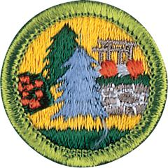

# Landscape Architecture Merit Badge

## Overview

Landscape architects design and plan the various outdoor spaces in modern communities – neighborhood parks, soccer fields, school grounds, places of worship, office parks, shopping malls, cemeteries, and lakes – creating outdoor places that people will care about and want to visit.

## Requirements

* NOTE:  The official merit badge pamphlets are now free and downloadable  [HERE](https://filestore.scouting.org/filestore/Merit_Badge_ReqandRes/Pamphlets/Architecture_Landscape.pdf) or can be purchased at the [Scout Shop.](https://www.scoutshop.org/)
* (1) Go to a completed landscape project that a landscape architect has designed. Before you visit the site, obtain a plan of the design from the landscape architect if one is available.
* (2) After completing requirement 1, discuss the following with your counselor:
    * (a) Tell whether the design had separate spaces, a defined point of entry, a clear path system, and sun and shade variety. Resource: [Defining Spaces and Adding Privacy Outdoors | Design Tips | HGTV (video)](https://youtu.be/uVVCpugREjY?si=UjWU7ZHOL0LUOErs)
    * (b) Discuss how any structures, the designated seating, eating, or parking areas suited the overall design. Resource: [Ripple Park | Landscape Architecture Capstone (video)](https://youtu.be/lEXvdRFBC8s?si=bSb-EyaJNFCsz99C)
    * (c) Explain how the design reflected consideration for the comfort, shelter, and security of the users. Resource: [Spaces that Heal and Comfort (website)](https://eptdesign.com/spaces-that-heal-and-comfort/)
    * (d) Discuss how the choice of trees, shrubs, and ground covers used in the project contributed to its appeal and function. Resource: [Landscaping with Trees and Shrubs: Types and Planting (video)](https://youtu.be/aBVcBep4Gv8?si=qvfbVWL4ZB2Qb4DJ)

* (3) Identify five shrubs, five trees, and one ground cover, being sure that you select examples of different shapes, sizes, and textures. With the help of your counselor or a local nursery, choose plants that will grow in your area. Bring pictures of the different planting materials or, if possible, examples of their branches, leaves, or flowers to a group such as your troop or class at school.  Be prepared to tell how you might use each in the design of a landscape and the maintenance that would follow. Resource: [Tree and Shrub ID (video)](https://youtu.be/YcMsvqqmorM?si=NO405TME8veCY23U)
* (4) After obtaining permission from the appropriate authority, look at and study a place of worship, school grounds, or a public building and identify where most people arrive by bus or car. Then do the following:
    * (a) Using a measuring tape, measure and draw the main site entry and its nearby area. Define the scale of your drawing. Be sure to include the driveway and sidewalk or path that leads to the building's main entry. Indicate any sidewalks, structures, trees and plants, lights, drains, utilities, or other site furnishings within the study area. Make two copies of this plan and save the original, then do 4(b) and 4(c) using the copies. Resource: [Create Your Own Landscape Design | Site Survey (video)](https://youtu.be/6fLp1fWKzjQ?si=9c4WHFrHoS30ltSk)
    * (b) On one copy of your site plan, use directional arrows to indicate where the water drains across the site, where ditches occur, and where water stands for a longer period of time.
    * (c) Decide how you can make the place safer and more comfortable for those using it. Redesign the area on another copy of the plan. You may want to include new walks, covered waiting areas, benches, space-defining plantings of trees and shrubs, and drainage structures.

* (5) Identify three career opportunities that would use skills and knowledge in landscape architecture. Pick one and research the training, education, certification requirements, experience, and expenses associated with entering the field. Research the prospects for employment, starting salary, advancement opportunities, and career goals associated with this career. Discuss what you learned with your counselor and whether you might be interested in this career. Resource: [Career Connections: Landscape Architect (video)](https://youtu.be/vVRUsQ8WrW8?si=miQ1-ySUPKVHHO8s)

## Resources

- [Landscape Architecture merit badge page](https://www.scouting.org/merit-badges/landscape-architecture/)
- [Landscape Architecture merit badge PDF](https://filestore.scouting.org/filestore/Merit_Badge_ReqandRes/Pamphlets/Architecture_Landscape.pdf) ([local copy](files/landscape-architecture-merit-badge.pdf))
- [Landscape Architecture merit badge pamphlet](https://www.scoutshop.org/bsa-architecture-and-landscape-merit-badge-pamphlet-boy-scouts-of-america-659867.html)
- [Landscape Architecture merit badge workbook PDF](http://usscouts.org/mb/worksheets/Landscape-Architecture.pdf)
- [Landscape Architecture merit badge workbook DOCX](http://usscouts.org/mb/worksheets/Landscape-Architecture.docx)

Note: This is an unofficial archive of Scouts BSA Merit Badges that was automatically extracted from the Scouting America website and may contain errors.