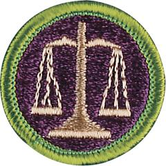

# Law Merit Badge

## Overview

Earning this merit badge enables a Scout to learn about the history and kinds of laws, the purpose and methods of law enforcement, consumer protection agencies, emerging law, and careers in the legal profession.

## Requirements

* (1) Define "law." Tell some of its sources. Describe the functions it serves.
* (2) Discuss TWO of the following:
    * (a) Justinian's Code, the Code of Hammurabi, and the Magna Carta
    * (b) The development of the jury system
    * (c) Two famous trials in history.

* (3) Tell what civil law is; tell what criminal law is. Tell the main  differences between them. Give examples of each.
* (4) Ask five people (not more than one from your immediate  family) about the role of law enforcement officers in our society. Discuss their answers with them. Go to a law enforcement  officer in your neighborhood and ask about his or her responsibilities and duties. Report your findings to your counselor.
* (5) Discuss with your counselor several laws that were passed to protect the consumer and the seller. Describe several organizations that provide help to consumers and sellers.
* (6) Do ONE of the following:
    * (a) Attend a session of a civil or criminal court. Write 250 words or more on what you saw.
    * (b) Plan and conduct a mock trial with your troop or school class. After the trial is over, discuss it with the group.

* (7) Arrange a visit with a lawyer who works for a business, bank, title company, or government agency. Find out his or her duties and responsibilities. Report what you have learned.
* (8) Explain the requirements for becoming a lawyer in your state. Describe how judges are selected in your state.
* (9) Make a list of 15 jobs that deal with some aspects of law or legal processes. Tell which you prefer. Why?
* (10) Tell where people can go to obtain the help of a lawyer if they are unable to pay for one. Tell what you can do if you can afford a lawyer but do not know of any in your area.
* (11) Discuss with your counselor the importance in our society of TWO of the following areas of the law or process:
    * (a) Administrative
    * (b) Alternative Dispute Resolution
    * (c) Bankruptcy
    * (d) Biotechnology
    * (e) Environmental
    * (f) Family
    * (g) Immigration
    * (h) Information Technology
    * (i) Intellectual Property, (Copyright, Patents and Trademarks)
    * (j) International
    * (k) Privacy.

## Resources

- [Law merit badge page](https://www.scouting.org/merit-badges/law/)
- [Law merit badge PDF](https://filestore.scouting.org/filestore/Merit_Badge_ReqandRes/Pamphlets/Law_2023.pdf) ([local copy](files/law-merit-badge.pdf))
- [Law merit badge pamphlet](https://www.scoutshop.org/bsa-law-merit-badge-pamphletboy-scouts-of-america-660409.html)

Note: This is an unofficial archive of Scouts BSA Merit Badges that was automatically extracted from the Scouting America website and may contain errors.