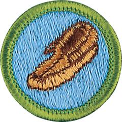

# Leatherwork Merit Badge

## Overview

Scouts who complete the requirements to earn the Leatherwork merit badge will explore leather’s history and its endless uses. They will learn to make a useful leather item using the same types of raw materials that our ancestors used; be challenged to master skills like hand-stitching, lacing, and braiding.; and learn how to preserve and protect leather items so they will last a lifetime and beyond.

## Requirements

* NOTE:  The official merit badge pamphlets are now free and downloadable  [HERE](https://filestore.scouting.org/filestore/Merit_Badge_ReqandRes/Pamphlets/Leatherwork.pdf) or can be purchased at the [Scout Shop.](https://www.scoutshop.org/)
* (1) Do the following: Resource: [Be Prepared (video)](https://youtu.be/p5wSqJO-bIc?si=_-SM0CzDAFnIRrEm)
    * (a) Explain to your counselor the hazards you are most likely to encounter while using leatherwork tools and materials, and what you should do to anticipate, help prevent, mitigate, or lessen these hazards.Resource: [Safety in Leatherwork | Dangers and Health and Safety Tips (video)](https://youtu.be/eDDvWMyOPO8?si=svFeILuCoVTRbjng)
    * (b) Show that you know first aid for injuries or illnesses that could occur while working with leather, including minor cuts and scratches, puncture wounds, ingested poisoning, and reactions from exposure to chemicals such as dyes, cements, and finishes used in leatherworking.Resources: [First Aid (PDF)](https://filestore.scouting.org/filestore/Merit_Badge_ReqandRes/Requirement%20Resources/Leatherwork/Leatherwork_First%20Aid.pdf) [First Aid for Minor Cuts (website)](https://www.aad.org/public/everyday-care/injured-skin/burns/treat-minor-cuts) [First Aid for Puncture Wounds (website)](https://www.mayoclinic.org/first-aid/first-aid-puncture-wounds/basics/art-20056665)

* (2) Explain the following:
    * (a) Where leather comes from Resource: [How is Leather Made? (video)](https://youtu.be/oNTWz7bwolc?si=MTkSYtqnDxvJIgC8)
    * (b) Kinds of hides that are used to make leather Resources: [Picking the Best Part of the Leather Hide (video)](https://youtu.be/UifaYowyj44?si=mz4_Fm3dsS2IdwDf) [Useful Leather Crafting Charts (website)](https://leatherado.com/pages/useful-leather-craft-charts)
    * (c) Five types of leather Resource: [Leather Is Made From Which Animal (video)](https://youtu.be/fCrCwKpBXe4?si=ZosX3COH795k644n)
    * (d) Best uses for each type of leather. Resources: [What Leather Should I Use for Tooling? (video)](https://youtu.be/NNppGlzskQU?si=a3Kf5tP4MR28dcjf) [Choosing the Correct Leather for your Project (video)](https://youtu.be/i9chSW724QI?si=m5PgNOUbjl-obxra)

* (3) Make one or more articles of leather that use at least five of the following steps:
    * (a) Pattern layout and transfer Resources: [Transferring Patterns (video)](https://youtu.be/zkA_TImwL7k?si=uy8jlrqb-_nJdl3v) ["Tap offs" or Mirrored Image Transfers (video)](https://youtu.be/dIZWhRV43WE?si=hEtWo21YxszT8uoa)
    * (b) Cutting leather Resource: [Best Practices for Cutting Leather (video)](https://youtu.be/KwamMpHW9Ls?si=8jzWvnYf8rteJcQd)
    * (c) Punching holes Resources: [How to Use a Rotary Hole Punch (video)](https://youtu.be/lu14WIqvxHw?si=Sf-GEE-qn9xG9Bea) [How to Punch Holes (video)](https://youtu.be/ei1wqcTX3BQ?si=02881vW0BGWC9EzL)
    * (d) Carving or stamping surface designs Resources: [Basic Leather Carving (video)](https://youtu.be/mhYUU3soIac?si=a_KUcxnL_Xz9nSAW) [How to Stamp Leather (video)](https://youtu.be/J-ngZ2h4GPA?si=fW2UlhHrbiek-0ox)
    * (e) Applying dye or stain and finish to the project Resource: [Basics of Hand Dyeing Leather (video)](https://youtu.be/DJ8s7wH-YCg?si=gTx6mtrkUkl3JUej)
    * (f) Assembly by lacing or stitching Resources: [How to Punch Holes (for Sewing) in Leather (video)](https://youtu.be/GYnXLSGakYA?si=WJoxl-Dto6gmMres) [How to Choose the Right Thread and Needle Size for Hand-Sewing in Leather (video)](https://youtu.be/CepMYy3yra8?si=bpkV8Y0zoef-tBId) [The Most Common Stitches in Hand-Stitching for Leatherwork (video)](https://youtu.be/Hd103-7adK8?si=UnFoIJJ46SNdtwf7) [How to Start and End Hand-Swing Lines in Leather (video)](https://youtu.be/Eew734WXXzs?si=Jkc2U94RGO1eTfpY)
    * (g) Setting snaps and rivets Resources: [How to Set Snaps (video)](https://youtu.be/egQHoUw58r4?si=3coK-uKt6ziz5AOM) [How to Remove a Snap (video)](https://youtube.com/shorts/Bb387hzctjA?si=_UNKaVRDZEq2oXed) [How to Set Rivets (video)](https://youtu.be/l0VJgjHJN1c?si=IdbPEWFEAzINzoIm)
    * (h) Dressing edges. Resource: [Edge Finishing Techniques (video)](https://youtu.be/kb8yyG3TO70?si=3neDiHe3jxmRj7UJ)

* (4) Braid or plait an article out of leather, vinyl lace, or paracord. Resources: [Four Strand Round Braid (video)](https://youtu.be/TtncZNCWpQE?si=Ys_SbWAv__wDYzNU)  [Plaiting: How to Braid Any Number of Cords (video)](https://youtu.be/qjqXAV9lyns?si=1VmEcBuPoFOW1wFh)
* (5) Do ONE of the following:
    * (a) Learn about the commercial tanning process. Report about it to your counselor. Resource: [How is Leather Made? (video)](https://youtu.be/6Cn7QqdFIxc?si=ocfbQxYR8AA7KPIb)
    * (b) Tan the skin of a small animal. Describe the safety precautions you will take and the tanning method that you used. Resource: [How to Tan Animal Hides (Never Destroy Animals for This Purpose) (video)](https://youtu.be/RJNyABFzWPw?si=TqYic4EWmIBT7Zzx)
    * (c) Recondition or show that you can take proper care of your shoes, a baseball glove, a saddle, furniture, or other articles of leather. Discuss with your counselor the advantages or disadvantages of leather vs. synthetic materials. Resources: [How to Clean & Shine Leather Shoes! (video)](https://youtu.be/MSaNoMNrZxU?si=NLIb7JASM5tkReY9) [How to Care for Your Baseball Glove (video)](https://youtu.be/sNXcHCHK-wI?si=PN2HDyT5eopuOtnZ) [How to Clean a Western Saddle (video)](https://youtu.be/g_oDJhwVKFI?si=RyU4gxTsFrK672hj) [How to Remove Mold and Mildew on Leather (video)](https://youtu.be/2NUr6y3R7Mg?si=6s2_1YHwovPiZQ_S)
    * (d) Visit a leather-related business. This could be a leathercraft supply company, a tannery, a leather goods or shoe factory, or a saddle shop. Report on your visit to your counselor. Resource: [A Random Walk Through Horween Leather (video)](https://youtu.be/ljq0x4as32U?si=Tu4LneiFjmNgLEn1)

## Resources

- [Leatherwork merit badge page](https://www.scouting.org/merit-badges/leatherwork/)
- [Leatherwork merit badge PDF](https://filestore.scouting.org/filestore/Merit_Badge_ReqandRes/Pamphlets/Leatherwork.pdf) ([local copy](files/leatherwork-merit-badge.pdf))
- [Leatherwork merit badge pamphlet](https://www.scoutshop.org/bsa-leatherwork-merit-badge-pamphlet-661052.html)

Note: This is an unofficial archive of Scouts BSA Merit Badges that was automatically extracted from the Scouting America website and may contain errors.