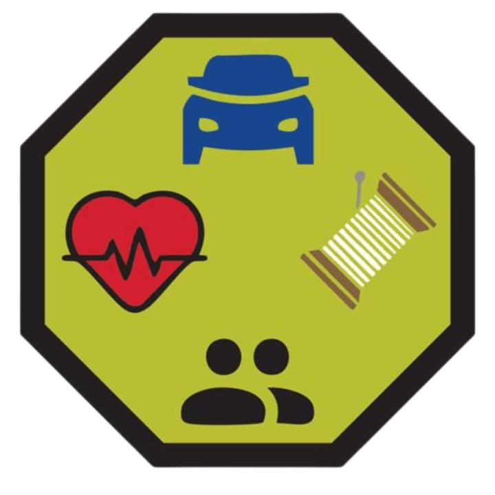

# Life Skills Merit Badge

## Overview

**Test Lab Merit Badge**, Verify current status at [Scouts BSA Test Lab](https://www.scouting.org/skills/merit-badges/test-lab/).

## Requirements

- (1) **Health. Do the following:**
  - (A) Describe the steps to make a doctor’s appointment.
  - (B) Locate the hospital or urgent care center closest to your home.
  - (C) Explain what health insurance is and why it is important to have.
  - (D) Identify 5 ways to practice medication safety at home.
  - (E) Describe what information should be included in your personal health record and create one for yourself.
  - (F) Identify 5 everyday situations where first aid would be required and what to do when first aid is needed.

- (2) **Household. Do the following:**
  - (A) Explain the steps required to do laundry. With your parent or guardian’s permission, wash and dry one load of laundry.
  - (B) Explain the steps required to iron clothes. With your parent or guardian’s permission, demonstrate how to iron two different articles of clothing.
  - (C) Demonstrate your knowledge of sewing by sewing a patch or button on a shirt or pair of pants.
  - (D) Explain the importance of maintaining a clean household. Describe why it is important to control clutter. Demonstrate your knowledge by cleaning your bedroom, bathroom, or kitchen.
  - (E) Demonstrate how to set a casual dining table and a formal dining table.

- (3) **Money. Do the following:**
  - (A) Explain what is required to open a bank account and compare the differences between a traditional bank, an online bank, and a credit union.
  - (B) Explain the importance of saving money.
  - (C) Explain what online bill pay is and compare the pros and cons of paying your bills online.
  - (D) Describe how a credit card works, the reasons to get a credit card, the costs you may incur by using a credit card, and how to use a credit card effectively.

- (4) **Social. Do the following:**
  - (A) Demonstrate how to properly introduce yourself in a social situation.
  - (B) Explain what social etiquette means and how to practice it.
  - (C) Explain what it means to set personal boundaries and what to do when those boundaries are crossed.
  - (D) Create a list of similarities and differences of the members of a group you are involved with (troop, school club, sports team, etc.). Share this list with your counselor and describe how these similarities and differences affect the group.
  - (E) Explain how equity is different from equality. Describe a situation that might exist in school, sports, an extra-curricular activity or Scouting that could result in inequity.
  - (F) Give six examples of appropriate table manners

- (5) **Self-Care. Do the following:**
  - (A) Explain what self-respect means and how you can demonstrate it.
  - (B) Explain to your counselor what might cause stress and how to manage it.
  - (C) Explain the importance of good personal hygiene and give examples of how to practice it.
  - (D) Explain the benefits of exercise and demonstrate three types of exercise found in the fitness section of your Scouts BSA handbook.

- (6) **Employment. Do THREE of the following:**
  - (A) Create a resume and review it with your counselor.
  - (B) Write a cover letter for a job posting and review it with your counselor.
  - (C) Describe how to make a great impression during a job interview and give 5 examples of questions that you would ask during an interview.
  - (D) Explain why it is essential to write professional emails. Write a professional email thanking someone for interviewing you for a job. Share your email with your counselor.
  - (E) Demonstrate how to leave a professional voicemail message.
  - (F) Explain how posts to social media can affect you when applying for a job.

- (7) **Transportation. Do TWO of the following:**
  - (A) Explain what to do if you are involved in a car accident.

    **[What to do after a car accident: a step-by-step guide](https://www.allstate.com/resources/car-insurance/in-case-of-a-car-accident)**
  - (B) Describe the steps on jumpstarting a car battery.

    **[How to Jump-Start a Car in 6 Steps](https://www.kbb.com/car-advice/how-to-jump-start-battery/)**
  - (C) Explain the benefits of regular car maintenance.

    **[The Benefits of Regular Car Maintenance](https://www.victorytoyota.com/the-benefits-of-regular-car-maintenance/)**
  - (D) Compare the differences between leasing versus buying a new car.

    **[Leasing vs. Buying a New Car](https://www.consumerreports.org/cars/buying-a-car/leasing-vs-buying-a-new-car-a9135602164/)**
  - (E) On a map of your community or using an electronic device, locate and point out the public transportation infrastructure. Plan how to get to a friend’s home or shopping center from your house. Explain the route and cost of the roundtrip to your counselor.

- (8) **Complete the survey below to complete the test lab requirements**

## Resources

- [Life Skills merit badge page](https://www.scouting.org/skills/merit-badges/test-lab/life-skills/)

Note: This is an unofficial archive of Scouts BSA Merit Badges that was automatically extracted from the Scouting America website and may contain errors.