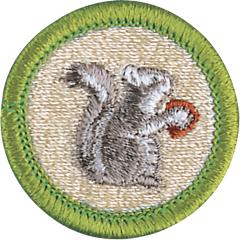

# Mammal Study Merit Badge

## Overview

A mammal may weigh as little as 1/12 ounce, as do some shrews, or as much as 150 tons, like the blue whale. It may spring, waddle, swim, or even fly. But if it has milk for its young, has hair of some kind, is relatively intelligent, and has warm blood, then it is a mammal.

## Requirements

- (1) Explain the following terms: animal, invertebrate, vertebrate, and mammal. Name three characteristics that distinguish mammals from all other animals.

  **Resources:** [Characteristics and Categories of Mammals (Video)](https://www.youtube.com/watch?v=jscSDZG1nFo), [10 Traits of Mammals (Video)](https://www.youtube.com/watch?v=JOqVQ3m-bDQ), [Mammals - Traits and Groups of Warm-Blooded Animals (Video)](https://www.youtube.com/watch?v=n9ud5ZPu2Po), [Vertebrate Diversity in Mammals (General Characteristics) (video)](https://www.youtube.com/watch?v=mXs71vqrvqI)

- (2) Explain how the animal kingdom is classified. Explain where mammals fit in the classification of animals. Classify three mammals from phylum through species.

  **Resources:** [The 5 Kingdoms in Classification (video)](https://youtu.be/oID1h-zL-uw?si=jHkAIYYgKaxKTZwG), [Animal Classification (video)](https://youtu.be/L6anmd7DnYw?si=tVuoSQOwEYpKbYO7), [The Three Types of Mammals, Differences, and How to Tell (video)](https://youtu.be/YAgjPwiSbvA?si=gwU-5Y3dVcmjt8Z7), [Mammal Species of the World Database (website)](https://www.departments.bucknell.edu/biology/resources/msw3/browse.asp)

- (3) Do ONE of the following:
  - (a) Spend three hours in two different kinds of natural habitats or at different elevations for a total of 6 hours. List the different mammal species and how many of each you identified by sight or sign. Tell why all mammals do not live in the same kind of habitat.

    **Resources:** [How to Find Mammal Signs (video)](https://www.youtube.com/watch?v=x8DfP0Nh7kA), [Animal Tracks Identification Guide | Animal Footprint ID Charts (website)](https://www.greenbelly.co/pages/animal-tracks-identification-guide)
  - (b) Spend three hours on five different days in at least a 4-acre area (about the size of 3 football fields) for a total of 15 hours. List the mammal species you identified by sight or sign.
  - (c) From study and reading, write a simple life history of one nongame mammal that lives in your area. Tell how this mammal lived before its habitat was affected in any way by humans. Tell how it reproduces, what it eats, and its natural habitat. Describe its dependency upon plants and other animals (including humans), and how they depend upon it. Describe how humans have benefited from the mammal you have chosen and whether the mammal has benefited from association with humankind.

- (4) Do ONE of the following:
  - (a) Under the guidance of a nature center or natural history museum, make two study skins of rats or mice. Tell the uses of study skins and mounted specimens respectively.

    **Resources:** [Skinning Your Rat (video)](https://youtu.be/m93WO9praZE?si=DG3Wt7aD9EBE-Zma), [Preparing Mammal Specimens (video)](https://www.youtube.com/watch?v=dBk9jwQBiuA)
  - (b) Take good pictures of two kinds of mammals in the wild. Record the date(s), time of day, weather conditions, approximate distance from the animal, habitat conditions, and any other factors you feel may have influenced the animal's activity and behavior.

    **Resources:** [Top 10 Wildlife Photography Shortcuts (video)](https://www.youtube.com/watch?v=r5liiAoUJ1Q), [The Most Important Wildlife Photography (video)](https://www.youtube.com/watch?v=wzuxDkmsZgM), [The Ultimate Wildlife Photography Tutorial (website)](https://photographylife.com/wildlife-photography-tutorial), [Wildlife Photography (website)](https://www.fs.usda.gov/visit/know-before-you-go/wildlife-photography)
  - (c) Write a life history of a native game mammal that lives in your area, covering the points outlined in requirement 3(c). List sources for this information.
  - (d) Make and bait a tracking pit. Report what mammals and other animals came to the bait.

    **Resources:** [Build Animal Track Station (video)](https://www.youtube.com/watch?v=rjg7FUw_5fM), [Creating a Backyard Animal Track Trap With Household Items (video)](https://www.youtube.com/watch?v=j_SPxHCvSYA), [Animal Tracking Basics - Track Traps, Measurements, Following Sign (video)](https://www.youtube.com/watch?v=i2SFVKWhIzY)
  - (e) Visit a natural history museum. Report on how specimens are prepared and cataloged. Explain the purposes of museums.

    **Resources:** [What Is the Purpose of a Natural History Museum? (video)](https://youtu.be/sCm6JFBdWfM?si=abiHDMFT2hvlOGJS)
  - (f) Write a report of 500 words on a book about a mammal species.
  - (g) Trace two possible food chains of carnivorous mammals from the soil through four stages to the mammal.

    **Resources:** [Animal of the Week: Food Chains (video)](https://www.youtube.com/watch?v=FpVXlk_Z-4E), [Food Chains & Food Webs (video)](https://www.youtube.com/watch?v=JCl_yDf0Qok), [Tundra Food Chain (website)](https://www.sciencefacts.net/tundra-food-chain.html)

- (5) Working with your counselor, select and carry out one project that will influence the numbers of one or more mammals.

  **Resources:** [Brushpiles With Game Commission Biologist Dan Mummert (video)](https://www.youtube.com/watch?v=pXTGUBPYwPo), [Create a Wildlife Habitat Garden (video)](https://www.youtube.com/watch?v=IOYDnuz0hA8), [How to Make a WILDLIFE GARDEN! The FOUR Things You MUST INCLUDE! (video)](https://www.youtube.com/watch?v=Vl0W8navRIg)

- (6) Discuss the importance of the Leave No Trace Seven Principles and the Outdoor Code as they relate to Mammal Study. Explain how you have followed the Leave No Trace Seven Principles and the Outdoor Code while in natural areas during field observation, specimen collection, and identification.

  **Resources:** [Leave No Trace Basics (video)](https://vimeo.com/1115216743/63b20c0b33?share=copy), [Leave No Trace Outdoor Ethics (video)](https://youtu.be/jXO1uY0MvmQ)

- (7) Do ONE of the following:
  - (a) Explore careers related to this merit badge. Research one career to learn about the training and education needed, costs, job prospects, salary, job duties, and career advancement. Your research methods may include—with your parent or guardian's permission—an internet or library search, an interview with a professional in the field, or a visit to a location where people in this career work. Discuss with your counselor both your findings and what about this profession might make it an interesting career.

    **Resources:** [10+ Wildlife Biology Careers You Should Know About (& Salaries) (video)](https://youtu.be/AK2Onqx-ctM?si=LwrbzHPsoZ0MrkDp)
  - (b) Explore how you could use knowledge and skills from this merit badge to pursue a hobby or healthy lifestyle. Research any training needed, expenses, and organizations that promote or support it. Discuss with your counselor what short-term and long-term goals you might have if you pursued this.

    **Resources:** [Top Tips to get into Wildlife Photography (video)](https://www.youtube.com/watch?v=C4HjfzY3z90), [A Look Inside the Life of a Wildlife Rehab Volunteer (video)](https://youtu.be/kgtt21yKZOw?si=f5yRyDVQYFQXD4YB)

## Resources

- [Mammal Study merit badge page](https://www.scouting.org/merit-badges/mammal-study/)
- [Mammal Study merit badge PDF](https://filestore.scouting.org/filestore/Merit_Badge_ReqandRes/Pamphlets/Mammal%20Study.pdf) ([local copy](files/mammal-study-merit-badge.pdf))
- [Mammal Study merit badge pamphlet](https://www.scoutshop.org/bsa-mammal-study-merit-badge-pamphlet-y-scouts-of-america-660058.html)
- [Mammal Study merit badge workbook PDF](http://usscouts.org/mb/worksheets/Mammal-Study.pdf)
- [Mammal Study merit badge workbook DOCX](http://usscouts.org/mb/worksheets/Mammal-Study.docx)

Note: This is an unofficial archive of Scouts BSA Merit Badges that was automatically extracted from the Scouting America website and may contain errors.