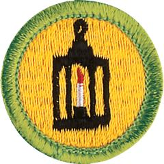

# Metalwork Merit Badge

## Overview

Scouts will begin their work on this merit badge by learning about the properties of metal, how to use simple metalworking tools, and the basic metalworking techniques. Then they will practice using these tools and techniques before concentrating on the more intricate skills of one of four metalworking options.

## Requirements

- (1) Read the safety rules for metalwork. Discuss how to be safe while working with metal. Discuss with your counselor the additional safety rules that apply to the metalwork option you choose for requirement 5.

  **Resources:** [Metalwork Tools Workshop Safety Training (video)](https://youtu.be/OsPSSayWEOU)

- (2) Explain the following terms: native metal, malleable, metallurgy, alloy, nonferrous, and ferrous. Then do the following:

  **Resources:** [Metallurgy: From Rocks to Alloys (video)](https://youtu.be/Q5t4D_4DwS0)

  - (a) Name two nonferrous alloys used by pre-Iron Age metalworkers. Name the metals that are combined to form these alloys.

    **Resources:** [How Alloys Made the Bronze Age Possible. Forging a New Era (video)](https://youtu.be/_5iNPCCeZb0), [From Gold and Silver to Electrum: The Truth About This Rare Alloy (video)](https://youtu.be/sGb28SC4ZjY)
  - (b) Name three ferrous alloys used by modern metalworkers.

    **Resources:** [What Are the Different Types of Steel? (video)](https://youtu.be/s6dh0ml-KHY)
  - (c) Describe how to work-harden a metal.

    **Resources:** [Work Hardening and Annealing (video)](https://youtu.be/iH7OJKreTx0), [Self Organising Steel Balls Explain Metal Heat Treatment (video)](https://youtu.be/xuL2yT-B2TM)
  - (d) Describe how to anneal a nonferrous and a ferrous metal.

    **Resources:** [Annealing Stainless Steel Spoons (video)](https://youtu.be/YLMq8lCml3c), [Introduction to Annealing (video)](https://youtu.be/8Pb7KP1t4i8), [How to Anneal Silver, Copper and Other Nonferrous Metals (video)](https://youtu.be/DPa4LmO7L1s)

- (3) Do the following:
  - (a) Work-harden a piece of 26- or 28-gauge sheet brass or sheet copper. Put a 45-degree bend in the metal, then heavily peen the area along the bend line to work-harden it. Note the amount of effort that is required to overcome the yield point in this unworked piece of metal.

    **Resources:** [Work Hardening of Copper (video)](https://youtu.be/Bau_opy5du4)
  - (b) Soften the work-hardened piece from requirement 3(a) by annealing it, and then try to remove the 45-degree bend. Note the amount of effort that is required to overcome the yield point.
  - (c) Make a temper color index from a flat piece of steel. Using hand tools, make and temper a center punch of medium-carbon or high-carbon steel.

    **Resources:** [How to Forge a Center Punch (video)](https://youtu.be/loewH904oOk)

- (4) Do ONE of the following:
  - (a) Identify three career opportunities that would use skills and knowledge in metalworking. Pick one and research the training, education, certification requirements, experience, and expenses associated with entering the field. Research the prospects for employment, starting salary, advancement opportunities and career goals associated with this career. Discuss what you learned with your counselor and whether you might be interested in this career.

    **Resources:** [Sheet Metal Workers Career Video (video)](https://youtu.be/t3cAgVHqHlw), [What Kinds of Careers Are in Metalcasting? (video)](https://youtu.be/WGaOFcQVLXo), [Blacksmithing 101: What is Blacksmithing? (video)](https://youtu.be/FJfR-oLE76k), [Career Advice on Becoming a Silversmith (video)](https://youtu.be/t9tQ1-wCUBw)
  - (b) Identify how you might use the skills and knowledge in metalworking to pursue a personal hobby. Research the additional training required, expenses, and affiliation with organizations that would help you maximize the enjoyment and benefit you might gain from it. Discuss what you learned with your counselor and share what short-term and long-term goals you might have if you pursued this.

    **Resources:** [Why Blacksmithing? (video)](https://youtu.be/SUqdthgh3Uw), [The Lost Art of Tinsmithing (video)](https://youtu.be/6TshB-Zemno), [Working with Silver is Awesome (video)](https://youtube.com/shorts/nr8BpATBXKk)

- (5) After completing the first four requirements, complete ONE of the following options:
  - **Option A—Sheet Metal Mechanic/Tinsmith.** Do ALL of the following:
    - (1) Name and describe the use of the basic sheet metalworking tools.

      **Resources:** [Essential Metal Fabrication Tools for Beginners: Tips and How I Use Them! (video)](https://youtu.be/I6Sliu42IJw)
    - (2) Create a sketch of two objects to make from sheet metal. Include each component's dimensions on your sketch, which need not be to scale.
    - (3) Make two objects out of 24- or 26-gauge sheet metal. Use patterns either provided by your counselor or made by you and approved by your counselor. Construct these objects using a metal that is appropriate to the object's ultimate purpose, and using cutting, bending, edging, and either soldering or brazing.

      **Resources:** [How To Make a Sheet Metal Box (video)](https://youtu.be/XtiYADl3PEo)
    - (a) One object also must include at least one riveted component.
    - (b) If you do not make your objects from zinc-plated sheet steel or tin-plated sheet steel, preserve your work from oxidation.

      **Resources:** [How To Prevent Rust (video)](https://youtu.be/_-Gfwzc5ASE)
  - **Option B—Silversmith.** Do ALL of the following:
    - (1) Name and describe the use of a silversmith's basic tools.

      **Resources:** [Silversmithing Tools for Beginners | All You Need to get Started Making Jewelry! (video)](https://youtu.be/vRd5YcRpyig)
    - (2) Create a sketch of two objects to make from sheet silver. Include each component's dimensions on your sketch, which need not be to scale.
    - (3) Make two objects out of 18- or 20-gauge sheet copper. Use patterns either provided by your counselor or made by you and approved by your counselor. Both objects must include a soldered joint. If you have prior silversmithing experience, you may substitute sterling silver, nickel silver, or lead-free pewter.

      **Resources:** [The Basics of Soldering | Jewelry 101 (video)](https://youtu.be/Q_gejiVEClE)
    - (a) At least one object must include a sawed component you have made yourself.

      **Resources:** [Step-by-Step Guide to Sawing for Handmade Jewelry (video)](https://youtu.be/KfA9HlzyAHU)
    - (b) At least one object must include a sunken part you have made yourself.

      **Resources:** [Basic Sinking & Planishing (video)](https://youtu.be/_kGPPtUYuI4)
    - (c) Clean and polish your objects.

      **Resources:** [How I Clean & Polish Jewelry RIGHT After Casting | Step By Step (video)](https://youtu.be/A-NTbRUhASQ)
  - **Option C—Founder.** Do ALL of the following:
    - (1) Name and describe the use of the basic parts of a two-piece mold. Name at least three different types of molds.

      **Resources:** [What Are the Common Types of Metal Casting Process in Engineering and Industry (video)](https://youtu.be/VveT7Ve7IeQ)
    - (2) Create a sketch of two objects to cast in metal. Include each component's dimensions on your sketch, which need not be to scale.
    - (3) Make two molds, one using a pattern provided by your counselor and another one you have made yourself that has been approved by your counselor. Position the pouring gate and vents yourself. **Note:** Do not use copyrighted materials as patterns.

      **Resources:** [Sand Casting Lesson for Beginners - Step-by-Step (video)](https://youtu.be/XlRK_SMWX7Y)
    - (a) Using lead-free pewter, make a casting using a mold provided by your counselor.
    - (b) Using lead-free pewter, make a casting using the mold that you have made.
  - (d) **Option D—Blacksmith.** Do ALL of the following:
    - (1) Name and describe the use of a blacksmith's basic tools.

      **Resources:** [Basic Blacksmithing Tools (video)](https://youtu.be/dw3rSK7L1Aw?si=DGyYJl6q65MdrVNY)
    - (2) Make a sketch of two objects to hot-forge. Include each component's dimensions on your sketch, which need not be to scale.
    - (3) Using low-carbon steel at least 1/4 inch thick, perform the following exercises:
      - (a) Draw out by forging a taper.

        **Resources:** [Blacksmith Basics: How to Draw Out a Taper  (video)](https://youtu.be/xUPM9emeOZU?si=s3kZQxvw4G2aXI3u), [Tapering for Beginners (video)](https://youtu.be/U363Q8UxrJA)
      - (b) Use the horn of the anvil by forging a **U** -shaped bend.

        **Resources:** [Blacksmithing For Beginners - Working On The Horn Of The Anvil (video)](https://youtu.be/-ESejG0pcGs?si=tmuAxFac5Ki45E-D)
      - (c) Form a decorative twist in a piece of square steel.

        **Resources:** [Blacksmithing for Beginners - Twisting Bar Stock (video)](https://youtu.be/PINugkxOues?si=XuDneyIAtlTuzb78)
      - (d) Use the edge of the anvil to bend metal by forging an **L** -shaped bend.

        **Resources:** [Fundamentals of Blacksmithing - Bending (video)](https://youtu.be/Rudy5ZNGp1A?si=p_11xuWq6tk_Nq6M)
    - (4) Using low-carbon steel at least 1/4 inch thick, make the two objects you sketched that require hot-forging. Be sure you have your counselor's approval before you begin.
    - (a) Include a decorative twist on one object.

      **Resources:** [Blacksmithing for Beginners - Twisting Bar Stock (video)](https://youtu.be/PINugkxOues?si=XuDneyIAtlTuzb78)
    - (b) Include a hammer-riveted joint in one object.

      **Resources:** [Forging Red Hot Rivet on This Awesome Anvil (video)](https://youtube.com/shorts/A73-0yq-XKQ?si=KfdUqcsa5E1Q-NBS)
    - (c) Preserve your work from oxidation.

      **Resources:** [Preventing Rust The Old Fashioned Way And Protecting Some Gifts (video)](https://youtu.be/xIvjVN7bk5w?si=QWPSQ_-ghLJ1hi45)

## Resources

- [Metalwork merit badge page](https://www.scouting.org/merit-badges/metalwork/)
- [Metalwork merit badge PDF](https://filestore.scouting.org/filestore/Merit_Badge_ReqandRes/Pamphlets/Metalwork.pdf) ([local copy](files/metalwork-merit-badge.pdf))
- [Metalwork merit badge pamphlet](https://www.scoutshop.org/metalwork-merit-badge-pamphlet-655637.html)
- [Metalwork merit badge workbook PDF](http://usscouts.org/mb/worksheets/Metalwork.pdf)
- [Metalwork merit badge workbook DOCX](http://usscouts.org/mb/worksheets/Metalwork.docx)

Note: This is an unofficial archive of Scouts BSA Merit Badges that was automatically extracted from the Scouting America website and may contain errors.