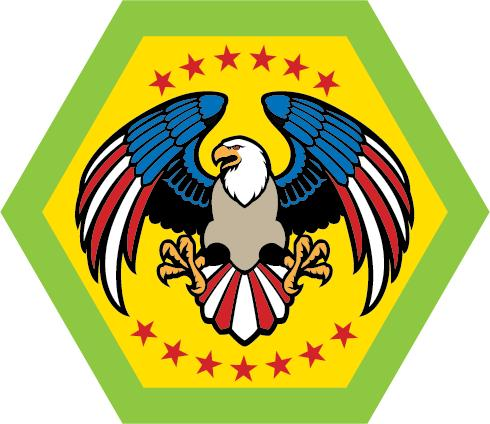

# Military Service & Veterans Merit Badge

## Overview

**Test Lab Merit Badge**, Verify current status at [Scouts BSA Test Lab](https://www.scouting.org/skills/merit-badges/test-lab/).

## Requirements

- (1) **Explore Military Heritage.** Do the following:
  - (a) Learn about Robert Baden-Powell’s military service. Discuss with your counselor what he learned about people, values, and culture through his military service and how it influenced the founding of Scouting.
    **[Robert Baden Powell (6 Min) (video)](https://www.youtube.com/watch?v=8xW61FgOImw)**
    **[Robert Baden-Powell (website) [Britannica]](https://www.britannica.com/biography/Robert-Stephenson-Smyth-Baden-Powell-1st-Baron-Baden-Powell)** (b) Select a historical military conflict. Discuss with your counselor what caused it and how leadership, planning, or values affected its outcome, how it was resolved, and discuss what lessons can be learned from it.
    **American Revolution [American Revolutionary War – Timelines and Maps – Animated US History (9 Min) (video)](https://www.youtube.com/watch?v=NdRuU5ON-LU) [History of the American Revolution (Website) [Library of Congress]](https://www.loc.gov/classroom-materials/united-states-history-primary-source-timeline/american-revolution-1763-1783/overview/)**
    **Civil War****[The American Civil War Explained (3 Min) (video)](https://www.youtube.com/watch?v=T3ryzrowNKc) [History of the US Civil War (website) [Library of Congress]](https://www.loc.gov/classroom-materials/united-states-history-primary-source-timeline/civil-war-and-reconstruction-1861-1877/overview/)**
    **World War I****[How Did WW I Start? (9 Min) (video)](https://www.youtube.com/watch?v=c7nUDLKKEBY) [U.S. Participation in World War I (website) [Library of Congress]](https://www.loc.gov/classroom-materials/united-states-history-primary-source-timeline/progressive-era-to-new-era-1900-1929/united-states-participation-in-world-war-i/)**
    **World War II****[World War II – Explained (5 Min) (video)](https://www.youtube.com/watch?v=tGlRJKsRozA) [World War II (website) [Library of Congress]](https://www.loc.gov/classroom-materials/united-states-history-primary-source-timeline/great-depression-and-world-war-ii-1929-1945/world-war-ii/)**
    **Korean War****[The Korean War: 5 Things to Know (4 Min) (video)](https://www.youtube.com/watch?v=h1wFrXKanC0) [Korea War Overview (website) [Stanford University]](https://spice.fsi.stanford.edu/docs/overview_of_the__korean_war_and_its_legacy)**
    **Vietnam War****[Vietnam War explained (3 Min) (video)](https://www.youtube.com/watch?v=XD08SZxKU2Y) [Vietnam War Overview (website) [Vassar]](https://www.vassar.edu/the-wars-for-vietnam/vietnam-war-overview)**
    **Gulf War****[What Happened in the Persian Gulf War? (4 Min) (video)](https://www.youtube.com/watch?v=xl_lctDXHuQ) [Gulf War Overview (website) [History.com]](https://www.history.com/articles/persian-gulf-war)**

- (2) **Understand the Cost of War and the Value of Peace.** Do the following:
  - (a) Discuss with your counselor why military conflict should be a last resort. (b) Do ONE of the following:
    - (1)
      - (a) Read or listen to President Dwight D. Eisenhower’s “Atoms for Peace” speech and explain the objectives and role of the International Atomic Energy Agency (IAEA) in promoting peaceful uses of nuclear energy.
        **[Atoms For Peace Speech Eisenhower (11 Min) (video)](https://www.youtube.com/watch?v=2DxeLeginUQ)**
        **[Atoms for Peace Overview (website) [Eisenhower Library]](https://www.eisenhowerlibrary.gov/research/online-documents/atoms-peace)**
        **[International Atomic Energy Agency (website) [IAEA]](http://www.iaea.org/)**
    - (a) Explain the role of the United Nations in promoting peace and resolving international disputes.
      **[United Nations Peacekeeping (website)](https://peacekeeping.un.org/en)**
  - (c) Reflect on the human and societal costs of war and share the lessons that can be learned from major conflicts.
    **[The Impact of War on Civilians: Understanding the Human Cost of Conflict (2.5 Min) (video)](https://www.youtube.com/watch?v=bi_dbJBqNUA)**

- (3) **United States Armed Forces.** Do ONE of the following:
  - (a) Choose one of the branches of service of the United States and research its history, its mission, and its organization. Explain to your counselor what you learned.
    **US Air Force [The EPIC History of the U.S. Air Force (4.5 Min) (video)](https://www.youtube.com/watch?v=jm0DCIS38T0) [History of the US Air Force (website) [Clemson University]](https://www.clemson.edu/business/academics/air-rotc/about/history.html)**
    **US Army**
    **[Center of Military History (5 Min) (video)](https://www.youtube.com/watch?v=z4DmoTrRVw0) [US Army Structure EXPLAINED! (4 Min) (video)](https://www.youtube.com/watch?v=0pOjfwL3gpA) [History of the US Army (website)](https://www.legendsofamerica.com/army-history-timeline/)**
    **US Coast Guard [United States Coast Guard – 1790 to Today – A Short History (4 Min) (video)](https://www.youtube.com/watch?v=CTib37o8TGU) [History of the US Coast Guard (website) [The Grace]](https://thegracemuseum.org/learn/2020-6-10-history-of-the-us-coast-guard/)**
    **US Marine Corps [Short History of the Marines (4.5 Min) (video)](https://www.youtube.com/watch?v=j9yef9Zxgww) [Summarized History of the USMC (website)](https://www.ebsco.com/research-starters/history/united-states-marine-corps)**
    **US Navy****[The History of the United States Navy (6 Min) (video)](https://www.youtube.com/watch?v=6-2Kac2xSZ0)**
    **[Every US Navy Fleet Explained (9 Min) (video)](https://www.youtube.com/watch?v=Gan3GQnPQf4) [History of the United States Navy (website) [Britannica]](https://www.britannica.com/topic/United-States-Navy/Theories-of-force-projection-and-World-War-I)**
    **US Space Force [Exploring the United States Space Force: History, Mission, and Capabilities (6 Min) (video)](https://www.youtube.com/watch?v=66V_wcePi6k) [Britannica Space Force Article (website)](https://www.britannica.com/science/space-exploration)** (b) Learn about the Veterans History Project organized by the Library of Congress. Conduct and record an interview of a veteran using those guidelines. Share your recording with your counselor and the veteran. With the veteran’s permission, share it with the Library of Congress.
    **[Youth Participation and Guidelines (website)](https://www.loc.gov/programs/veterans-history-project/how-to-participate/customized-guidance/)**
    **[Customized Guidance for Scouts (PDF)](https://www.loc.gov/static/programs/veterans-history-project/documents/for-scouts-custom-guidance.pdf)**
    **[Library of Congress Project Aims to Save Veterans’ Stories (2.5 Min) (video)](https://www.youtube.com/watch?v=Y-zMq13vKiY)**

- (4) **Understand Military Recognition.** Do the following:
  - (a) Explain the history and significance of the Medal of Honor and the Purple Heart.
    **[In Their Own Words: An Introduction to the Medal of Honor and Its Recipients (10 Min) (video)](https://www.youtube.com/watch?v=3ZwXgTnH854)**
    **[Medal of Honor History & Recipients (website) [Veteran Affairs]](https://www.cem.va.gov/history/Medal-of-Honor-history.asp)**
    **[The Purple Heart (1 Min) (video)](https://www.youtube.com/shorts/Tv8Om9utYXs)**
    **[The History of the Purple Heart (Website) [National WWII Museum]](https://www.nationalww2museum.org/war/articles/history-of-the-purple-heart)** (b) Describe the qualifications for receiving each award.
    **[The INTENSE Process of Awarding a Medal of Honor: Step by Step (5 Min) (video)](https://www.youtube.com/watch?v=ZxhI7JvyXlk)**
    **[How is the Medal of Honor Awarded? (website) [Medal of Honor Foundation]](https://www.cmohs.org/news-events/blog/how-is-the-medal-of-honor-awarded/)**
    **[What Is the Criteria for Receiving a Purple Heart?(3.5 Min) (video)](https://www.youtube.com/watch?v=OcCch7iMRAM) [Understanding Purple Heart Qualifications (website)](https://crawfordcountyveteransohio.com/blog/purple-heart-qualifications-guidance/)** (c) Research a Medal of Honor recipient and share their story with your counselor. Explain why their actions were recognized.
    **[Famous American Medal of Honor Recipients (13 Min) (video)](https://www.youtube.com/watch?v=M_t1_fzFSOI)**
    **[Medal of Honor Recipients (website) [Congressional Medal of Honor Society]](https://www.cmohs.org/recipients)**

- (5) **Military Uniforms and Insignia.** Do the following:
  - (a) Learn about the purpose and history of military uniforms and insignia.
    **[https://www.war.gov/Resources/Insignias/#officer-insignia](https://www.war.gov/Resources/Insignias/#officer-insignia)**
    **[https://en.wikipedia.org/wiki/Uniforms_of_the_United_States_Armed_Forces](https://en.wikipedia.org/wiki/Uniforms_of_the_United_States_Armed_Forces)** (b) Identify the different uniforms worn by members of the U.S. Army, Navy, Marine Corps, Air Force, Space Force, and Coast Guard. (c) Learn to identify and describe the rank insignia for all enlisted and officer ranks from one branch of the U.S. Armed Forces.
    [**U.S. Military Ranks & Pay Grade by Branch (website) [Veterans.com]**](https://veteran.com/military-ranks-insignia-charts/) (d) Explain how rank and insignia show respect, order, and responsibility within the military.

- (6) **Reflect on Symbols of Service.** Do the following:
  - (a) Discuss with an active-duty member, reservist, or veteran what their uniform and the American Flag mean to them as a military member. Share what you learned with your counselor. Describe what proper respect for the flag means to them. (b) Discuss with your counselor what your uniform and troop flag mean to you.

- (7) **Honor Veterans.** Do the following:
  - (a) Participate in a Veterans Day, Memorial Day, or other event that honors veterans in your community, school, or place of worship.
    **[Bet You Didn’t Know: Veterans Day | History (2 Min) (video)](https://www.youtube.com/watch?v=mWD4Oy6fKlo&t=2s)**
    [**History of Veterans Day (website) [Veterans Affairs]**](https://department.va.gov/veterans-day/history-of-veterans-day/) (b) Discuss with your counselor what role you played and what you learned from the experience. (c) Visit a veterans’ organization, military museum, memorial, or cemetery. Discuss with your counselor what you learned about service, sacrifice, and remembrance.

- (8) **Military Academies.** Do the following:
  - (a) Learn about the purpose and history of TWO of the U.S. military academies: the U.S. Military Academy at West Point, the U.S. Naval Academy, the U.S. Air Force Academy, the U.S. Coast Guard Academy, and the U.S. Merchant Marine Academy.
    [**All US Military Academies Explained (7 Min) (video)**](https://www.youtube.com/watch?v=-Puh39QSVRI) (b) Explain the general requirements for admission to one of these academies.
    [**A Guide to the US Military Service Academies (website)**](https://www.collegeessayguy.com/blog/us-military-service-academies-guide) (c) Describe how attending a service academy prepares a person for military leadership and service to the nation. (d) Discuss with your counselor how the values of Scouting align with those of the military academies.
    [**https://westpoint.edu**](https://westpoint.edu)
    [**https://www.usna.edu/homepage.php**](https://www.usna.edu/homepage.php)
    [**https://www.usafa.edu**](https://www.usafa.edu)
    [**https://uscga.edu**](https://uscga.edu)
    [**https://www.usmma.edu**](https://www.usmma.edu)

- (9) **Inspire Service and Leadership.** Do the following:
  - (a) Discuss how learning about veterans and military service can inspire youth to serve their community and country.
    **[Scoutmaster Talks About How Military Life Affects Scouting (2.5 Min)](https://www.youtube.com/watch?v=ZffcUB1ZlxM) [21 Strengths Arising From Military Experience (PDF)](https://ucnet.universityofcalifornia.edu/wp-content/uploads/working-at-uc/your-career/veterans/_files/21_Strengths_Arising_From_Military_Experience.pdf)** (b) List two ways you can demonstrate courage, service, or leadership in your daily life.
    **[The BEST Place to Find Courage (2 Min) (video)](https://www.youtube.com/watch?v=-fku1Evr7Vo)**
    [**6 Ways Students can Demonstrate Leadership (website) [University of Colorado]**](https://www.colorado.edu/orientation/2024/02/29/6-ways-students-can-demonstrate-leadership) (c) Research service projects in your area that honor veterans or support those currently serving. Share what you learned with your counselor.
    **[Honoring Heroes: 10 Eagle Scout Projects Dedicated to Veterans (1 min) (video)](https://www.youtube.com/shorts/FFRlU2fl0nc)**
    [**20 Project Ideas for Serving Veterans (PDF)**](https://elks.org/SharedElksOrg/enf/files/TwentyProjectIdeasforServingVeterans.pdf)

- (10) **Careers.** Explore careers related to this military service. Research one career to learn about the training and education needed, costs, job prospects, salary, job duties, and career advancement. Your research methods may include — with your parent or guardian’s permission — an internet or library search, an interview with a professional in the field, or a visit to a location where people in this career work. Discuss with your counselor both your findings and what about this profession might make it an interesting career.

  **Resources:** [U.S. Air Force – Own the Sky](https://youtu.be/LbNP0FUItjI?si=ldSxlAsuMOHw9JsA), [First Jump | Be All You Can Be | U.S. Army](https://youtu.be/luc9saxt_YQ?si=ta-_QOTrZeoW_HF4), [Coast Guard – What Makes a Life?](https://youtu.be/_CfGZ_TvTeI?si=ASAIOSsOIspLd9CT), [My Why | U.S. Marine Corps](https://youtu.be/L2ljqUpkC1c), [Strong Enough – US Navy](https://youtu.be/b_FL2yiCJSE?si=bRzZSvPec2qhy3MZ), [U.S. Space Force – Origins](https://youtu.be/R9bzFKHrQoo?si=U_qkxxjK66zMCAXl)

- (11) **Complete the survey below to complete the test lab requirements**

## Resources

- [Military Service & Veterans merit badge page](https://www.scouting.org/skills/merit-badges/test-lab/military-service-veterans/)

Note: This is an unofficial archive of Scouts BSA Merit Badges that was automatically extracted from the Scouting America website and may contain errors.