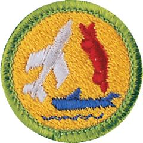

# Model Design and Building Merit Badge

## Overview

Model making, the art of creating copies of objects that are either smaller or larger than the objects they represent, is not only an enjoyable and educational hobby: it is widely used in the professional world for such things as creating special effects for movies, developing plans for buildings, and designing automobiles and airplanes.

## Requirements

- (1) **Safety.** Discuss all safety procedures with your counselor before beginning your modelmaking project, and explain why each is important—both in traditional and computer-assisted design and construction:
  - (a) Explain the requirements for personal safety when using modelmaking hand tools, and when to use proper protective equipment.
  - (b) Explain digital safety best practices when using computer design software, and digital fabrication tools.
  - (c) Explain what precautions to take when using flammable or hazardous materials.

- (2) **Types of Models and Materials.** Do the following:
  - (a) Explain the uses for each of the following types of models: architectural, structural, process, mechanical, and industrial.
  - (b) Explain to your counselor how either traditional and/or computer design tools can be used to create plans, simulate function, visualize models, and assist in constructing or fabricating parts.
  - (c) Describe to your counselor traditional and modern materials and fabrication methods that can be used for making these models. Include physical and digital materials and methods.

- (3) **Planning Your Project.** With your counselor's advice, select a subject from requirement 4 for your model project. (You must not use a pre-made kit; your project must be your original design.)
  Do the following:
  - (a) Prepare the necessary plans to the proper scale.
  - (b) Make a list of materials.
  - (c) Create a list of the required tools.
  - (d) This model should be your own original work. Tell why you selected this subject.
  - (e) Discuss with your counselor if you plan to integrate computer design tools to complete your project.

- (4) **Build Your Model.** Do ONE of the following using physical and/or computer design methods. Before beginning any model, discuss your approach with your counselor, including the possible use of computer design software such as CAD or 3D modeling tools. Present your plans and completed model to your counselor.
  - (a) **Architectural Model.**
    Design and build a model of a house to a scale of 1⁄4" = 1'0" (1:48 scale). Begin by creating floor plans and elevations. Include windows, doors, and structural elements. Discuss with your counselor the materials you intend to use, the amount of detail required, outside treatment (finish, shrubbery, walks, etc.), and color selections. You may choose to 3D print elements or use laser-cut parts based on using computer design. Present both your design and final model to your counselor for evaluation.
  - (b) **Structural Model.**
    Construct a scale model showing corner construction of a wood-frame building to a scale of 1 1⁄2"=1'0" (1:8 scale). Begin with a structural layout showing the parts of the floor and wall frames, such as intermediate girder, joist, bridging, subfloor, sill, sole plate, stud, and rafter. Use your plans to assist in building a physical model with cardboard, foam board, or wood. Review with your counselor the parts of the structure and discuss challenges in both your design and build process, gathering the materials and supporting the structure.
  - (c) **Process Model.**
    Design and build a model showing the plumbing system of your house to a scale of 3 ⁄4" =1'0" (1:16 scale) or an agreed upon scale. Show hot and cold-water supply, all waste returns, and venting. After creating your plan, talk to your counselor about how to begin this model, and present the scale and the materials you will use. Build the model using appropriate materials such as tubing, straws, or printed parts. After completion, present your model to your counselor, and be prepared to discuss any problems you had building this model.
  - (d) **Mechanical Model.** Build a model of a mechanical device that incorporates at least two of the six simple machines. You can use digital tools to design and simulate the device before constructing it. Once your design is approved by your counselor, build a working physical model using materials such as wood, plastic, or 3D printed parts. Present your models to your counselor and be prepared to discuss materials used, the machine's function, and challenges you encountered during the construction process.
  - (e) **Industrial Model.**
    Build a model of an actual passenger-carrying vehicle to a scale of 1" = 1'0" or 1 ⁄2" = 1'0" (1:12 or 1:24 scale). Begin by measuring a real vehicle and modeling it from multiple views (top, front, rear, sides). You can draw it or use computer design software. From your plans, build a physical model or use digital rendering or 3D printing to produce the final version. Discuss with your counselor which parts were most challenging.

- (5) **Special-Effects Fantasy Model.** Design and build a fantasy spacecraft model suitable for a science-fiction film, using traditional modeling and/or computer design techniques. Determine an appropriate scale for your design—one that makes practical sense. Do the following:
  - (a) Research real-world aircraft, submarines, and naval ships for design inspiration.
  - (b) Design individual components (such as the cockpit, living areas, engines, and storage).
  - (c) Produce a final sketch or a rendered image of the complete model from multiple angles.
  - (d) Discuss your design process and scale choices with your counselor. Describe the materials (physical and/or digital) you used, how you engineered your model and discuss any difficulties you encountered and what you learned.

- (6) **Careers.** Explore careers related to this merit badge. Research one career to learn about the training and education needed, costs, job prospects, salary, job duties, and career advancement. Your research methods may include—with your parent or guardian's permission—an internet or library search, an interview with a professional in the field, or a visit to a location where people in this career work. Discuss with your counselor both your findings and what about this profession might make it an interesting career.

## Resources

- [Model Design and Building merit badge page](https://www.scouting.org/merit-badges/model-design-and-building/)
- [Model Design and Building merit badge PDF](https://filestore.scouting.org/filestore/Merit_Badge_ReqandRes/Pamphlets/Model%20Design.pdf) ([local copy](files/model-design-and-building-merit-badge.pdf))
- [Model Design and Building merit badge pamphlet](https://www.scoutshop.org/catalog/product/view/id/17381)
- [Model Design and Building merit badge workbook PDF](http://usscouts.org/mb/worksheets/Model-Design-and-Building.pdf)
- [Model Design and Building merit badge workbook DOCX](http://usscouts.org/mb/worksheets/Model-Design-and-Building.docx)

Note: This is an unofficial archive of Scouts BSA Merit Badges that was automatically extracted from the Scouting America website and may contain errors.