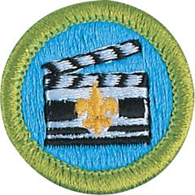

# Moviemaking Merit Badge

## Overview

Moviemaking is a way to tell stories visually through the art and science of motion picture photography.

## Requirements

- (1) Discuss and demonstrate the proper elements of a good motion picture. In your discussion, include visual storytelling, rhythm, the 180-axis rule, camera movement, framing and composition of camera shots, and lens selection.

- (2) Do the following:
  - (a) In a three- or four-paragraph treatment, tell the story you plan to produce, making sure that the treatment conveys a visual picture.
  - (b) Prepare a storyboard for your motion picture.

    **Note:** This can be done with rough sketches and stick figures.
  - (c) Demonstrate the following motion picture shooting techniques:
  - (1) Using a tripod
  - (2) Panning a camera
  - (3) Framing a shot
  - (4) Selecting an angle
  - (5) Selecting proper lighting
  - (6) Handheld shooting.
  - (d) Using motion picture shooting techniques, plan ONE of the following programs. Start with a treatment and complete the requirement by presenting this program to a pack or your troop, patrol, or class.
  - (1) Film a court of honor and show it to an audience.
  - (2) Create a short feature of your own design, using the techniques you learned.
  - (3) Shoot a vignette that could be used to train a new Scout in a Scouting skill.

- (3) Do ONE of the following:
  - (a) With your parent or guardian's permission and your counselor's approval, visit a film set or television production studio and watch how production work is done.
  - (b) Explain to your counselor the elements of the zoom lens and three important parts.

- (4) Do ONE of the following:
  - (a) Explore careers related to this merit badge. Research one career to learn about the training and education needed, costs, job prospects, salary, job duties, and career advancement. Your research methods may include—with your parent or guardian's permission—an internet or library search, an interview with a professional in the field, or a visit to a location where people in this career work. Discuss with your counselor both your findings and what about this profession might make it an interesting career.
  - (b) Explore how you could use knowledge and skills from this merit badge to pursue a hobby or healthy lifestyle. Research any training needed, expenses, and organizations that promote or support it. Discuss with your counselor what short-term and long-term goals you might have if you pursued this.

## Resources

- [Moviemaking merit badge page](https://www.scouting.org/merit-badges/moviemaking/)
- [Moviemaking merit badge PDF](https://filestore.scouting.org/filestore/Merit_Badge_ReqandRes/Pamphlets/Moviemaking.pdf) ([local copy](files/moviemaking-merit-badge.pdf))
- [Moviemaking merit badge pamphlet](https://www.scoutshop.org/moviemaking-merit-badge-pamphlet-650735.html)
- [Moviemaking merit badge workbook PDF](http://usscouts.org/mb/worksheets/Moviemaking.pdf)
- [Moviemaking merit badge workbook DOCX](http://usscouts.org/mb/worksheets/Moviemaking.docx)

Note: This is an unofficial archive of Scouts BSA Merit Badges that was automatically extracted from the Scouting America website and may contain errors.