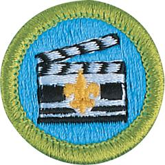

# Moviemaking Merit Badge

## Overview

Moviemaking is a way to tell stories visually through the art and science of motion picture photography.

## Requirements

- (1) Discuss and demonstrate the proper elements of a good motion picture. In your discussion, include visual storytelling, rhythm, the 180-axis rule, camera movement, framing and composition of camera shots, and lens selection.

  **Resources:** [Film Making Basics (video)](https://youtu.be/BFwMRVwrKcA?si=uW4whxq0-SZjyFHJ)

- (2) Do the following:
  - (a) In a three- or four-paragraph treatment, tell the story you plan to produce, making sure that the treatment conveys a visual picture.

    **Resources:** [Film Production Explained, Each Step of the Production Process (video)](https://youtu.be/puF9CkvmJt0?si=jiFW5a-I3X0vZDV4)
  - (b) Prepare a storyboard for your motion picture. **Note:** This can be done with rough sketches and stick figures.

    **Resources:** [What Is a Storyboard and Why Is It Important? Pre-Production Filmmaking (video)](https://youtu.be/yPtqHdQcOOw?si=24Rdiz36nJTayneu)
  - (c) Demonstrate the following motion picture shooting techniques:
  - (1) Using a tripod

    **Resources:** [7 Tripod Tricks for Filmaking (video)](https://youtu.be/pAvn034VcCg)
  - (2) Panning a camera

    **Resources:** [Camera Panning (video)](https://youtu.be/Km7Rfpda_Lw)
  - (3) Framing a shot

    **Resources:** [Reverse Shot (video)](https://youtu.be/5UE3jz_O_EM), [Frame it Right Essential Framing (short video)](https://www.youtube.com/shorts/DAwz2Wnrr90?feature=share)
  - (4) Selecting an angle

    **Resources:** [Film making 101: 5 Camera Angles (video)](https://youtu.be/nfHvSnILXl0?si=9ObCi1MwUvu3CHyW), [12 CAMERA ANGLES to Enhance Your Films (video)](https://youtu.be/SlNviMsi0K0)
  - (5) Selecting proper lighting

    **Resources:** [Ultimate Guide to Cinematic Lighting (video)](https://youtu.be/r2nD_knsNrc), [Zack Snyder Justice League Martian Man Hunter Meets Lois (video)](https://youtu.be/zdZ2zza5WbY?si=m3eF-8tZrS-NaOC5)
  - (6) Handheld shooting

    **Resources:** [5 Tips for Shooting Handheld Videos (video)](https://youtu.be/LuJdvwm8-0k), [Birdman (video)](https://youtu.be/PVmaJAmQ3yQ)
  - (d) Using motion picture shooting techniques, plan ONE of the following programs. Start with a treatment and complete the requirement by presenting this program to a pack or your troop, patrol, or class.
  - (1) Film a court of honor and show it to an audience.

    **Resources:** [4 Videography Tips for Beginners (video)](https://youtu.be/oPfet0ypjmY?si=flKBth5nUkcFZelI)
  - (2) Create a short feature of your own design, using the techniques you learned.

    **Resources:** [10 Tips for Beginner Videographers (video)](https://youtu.be/kZWH6OBDdR0?si=e1VBvG2lGwQHKqEY)
  - (3) Shoot a vignette that could be used to train a new Scout in a Scouting skill.

    **Resources:** [How to Make a Great Instructional Video (video)](https://youtu.be/cLLuuV_57JY?si=vcdpLOuyRcHeC1jf)

- (3) Do ONE of the following:
  - (a) With your parent or guardian's permission and your counselor's approval, visit a film set or television production studio and watch how production work is done.

    **Resources:** [Film Set Order of Operations (video)](https://youtu.be/zqUAiM-FLrs?si=xK2hkF_sD9zCzGcM)
  - (b) Explain to your counselor the elements of the zoom lens and three important parts.

    **Resources:** [How Lens Work in Camera (video)](https://youtu.be/fRKsKR9wvqE), [The Parts of a Camera Lens - Anatomy of a DSLR Lens (video)](https://youtu.be/15h9iG-Rdwk?si=TUp4-HL00H50ZX79)

- (4) Do ONE of the following:
  - (a) Explore careers related to this merit badge. Research one career to learn about the training and education needed, costs, job prospects, salary, job duties, and career advancement. Your research methods may include—with your parent or guardian's permission—an internet or library search, an interview with a professional in the field, or a visit to a location where people in this career work. Discuss with your counselor both your findings and what about this profession might make it an interesting career.

    **Resources:** [Top 10 Careers in Film & Video Production (video)](https://youtu.be/CNMBMhNh2S0)
  - (b) Explore how you could use knowledge and skills from this merit badge to pursue a hobby or healthy lifestyle. Research any training needed, expenses, and organizations that promote or support it. Discuss with your counselor what short-term and long-term goals you might have if you pursued this.

    **Resources:** [Filmmaking as a Hobby - Getting Started (video)](https://youtu.be/d30kfqueNKI)

## Resources

- [Moviemaking merit badge page](https://www.scouting.org/merit-badges/moviemaking/)
- [Moviemaking merit badge PDF](https://filestore.scouting.org/filestore/Merit_Badge_ReqandRes/Pamphlets/Moviemaking.pdf) ([local copy](files/moviemaking-merit-badge.pdf))
- [Moviemaking merit badge pamphlet](https://www.scoutshop.org/moviemaking-merit-badge-pamphlet-650735.html)
- [Moviemaking merit badge workbook PDF](http://usscouts.org/mb/worksheets/Moviemaking.pdf)
- [Moviemaking merit badge workbook DOCX](http://usscouts.org/mb/worksheets/Moviemaking.docx)

Note: This is an unofficial archive of Scouts BSA Merit Badges that was automatically extracted from the Scouting America website and may contain errors.