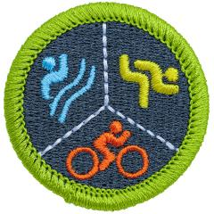

# Multisport Merit Badge

## Overview

Multisport is a racing competition that includes any combination of running, biking, or swimming. This badge serves as a natural progression for Scouts who are interested in or have earned individual badges for Swimming, Cycling, Athletics, or Personal Fitness. For Scouts active in one of these sports, it provides a fun opportunity to expand into another fitness area and enjoy the benefits of cross-training. Scouts proficient in two sports can discover new ways to combine their skills, which offers both immediate and long-term benefits for well-being, personal growth, and athletic endeavors.

## Requirements

- (1) Do the following:
  - (a) Explain to your counselor the most likely hazards you may encounter during multisport activities and what you should do to anticipate, prevent, mitigate, and respond to these hazards.
  - (b) Show that you know first aid for injuries or illnesses that could occur while participating in multisport events, including abrasions, blisters, concussions, contusions, dehydration, hypothermia, overheating, sprains, and strains.

- (2) Do the following:
  - (a) Discuss the importance of having a physical examination each year. Discuss why overall health, immunizations, medications, allergies, and medical history are covered during an examination. Tell your counselor when you last underwent a physical examination.
  - (b) Explain the importance of maintaining good health habits, especially during training, and how the use of tobacco products, alcohol, and other harmful substances can negatively affect your health and your performance in athletic activities.
  - (c) Define a healthy diet and explain the importance of maintaining a healthy diet.

- (3) Do the following:
  - (a) Discuss with your counselor your level of familiarity and experience with the multisport events (swimming, biking, and running) and the order and distance of each sports segment.
  - (b) Explain to your counselor which multisport event (swimming, biking, or running) you feel is your strongest and which you could improve upon the most.
  - (c) Identify the required equipment for each of the three common multisport events (swimming, biking, and running).
  - (d) Based on your interests, experience, and discussion with your counselor, select ONE of the following multisport formats to concentrate on for the remaining requirements: triathlon (swimming, biking, and running), duathlon (biking and running), aquathlon (swimming and running) and aquabike (swimming and biking).

- (4) Complete ALL of the following for the multisport format option you selected in requirement 3(d):
  - **Option A—Triathlon.**
  - (1) **Swimming**
  - (a) Before doing requirements 5 through 8, earn the Swimming merit badge.
  - (b) Explain the components of the Scouting America Safe Swim Defense program and how you will ensure they are in place when you swim.
  - (c) Explain to your counselor the difference between a pool swim and an open water swim, including at what water temperature it is appropriate to wear a wet suit.
  - (2) **Biking**
  - (a) Explain to your counselor how to ride predictably, be conspicuous, think ahead, and ride ready.
  - (b) Discuss what should be checked regularly to make sure the bicycle is safe to ride.
  - (c) Explain the importance of wearing a properly sized and fitted helmet while cycling and of wearing the right clothing for the weather.
  - (3) **Running**
  - (a) Demonstrate a proper run warmup and cool-down. Explain to your counselor the importance of maintaining healthy habits, including hydration, nutrition, injury prevention, and rest.
  - (b) Learn and state the basic rules of the road for runners.
  - (c) Demonstrate important running drills, including high knees, butt kicks, lunges, inchworms, and soldier kicks.
  - **Option B—Duathlon.**
  - (1) **Biking**
  - (a) Explain to your counselor how to ride predictably, be conspicuous, think ahead, and ride ready.
  - (b) Discuss what should be checked regularly to make sure the bicycle is safe to ride.
  - (c) Explain the importance of wearing a properly sized and fitted helmet while cycling and of wearing the right clothing for the weather.
  - (2) **Running**
  - (a) Demonstrate a proper run warmup and cool-down. Explain to your counselor the importance of maintaining healthy habits, including hydration, nutrition, injury prevention, and rest.
  - (b) Learn and state the basic rules of the road for runners.
  - (c) Demonstrate important running drills, including high knees, butt kicks, lunges, inchworms, and soldier kicks.
  - **Option C—Aquathlon.**
  - (1) **Swimming**
  - (a) Before doing requirements 5 through 8, earn the Swimming merit badge.
  - (b) Explain the components of the Scouting America Safe Swim Defense guidelines and how you will ensure they are in place when you swim.
  - (2) **Running**
  - (a) Demonstrate a proper run warmup and cool-down. Explain to your counselor the importance of maintaining healthy habits, including hydration, nutrition, injury prevention, and rest.
  - (b) Learn and state the basic rules of the road for runners.
  - (c) Demonstrate important running drills, including high knees, butt kicks, lunges, inchworms, and soldier kicks.
  - (c) Explain to your counselor the difference between a pool swim and an open water swim, including at what water temperature it is safe to swim, and when it is appropriate to wear a wet suit.
  - **Option D—Aquabike.**
  - (1) **Swimming**
  - (a) Before doing requirements 5 through 8, earn the Swimming merit badge.
  - (b) Explain the components of the Scouting America Safe Swim Defense guidelines and how you will ensure they are in place when you swim.
  - (c) Explain to your counselor the difference between a pool swim and an open water swim, including at what water temperature it is appropriate to wear a wet suit.
  - (2) **Biking**
  - (a) Explain to your counselor how to ride predictably, be conspicuous, think ahead, and ride ready.
  - (b) Discuss what should be checked regularly to make sure the bicycle is safe to ride.
  - (c) Explain the importance of wearing a properly sized and fitted helmet while cycling and of wearing the right clothing for the weather.

- (5) Do the following:
  - (a) With guidance from your counselor, establish a four-week training plan that combines your chosen multisport format to develop proper techniques, gain self-confidence, and increase endurance. Each session should last at least 25 minutes and include a proper warmup before the session and stretching afterward.
  - (b) Use a chart or other tracking method to monitor your training and development during this period.
  - (c) Set a personal goal for improvement based on one or more of the following criteria: time, technique, or distance.
  - (d) At the end of four weeks, discuss your progress with your counselor and tell how your development has affected you mentally and physically.

- (6) Learn the methods of setting up your transition area, which is where your bike equipment and/or running gear will be. Discuss with your counselor how to smoothly and safely transition from one element to the next, such as mounting and dismounting your bike or adjusting your gear.

- (7) After completing requirements 1-6, do ONE of the following (complete all of the activities on the same day and consecutively) for the multisport focus area you selected in requirement 3(d), including demonstrating a smooth and safe transition between each:
  - (a) Triathlon (swim 100 m, bike 3 km, and run 1 km)
  - (b) Duathlon (run 1.5 km, bike 3 km, and run 0.75 km)
  - (c) Aquathlon (swim 100 m and run 1 km)
  - (d) Aquabike (swim 100 m and bike 3 km).

- (8) Do TWO of the following and discuss with your counselor:
  - (a) Research and identify two ways you can continue participating in multisport after completing this merit badge.
  - (b) Research an Olympic, Paralympic, or professional triathlete (past or current). Share information on their background in the sport and what inspires you most about this individual.
  - (c) Demonstrate leadership by starting a training group and educating your peers on the importance of physical activity, nutrition, and the disciplines of multisport.
  - (d) Sign up for and participate in a sanctioned multisport event in your area.
  - (e) Volunteer at a local multisport event, running race, biking event, swim meet, or adaptive sporting event.

## Resources

- [Multisport merit badge page](https://www.scouting.org/merit-badges/multisport/)
- [Multisport merit badge PDF](https://filestore.scouting.org/filestore/Merit_Badge_ReqandRes/Pamphlets/Multisport.pdf) ([local copy](files/multisport-merit-badge.pdf))
- [Multisport merit badge pamphlet](https://www.scoutshop.org/multisport-merit-badge-pamphlet-664475.html)

Note: This is an unofficial archive of Scouts BSA Merit Badges that was automatically extracted from the Scouting America website and may contain errors.