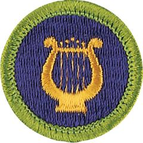

# Music Merit Badge

## Overview

The history of music is rich and exciting. Through the ages, new music has been created by people who learned from tradition, then explored and innovated. All the great music has not yet been written. Today, the possibilities for creating new music are limitless.

## Requirements

- (1) Sing or play a simple song or hymn chosen by your counselor, using good technique, phrasing, tone, rhythm, and dynamics. Read all the signs and terms of the score.

  **Resources:** [How to Read Music (video)](https://youtu.be/ZN41d7Txcq0?si=G50I4GaI0d62XHew), [Violin Demonstration  (video)](https://youtu.be/XbppMuZF3_8?si=c9BYdNXj6_VO4WEY), [Instrument Demonstration for Beginning Band (video)](https://youtu.be/CCTeSjpDsIs?si=NZkosauuFJR21A14)

- (2) Name the five general groups of musical instruments. Create an illustration that shows how tones are generated and how instruments produce sound.

  **Resources:** [Classification of Musical Instruments (video)](https://youtu.be/WencyslK76o), [Orchestral Instruments and How They Sound (video)](https://youtu.be/Sr-l2m8twX0?si=6Fj8mHWGIRqhrhwi)

- (3) Do TWO of the following:
  - (a) Attend a live performance, or listen to three hours of recordings from any two of the following musical styles: blues, jazz, classical, country, bluegrass, ethnic, gospel, musical theater, opera. Describe the sound of the music and the instruments used. Identify the composers or songwriters, the performers, and the titles of the pieces you heard. If it was a live performance, describe the setting and the reaction of the audience. Discuss your thoughts about the music.
  - (b) Interview an adult member of your family about music. Find out what the most popular music was when he or she was your age. Find out what his or her favorite music is now, and listen to three of your relative's favorite tunes with him or her. How do those favorites sound to you? Had you ever heard any of them? Play three of your favorite songs for your relative, and explain why you like these songs. Ask what he or she thinks of your favorite music.
  - (c) Serve for six months as a member of a school band, choir, or other organized musical group, or perform as a soloist in public six times.
  - (d) List five people who are important in the history of American music and explain to your counselor why they continue to be influential. Include at least one composer, one performer, one innovator, and one person born more than 100 years ago.

- (4) Do ONE of the following:
  - (a) Teach three songs to a group of people. Lead them in singing the songs, using proper hand motions.
  - (b) Compose and write the score for a piece of music of 12 measures or more, and play this music on an instrument.
  - (c) Make a traditional instrument and learn to play it.

- (5) Define for your counselor *intellectual property* (IP). Explain how to properly obtain and share recorded music.

  **Resources:** [What Are Intellectual Property Rights? (video)](https://youtu.be/UqZJPuyK9VY)

- (6) Do ONE of the following:
  - (a) Explore careers related to this merit badge. Research one career to learn about the training and education needed, costs, job prospects, salary, job duties, and career advancement. Your research methods may include—with your parent or guardian's permission— an internet or library search, an interview with a professional in the field, or a visit to a location where people in this career work. Discuss with your counselor both your findings and what about this profession might make it an interesting career.

    **Resources:** [Careers in the Music Industry (video)](https://youtu.be/X9baGNtXjv4?si=thzzvSy24o1fR6gn)
  - (b) Explore how you could use knowledge and skills from this merit badge to pursue a hobby. Research any training needed, expenses, and organizations that promote or support it. Discuss with your counselor what short-term and long-term goals you might have if you pursued this.

    **Resources:** [Music Hobbies (video)](https://youtu.be/2XdqwW4zDtE?si=DBqxq3JLiPrE1mG9)

## Resources

- [Music merit badge page](https://www.scouting.org/merit-badges/music/)
- [Music merit badge PDF](https://filestore.scouting.org/filestore/Merit_Badge_ReqandRes/Pamphlets/Music%20Bugling.pdf) ([local copy](files/music-merit-badge.pdf))
- [Music merit badge pamphlet](https://www.scoutshop.org/music-and-bugling-merit-badge-pamphlet-650736.html)
- [Music merit badge workbook PDF](http://usscouts.org/mb/worksheets/Music.pdf)
- [Music merit badge workbook DOCX](http://usscouts.org/mb/worksheets/Music.docx)

Note: This is an unofficial archive of Scouts BSA Merit Badges that was automatically extracted from the Scouting America website and may contain errors.