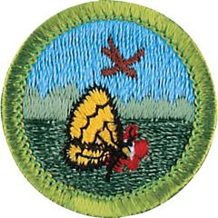

# Nature Merit Badge

## Overview

There is a very close connection between the soil, the plants, and all animal life, including people. Understanding this connection, and the impact we have upon it, is important to preserving the wilderness, as well as to our own well-being as members of the web of nature.

## Requirements

* Note: In most cases all specimens should be returned to the wild at the location of original capture after the requirements have been met. Check with your counselor for those instances where the return of these specimens would not be appropriate. Under the Endangered Species Act of 1973, some plants and animals are or may be protected by federal law. The same ones and/or others may be protected by state law. Be sure that you do not collect protected species. Your state may require that you purchase and carry a license to collect certain species. Check with the wildlife and fish and game officials in your state regarding species regulations before you begin to collect.
* NOTE:  The official merit badge pamphlets are now free and downloadable  [HERE](https://filestore.scouting.org/filestore/Merit_Badge_ReqandRes/Pamphlets/Nature.pdf) or can be purchased at the [Scout Shop.](https://www.scoutshop.org/)
* (1) Name three ways in which plants are important to animals. Name a plant that is protected in your state or region, and explain why it is at risk. Resources:  [Why Animals Need Plants (video)](https://www.pbs.org/video/why-animals-need-plants-y469zr)  [11 Plants That Use Animals to Do Their Dirty Work (website)](https://completegardening.com/11-plants-that-use-animals-to-do-their-dirty-work/)
* (2) Name three ways in which animals are important to plants. Name an animal that is protected in your state or region, and explain why it is at risk. Resource:  [How Do Animals Help Plants? (4 Symbiotic Interactions) (website)](https://nature-mentor.com/how-do-animals-help-plants/)
* (3) Explain the term "food chain." Give an example of a four-step land food chain and a four-step water food chain. Resources:  [Food Chains and Food Webs (video)](https://youtu.be/JCl_yDf0Qok?si=E9r3jI_7n8iYE1Rb)  [Food Chains in the Everglades (video)](https://youtu.be/5Z8rKhXUYAg?si=CG1gOoYQ6n9s86LY)
* (4) Do all the requirements in FIVE of the following fields:
    * (a) Birds
        * (1) In the field, identify eight species of birds.Resources: [How to Identify Birds [TOP 10 BACKYARD BIRDS] (video)](https://www.youtube.com/watch?v=HtBcOk8ICpA) [Merlin Bird ID (website)](https://merlin.allaboutbirds.org/)
        * (2) Make and set out a birdhouse OR a feeding station OR a birdbath. List what birds used it during a period of one month. Resources: [DIY Birdhouse (video)](https://www.youtube.com/watch?v=u4iAhnbWpz8) [How to Pick (or Build) the Right Bird Bath for Your Garden (video)](https://www.youtube.com/watch?v=yZl2N2XlHDA) [Build a Bird House for Under $5 in Under 5 Minutes (video)](https://www.youtube.com/watch?v=j0werPvrrPI)

    * (b) Mammals
        * (1) In the field, identify three species of wild mammals. Resources: [How to Find Mammal Signs (video)](https://www.youtube.com/watch?v=x8DfP0Nh7kA) [Mammals (website)](https://www.nwf.org/Educational-Resources/Wildlife-Guide/Mammals)
        * (2) Make plaster casts of the tracks of a wild mammal. Resources: [How to Make Plaster Casts of an Animal Track (video)](https://www.youtube.com/watch?v=Y4WTmgo4zeA) [How to Make Your Own Animal Track Cast (video)](https://www.youtube.com/watch?v=A_ksi4Ih_wU)

    * (c) Reptiles and Amphibians
        * (1) Show that you can recognize the venomous snakes in your area. Resources: [How to Tell if a Snake Is Venomous (website)](https://urbanjunglewildliferemoval.com/blog/how-to-tell-venomous-snake/) [Zoologist Explains Snake Venom - Poisonous vs Venomous (video)](https://youtu.be/KxXfWrI6bB4?si=6TMzt9gUfQdxCvWc)
        * (2) In the field, identify three species of reptiles or amphibians. Resources: [Reptiles of the United States (website)](https://www.inaturalist.org/places/united-states#taxon=26036) [Amphibians of the United States (website)](https://www.inaturalist.org/places/united-states#taxon=20978)
        * (3) Recognize one species of toad or frog by voice; OR identify one reptile or amphibian by eggs, den, burrow, or other signs. Resources: [Reptiles vs. Amphibians (video)](https://www.youtube.com/watch?v=6MsTbQi19SA) [Frog Sounds: Why They Make Them (Examples) (video)](https://youtu.be/74-vaZv54s8?si=7ClcX_Akwhjh0A_T)

    * (d) Insects and Spiders
        * (1) Collect and identify either in the field or through photographs 10 species of insects or spiders. Photos may be taken with your own equipment or gathered from other sources. Resource: [How to Start a Bug Collection (video)](https://youtu.be/_Ep2ronR_io?si=VWUcH8SZodx_njzz)
        * (2) Hatch an insect from the pupa or cocoon; OR hatch adults from nymphs; OR keep larvae until they form pupae or cocoons; OR keep a colony of ants or bees through one season. Resources: [Hatch and Raise Monarch Butterflies (video)](https://www.youtube.com/watch?v=XC_O2MN4iOk) [How to Raise an Ant Colony 101 | The Ultimate Guide to Keeping Pet Ants (video)](https://www.youtube.com/watch?v=o1421IyFKuU) [How to Raise a Caterpillar Into a Butterfly (video)](https://www.youtube.com/watch?v=G-nriWdyR5w)

    * (e) Fish
        * (1) Identify two species of fish native to your area. Resource: [Game Fish Identification Reference Guides (website)](https://igfa.org/game-fish-database/)
        * (2) Collect four kinds of animal food eaten by fish in the wild. Resource: [What Do Fish Eat? (video)](https://www.youtube.com/watch?v=LVTGIn4gnTw)

    * (f) Mollusks and Crustaceans
        * (1) Identify five species of mollusks and crustaceans. Resources: [All About Mollusks (video)](https://www.youtube.com/watch?v=G_GJH1t7VVM) [Crustaceans Facts (video)](https://youtu.be/nfTQUX-GMjc?si=uWRRlR9ez4Tc5ymm)
        * (2) Collect, mount, and label six shells. Resources: [Organizing My Massive Seashell Collection. Identifying Similar Shells & Comparing Shells to Critters (video)](https://youtu.be/MMkynhuI_1w?si=ZC4ur2DlM9Sl2IFw) [Organizing a Shell Collection (website)](https://conchologistsofamerica.org/organizing-a-shell-collection/)

    * (g) Plants
        * (1) In the field, identify 15 species of wild plants. Resource: [How to Identify Wild Plants - A Guide To Botanical Terms (video)](https://www.youtube.com/watch?v=5Aj82u2he6s)
        * (2) Do ONE of the following:
            * (a) Collect and label the seeds of six plants OR the leaves of 12 plants. Resources: [Science at Play: Preserving Fall Leaves (video)](https://www.youtube.com/watch?v=06nhKenT410) [Harvesting & Saving Seeds! (video)](https://www.youtube.com/watch?v=QqIoGe-m2OM)
            * (b) Photograph the seeds of six plants OR the leaves of 12 plants and create a catalog of your photos. Resources: [Plant Photography for Beginners (video)](https://youtu.be/ChxvvKV2Gx8?si=PXSE1d46dKsQqDmv) [How I Shot My First Plant Time-Lapse (video)](https://youtu.be/gqoAL4-XTNg?si=p-r1McCO7JyXONJH)

    * (h) Soils and Rocks
        * (1) Collect and identify three different types of soil that represent soils high in sand, clay and humus. Resource: [Layers of Soil | Soil Profile Formation (video)](https://www.youtube.com/watch?v=VTuL5Pa0gC0)
        * (2) Collect and identify five different types of rocks from your area. Resources: [Rockhounding 101: What to Look for on Your Next Adventure! (video)](https://youtu.be/yORP1Ba-K4Q?si=iR3Lo66iW-dmFjno) [Rock & Mineral Identification | It Can Be Easier Than You Think (video)](https://www.youtube.com/watch?v=mgld5jeYR04)

* (5) Discuss the importance of the Leave No Trace Seven Principles and the Outdoor Code and how they relate to nature. Explain how you have followed the Leave No Trace Seven Principles and the Outdoor Code while in natural areas during field observation,  specimen collection, and identification. Resources: [The Outdoor Code Explained (video)](https://www.youtube.com/watch?v=XoOSgw6sOPA)  [What is Leave No Trace?  (video)](https://www.youtube.com/watch?v=Rpq01rO9ZR0)  [Leave No Trace Basics (video)](https://vimeo.com/1115216743/63b20c0b33?share=copy)
* (6) Do the following:
    * (a) Explain what succession is to your counselor. Resources: [Ecological Succession (video)](https://www.youtube.com/watch?v=IrIvMt6HWlA) [Ecological Succession: Change Is Good (video)](https://www.youtube.com/watch?v=jZKIHe2LDP8)
    * (b) Visit a natural area (forest, grassland, meadow, water feature) and explain what stage of succession (both plant and animal) the area is in. Talk about what community/succession stages may have been there before and what community/succession stages may replace what you see now. Discuss what disturbances or changes have taken place in the past to create this landscape and what changes may occur in the future to change the landscape further. Resource: [Ecological Succession-Primary and Secondary (video)](https://youtu.be/8ceDE01iWLE?si=kzFlf4WEsd2ArppS)

* (7) Do ONE of the following:
    * (a) Identify three career opportunities that would use skills and knowledge in Nature. Pick one and research the training, education, certification requirements, experience, and expenses associated with entering the field. Research the prospects for employment, starting salary, advancement opportunities and career goals associated with this career. Discuss what you learned with your counselor and whether you might be interested in this career. Resources: [10+ Wildlife biology careers (video)](https://youtu.be/AK2Onqx-ctM?si=OS1LiXEGCczteH1X) [12 Environmental Career Paths for Non-Scientists (video)](https://youtu.be/GfpULQZL3tk?si=byWfIgDnVLy-xAPY) [10+ Outdoor & Nature Job Ideas With NO Degree! (video)](https://youtu.be/Q-3KseGxoOw?si=qn8G2GE_wnzwTI6B)
    * (b) Identify how you might use the skills and knowledge in Nature to pursue a personal hobby. Research the additional training required, expenses, and affiliation with organizations that would help you maximize the enjoyment and benefit you might gain from it. Discuss what you learned with your counselor and share what short-term and long-term goals you might have if you pursued this. Resources: [Other Hobbies in Your Journal: The Nature Journal Show (video)](https://www.youtube.com/watch?v=Pt1UqDNcaFg) [15 Hobbies for Animal and Nature Lovers (website)](https://wildlifeinformer.com/hobbies-for-animal-and-nature-lovers/)

## Resources

- [Nature merit badge page](https://www.scouting.org/merit-badges/nature/)
- [Nature merit badge PDF](https://filestore.scouting.org/filestore/Merit_Badge_ReqandRes/Pamphlets/Nature.pdf) ([local copy](files/nature-merit-badge.pdf))
- [Nature merit badge pamphlet](https://www.scoutshop.org/bsa-nature-merit-badge-pamphlet-boy-scouts-of-america-659868.html)

Note: This is an unofficial archive of Scouts BSA Merit Badges that was automatically extracted from the Scouting America website and may contain errors.