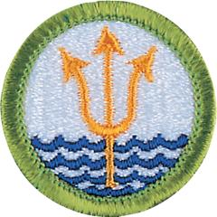

# Oceanography Merit Badge

## Overview

The oceans cover more than 70 percent of our planet and are the dominant feature of Earth. Wherever you live, the oceans influence the weather, the soil, the air, and the geography of your community. To study the oceans is to study Earth itself.

## Requirements

- (1) Name four branches of oceanography. Describe at least five reasons why it is important for people to learn about the oceans.

  **Resources:** [What is Oceanography (video)](https://youtu.be/NMM_GboBZyc?si=xq_9tR0kLLbCYoQo)

- (2) Explain the following terms: salinity, temperature, and density. Describe how these important properties of seawater are measured by an oceanographer. Discuss the circulation and currents of the ocean. Describe the effects of the oceans on weather and climate.

  **Resources:** [Temperature and Salinity (video)](https://youtu.be/jKWc5oy0NCQ?si=2B4crDCxvuYbGQce), [An Ocean in Motion (video)](https://youtu.be/R5-s6O8qyvE), [Oceans and Climate (video)](https://youtu.be/zO2153cJORI), [How Do Ocean Currents Affect the Weather Pattern? (video)](https://youtu.be/T9LTtqcKDw0?si=qNZusyjB_bPjS0UQ)

- (3) Describe the characteristics of ocean waves and do the following:

  **Resources:** [Where Do waves Come From? (video)](https://youtu.be/Fkwkn7vXpWI)

  - (a) Point out the differences among the storm surge, tsunami, tidal wave, and tidal bore.

    **Resources:** [Tsunami vs Tidal Wave: What's the Difference? (video)](https://youtu.be/wk7RyUReaIA), [What is Storm Surge? (video)](https://youtu.be/ZxYCB4VPVow)
  - (b) Explain the difference between sea, swell, and surf.

    **Resources:** [Weather explained: What's the difference between seas and swell? (video)](https://www.skynews.com.au/australia-news/weather-explained-whats-the-difference-between-seas-and-swell/video/836f58b40244e1a18c28b015033f9792), [Difference Between Swell and Surf (website)](https://support.surfline.com/hc/en-us/articles/4410126820891-Difference-between-swell-and-surf), [The Difference Between SWELL and SURF (video)](https://www.youtube.com/shorts/qcwAsh9TDvo)
  - (c) Explain how breakers are formed.

    **Resources:** [How Do Waves Break? (video)](https://www.youtube.com/watch?v=aXuQC1qRuEM)
  - (d) Explain what a rip current is, how to avoid them, and what to do if you are caught in one.

    **Resources:** [New Guide to Spot and Escape a Rip Current (video)](https://youtu.be/lofVgAzut6w?si=At3-3C6bldcYJI5Q)

- (4) Draw a cross-section of underwater topography. Name and put on your drawing the following: seamount, guyot, rift valley, canyon, trench, and oceanic ridge. Compare the depths in the oceans with the heights of mountains on land. Show what is meant by:

  **Resources:** [Diagram of Sea Floor (website)](https://www.visualdictionaryonline.com/earth/geology/ocean-floor.php), [How Deep Does the Ocean Go? (video)](https://youtu.be/mAwfTahzbtw), [How Deep the Ocean REALLY Is (video)](https://youtube.com/shorts/DZ9v54D4mZ8?si=l4pnMMCRDzgxQOpF)

  - (a) Continental shelf
  - (b) Continental slope
  - (c) Abyssal plain

- (5) List the main salts, gases, and nutrients in seawater. Describe some important properties of water. Tell how the animals and plants of the ocean affect the chemical composition of seawater. Explain how differences in evaporation and precipitation affect the salt content of the oceans.

  **Resources:** [Seawater Composition (website)](https://www.marinebio.net/marinescience/02ocean/swcomposition.htm), [Why is the Sea Salty? (video)](https://youtu.be/SPF6cSan6tc)

- (6) Describe some of the biologically important properties of seawater. Define benthos, nekton, and plankton. Name some of the plants and animals that make up each of these groups. Describe the place and importance of phytoplankton in the oceanic food chain.

  **Resources:** [Nekton, Benthos, and Plankton (video)](https://youtu.be/4cguoY4qTXA), [Feeding the Sea: Phytoplankton Fuel Ocean Life (video)](https://youtu.be/AWfebk0_auY), [NASA | Earth Science Week: The Ocean's Green Machines (video)](https://youtu.be/H7sACT0Dx0Q), [Open Ocean Food Chain (website)](https://teara.govt.nz/en/video/5354/open-ocean-food-chain)

- (7) Do ONE of the following:
  - (a) Make a plankton net. Tow the net by a dock, wade with it, hold it in a current, or tow it from a rowboat. Do this for about 20 minutes. Save the sample. Examine it under a microscope or high-power glass. Identify the three most common types of plankton in the sample.**Note:** May be done in lakes or streams.

    **Resources:** [How to Make a Soda Bottle Plankton Net (video)](https://youtu.be/e-MYhWcWWXw), [Make Your Own Plankton Net! (video)](https://youtu.be/HBcuGbMc8cU?si=c6sGRZYkRXv9QDtE)
  - (b) Make a series of models (clay or plaster and wood) of a volcanic island. Show the growth of an atoll from a fringing reef through a barrier reef. Describe the Darwinian theory of coral reef formation.

    **Resources:** [Coral Reefs: Types and Formation (video)](https://youtu.be/mPA9Ze16lGw?si=pVw56hFgRlnPJtro), [How Coral Reefs are Formed (video)](https://youtu.be/anDSRfSY7LQ)
  - (c) Measure the water temperature at the surface, midwater, and bottom of a body of water four times daily for five consecutive days. You may measure depth with a rock tied to a line. Make a Secchi disk to measure turbidity (how much suspended sedimentation is in the water). Measure the air temperature. Note the cloud cover and roughness of the water. Show your findings (air and water temperature, turbidity) on a graph. Tell how the water temperature changes with air temperature.

    **Resources:** [How to make and Use a Secchi Disk (video)](https://youtu.be/lr66G09PuKg)
  - (d) Make a model showing the inshore sediment movement by littoral currents, tidal movement, and wave action. Include such formations as high and low waterlines, low-tide terrace, berm, and coastal cliffs. Show how offshore bars are built up and torn down.

    **Resources:** [Longshore Drift Model Demo (video)](https://youtu.be/bfzAeQXhSGk)
  - (e) Make a wave generator. Show reflection and refraction of waves. Show how groins, jetties, and breakwaters affect these patterns.

    **Resources:** [DIY Ripple Tank (video)](https://youtu.be/9l-tIvvtCPA), [Reflecting Waves in a Ripple Tank (video)](https://youtu.be/iGuUKRmytLw), [Refraction of Waves in a Ripple Tank (video)](https://youtu.be/7wfEczDapHA), [Coastal Erosion and the Methods Used to Reduce It (video)](https://youtu.be/_eeKpz8oD7E), [Wave Tank Demonstration (video)](https://youtu.be/3yNoy4H2Z-o?si=spekLgWh6z3YHC8W)
  - (f) With your counselor's and parent or guardian's approval and permission, track and monitor satellite images available on the internet for a specific location for three weeks. Describe what you have learned to your counselor.

    **Resources:** [Weather Satellite Images (website)](https://www.nhc.noaa.gov/satellite.php)

- (8) Do ONE of the following:
  - (a) Write a 500-word report on a book about oceanography approved by your counselor.
  - (b) Visit one of the following and write a 500-word report about your visit.
  - (1) Oceanographic research ship

    **Resources:** [Tour of a Research Vessel (video)](https://youtu.be/LVDQi5iG99M)
  - (2) Oceanographic institute, marine laboratory, or marine aquarium

    **Resources:** [A Virtual Tour of Bodega Marine Laboratory (video)](https://youtu.be/DYI_gw72bk8?si=2GDdWk4RX68hyIK5), [A Visit to Mote Marine Laboratory & Aquarium (video)](https://youtu.be/aaY1fwyjU1U)
  - (c) Explain to your troop, in a five-minute prepared speech "Why Oceanography Is Important," or describe "Career Opportunities in Oceanography." (Before making your speech, show your speech outline to your counselor for approval.)

    **Resources:** [Oceanography Careers (video)](https://youtu.be/uFHREUrMLSY), [How to Work with the Ocean (video)](https://youtu.be/N4d6YRKEaxg)

- (9) Describe four methods that marine scientists use to investigate the ocean, underlying geology, and organisms living in the water.

  **Resources:** [Studying the Ocean EXPLAINED (video)](https://youtu.be/ibPuzpHuAgY), [How do Scientists Explore the Deep Sea? (video)](https://youtu.be/vKzgIyCTY8k?si=gAsNKqiPyHLcwXys)

## Resources

- [Oceanography merit badge page](https://www.scouting.org/merit-badges/oceanography/)
- [Oceanography merit badge PDF](https://filestore.scouting.org/filestore/Merit_Badge_ReqandRes/Pamphlets/Oceanography.pdf) ([local copy](files/oceanography-merit-badge.pdf))
- [Oceanography merit badge pamphlet](https://www.scoutshop.org/oceanography-merit-badge-pamphlet-654572.html)
- [Oceanography merit badge workbook PDF](http://usscouts.org/mb/worksheets/Oceanography.pdf)
- [Oceanography merit badge workbook DOCX](http://usscouts.org/mb/worksheets/Oceanography.docx)

Note: This is an unofficial archive of Scouts BSA Merit Badges that was automatically extracted from the Scouting America website and may contain errors.