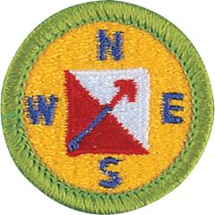

# Orienteering Merit Badge

## Overview

Orienteering, the use of map and compass to find locations and plan a journey, has been a vital skill for humans for thousands of years. Orienteering is also a recognized sport at the Olympic Games, and thousands of people participate in the sport each year in local clubs and competitions.

## Requirements

* NOTE:  The official merit badge pamphlets are now free and downloadable  [HERE](https://filestore.scouting.org/filestore/Merit_Badge_ReqandRes/Pamphlets/Orienteering.pdf) or can be purchased at the [Scout Shop.](https://www.scoutshop.org/)
* (1) Show that you know first aid for the following types of injuries that could occur while orienteering: cuts, scratches, blisters, snakebite, insect stings, tick bites, heat and cold reactions (sunburn, heatstroke, heat exhaustion, hypothermia), dehydration. Explain to your counselor why you should be able to identify poisonous plants and poisonous animals that are found in your area. Resources: [10 Ways to Handle Emergencies While Orienteering: Essential Tips for Adventure Safety (website)](https://shopeverbeam.com/blogs/news/10-ways-to-handle-emergencies-while-orienteering-essential-tips-for-adventure-safety)  [Tick Checks (video)](https://youtu.be/mwAHhOwqeX4)  [Heat Cramps, Heat Exhaustion, and Heat Stroke (website)](https://www.weather.gov/safety/heat-illness)  [Poisonous Plants (video)](https://youtu.be/P6aBc4OAD0g)
* (2) Explain what orienteering is. Resource: [Start Orienteering || A Newcomer's Guide (video)](https://youtu.be/26Zc5AVkFis?si=BBTUkJ_RFGL6VdEI)
* (3) Do the following:
    * (a) Explain how a compass works. Describe the features of an orienteering compass. Resource: [Basic Orienteering (video)](https://youtu.be/bzNA6-lx5n8?si=JfVYqR9vTbCwySw5)
    * (b) In the field, show how to take a compass bearing and follow it. Resource: [How to Use a Compass (video)](https://youtu.be/0cF0ovA3FtY?si=o6nQlPuwNkbBJhwu)

* (4) Do the following: Resource: [Topographic Maps (video)](https://youtu.be/CoVcRxza8nI?si=CX1u3glYRomi-DV-)
    * (a) Explain how a topographic map shows terrain features. Point out and name five terrain features on a map and in the field.
    * (b) Point out and name 10 symbols on a topographic map.
    * (c) Explain the meaning of declination.  Tell why you must consider declination when using map and compass together. Resource: [Magnetic Declination (video)](https://youtu.be/SStmBzQC7eI?si=Le11Br8wWTxuIj0J)
    * (d) Show a topographic map with magnetic north-south lines.
    * (e) Show how to measure distances on a map using an orienteering compass.
    * (f) Show how to orient a map using a compass.

* (5) Set up a 100-meter pace course. Determine your walking and running pace for 100 meters. Tell why it is important to pace-count. Resource: [Establishing a Pace Count (video)](https://youtu.be/YAS9Cc8fhO8?si=hYookKh8Yld4_auy)
* (6) Do the following:
    * (a) Identify 20 international control description symbols. Tell the meaning of each symbol. Resource: [International Orienteering Symbols (PDF)](https://carolinaorienteering.com/wp-content/uploads/Orienteering-Clue-Symbols.pdf)
    * (b) Show a control description sheet and explain the information provided. Resource: [Key Terms (website)](https://orienteering-sport.com/control-descriptions)
    * (c) Explain the following terms and tell when you would use them: attack point, collecting feature, catching feature, aiming off, contouring, reading ahead, handrail, relocation, and rough versus fine orienteering. Resource: [Setting Up an Orienteering Course (website)](https://betterorienteering.org/intermediate-techniques)

* (7) Do the following:
    * (a) Take part in three orienteering events. One of these must be a cross-country course.  Note: While orienteering is primarily an individual sport, Scouting America Youth Protection procedures call for using the buddy system. Requirement 7(a) can be completed by pairs or groups of Scouts.
    * (b) After each event, write a report with (1) a copy of the master map and control description sheet, (2) a copy of the route you took on the course, (3) a discussion of how you could improve your time between control points, and (4) a list of your major weaknesses on this course . Describe what you could do to improve.

* (8) Do ONE of the following:
    * (a) Set up a cross-country course that is at least 2,000 meters long with at least five control markers. Prepare the master map and control description sheet.
    * (b) Set up a score orienteering course with at least 12 control points and a time limit of at least 60 minutes. Set point values for each control. Prepare the master map and control description sheet.

* (9) Act as an official during an orienteering event. This may be during the running of the course you set up for requirement 8. Resource: [How to Setup a Compass Course (video)](https://youtu.be/IfSaBKaau4k?si=e-jJhIclbeNvXswp)
* (10) Teach orienteering techniques to your patrol, troop or crew.

## Resources

- [Orienteering merit badge page](https://www.scouting.org/merit-badges/orienteering/)
- [Orienteering merit badge PDF](https://filestore.scouting.org/filestore/Merit_Badge_ReqandRes/Pamphlets/Orienteering.pdf) ([local copy](files/orienteering-merit-badge.pdf))
- [Orienteering merit badge pamphlet](https://www.scoutshop.org/orienteering-merit-badge-pamphlet-662414.html)
- [Orienteering merit badge workbook PDF](http://usscouts.org/mb/worksheets/Orienteering.pdf)
- [Orienteering merit badge workbook DOCX](http://usscouts.org/mb/worksheets/Orienteering.docx)

Note: This is an unofficial archive of Scouts BSA Merit Badges that was automatically extracted from the Scouting America website and may contain errors.