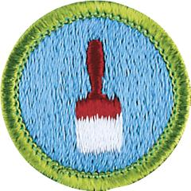

# Painting Merit Badge

## Overview

This merit badge provides an opportunity for Scouts to learn more about painting, including both the artistic and practical aspects.

## Requirements

- (1) Explain the proper safety procedures to follow when preparing surfaces and applying coatings.

  **Resources:** [Interior Painting Safety (video)](https://www.youtube.com/watch?v=4vpr3e_erug)

- (2) Do the following:
  - (a) Explain three ways that coatings can improve a surface.

    **Resources:** [Epoxy Resin Coatings (video)](https://www.youtube.com/watch?v=A-ERekKoohI)
  - (b) Explain the differences between oil-based paints, acrylic-based paints, and water-based paints.

    **Resources:** [Paints - Oil, Water, Enamel, Acrylic (video)](https://www.youtube.com/watch?v=jEyTpUfbrYA), [Water vs Oil Based Paints (video)](https://www.youtube.com/watch?v=T99OFHCLF4s)
  - (c) Explain where you would apply enamel paint, flat paint, wood stain, and varnish, and explain the importance of sheen.

    **Resources:** [Paint Sheen Differences Explained (video)](https://www.youtube.com/watch?v=DyKh80Yt9k0)
  - (d) Tell why each is best for these uses.

- (3) Prepare and paint two different surfaces using patching materials or caulking and the proper primers and topcoats. Suggested projects include an interior or exterior wall, a door, a piece of furniture, a concrete wall or floor, a porch rail, or a fence. Your counselor must preapprove the projects.

  **Resources:** [How to Paint a Room (video)](https://www.youtube.com/watch?v=CRXCB_3gLok)

- (4) Prepare and paint an item using harmonizing colors that you have selected using the color wheel in the *Painting* merit badge pamphlet.

  **Resources:** [Choosing a Color Palette for Your Home (video)](https://www.youtube.com/watch?v=K75ynD7aAeg), [Color Wheel from Painting Merit Badge Pamphlet (PDF)](https://filestore.scouting.org/filestore/Merit_Badge_ReqandRes/Requirement%20Resources/Painting/Painting_Color%20Wheet%20from%202025%20MBP.pdf)

- (5) Show the right way to use, clean, maintain, and store painting equipment.

  **Resources:** [Good Paint Hygiene (video)](https://www.youtube.com/watch?v=C_bY5_mOTcY), [How to Clean and Store Paint Brushes (video)](https://www.youtube.com/watch?v=u6_e5YXgviY)

- (6) Explain the importance of ladder safety, personal hygiene, and the use of personal protective equipment when painting.

  **Resources:** [Ladder Safety (video)](https://www.youtube.com/watch?v=b7ArZilnnTE), [Personal Protective Equipment for Painting (PPE) (video)](https://www.youtube.com/watch?v=67G06bhuxPA)

- (7) Explain some of the environmental and health issues concerning removing paint, applying paint, and discarding old paint.

  **Resources:** [How to Dispose of Old Paint (video)](https://www.youtube.com/watch?v=7YKuwlGgWpc), [Paint Removers (video)](https://www.youtube.com/watch?v=8lG6dAZE52k)

- (8) Do ONE of the following:
  - (a) Explore careers related to this merit badge. Research one career to learn about the training and education needed, costs, job prospects, salary, job duties, and career advancement. Your research methods may include—with your parent or guardian's permission—an internet or library search, an interview with a professional in the field, or a visit to a location where people in this career work. Discuss with your counselor both your findings and what about this profession might make it an interesting career.

    **Resources:** [Painters Career Overview (video)](https://youtu.be/5glRwgnb5gk), [Scenic Painter (video)](https://youtu.be/mWjbRoAId_4)
  - (b) Explore how you could use knowledge and skills from this merit badge to pursue a hobby or healthy lifestyle. Research any training needed, expenses, and organizations that promote or support it. Discuss with your counselor what short-term and long-term goals you might have if you pursued this.

    **Resources:** [How to Paint Murals Like a Pro (video)](https://youtu.be/L4ADLL2gAtU), [Easy Wall Painting DIY I Balcony Makeover I Yoga Wall Art (video)](https://youtu.be/UpImD3qedKw?si=CotiHOXpynF-JptZ), [Mood-Boosting Paint Colors for Every Room in Your House (website)](https://www.marthastewart.com/8229238/mood-boosting-paint-colors)

## Resources

- [Painting merit badge page](https://www.scouting.org/merit-badges/painting/)
- [Painting merit badge PDF](https://filestore.scouting.org/filestore/Merit_Badge_ReqandRes/Pamphlets/Painting.pdf) ([local copy](files/painting-merit-badge.pdf))
- [Painting merit badge pamphlet](https://www.scoutshop.org/painting-merit-badge-pamphlet-650872.html)
- [Painting merit badge workbook PDF](http://usscouts.org/mb/worksheets/Painting.pdf)
- [Painting merit badge workbook DOCX](http://usscouts.org/mb/worksheets/Painting.docx)

Note: This is an unofficial archive of Scouts BSA Merit Badges that was automatically extracted from the Scouting America website and may contain errors.