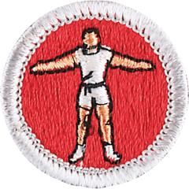

# Personal Fitness Merit Badge

## Overview

**Eagle required**

Personal fitness is an individual effort and desire to be the best one can be. Regardless of their current levels of personal fitness, in the twelve weeks it will take Scouts to complete the athletic requirements for this merit badge, they will be in better shape, feel better about themselves, have more energy, and gain self-confidence in their overall abilities.

## Requirements

- (1) **Defining Personal Fitness.** Explain to your counselor what personal fitness means to you, including:
  - (a) Describe a person who is physically fit.

    **Resources:** [Being Physically Fit (PDF)](https://filestore.scouting.org/filestore/Merit_Badge_ReqandRes/Requirement%20Resources/Personal%20Fitness/physically_fit_people.pdf)
  - (b) Describe a person who is mentally, emotionally and socially fit.

    **Resources:** [Being Mentally, Emotionally, and Socially Fit (video)](https://www.pbs.org/video/wellness-mind-frame-7um7lc/%20)
  - (c) Describe a person who is spiritually fit.

    **Resources:** [Being Spiritually Fit (video)](https://youtu.be/8gZ_JbDgERs)
  - (d) Explain why it is important to be fit in all of these ways.

    **Resources:** [Being Fit Overall (video)](https://kcts9.pbslearningmedia.org/resource/wellness-video/mind-frame/?student=true&focus=true)
  - (e) Discuss how each aspect of personal fitness relates to the Scout Oath and Scout Law.

    **Resources:** [The Scout Oath (video)](https://youtu.be/1_aUAbUs2Ts?si=gG4-nTpX5qeSmQE1)

- (2) **Monitoring Your Health.** Do the following:
  - (a) Discuss with your counselor the importance of having a physical examination each year. Discuss why overall health, immunizations, medications, allergies, and medical history are covered during an examination. Tell your counselor when you last underwent a physical examination.

    **Resources:** [Annual Physical Exam (website)](https://www.scouting.org/health-and-safety/ahmr/)
  - (b) Explain why it is important to have a routine dental examination. Explain what preventive or corrective treatments your dentist can provide, and why daily oral care is an important part of staying well. Tell your counselor when you last underwent a dental examination.

    **Resources:** [Dental Health (video)](https://youtu.be/7_MioRw-5QU), [Here's What Happens if You Stopped Brushing Your Teeth (video)](https://youtu.be/4kXrUXDZKuM?si=eXa9NCBLsJKFM_Bu)

- (3) **Your Fitness Knowledge and Habits.** Do the following with your counselor:
  - (a) Explain the physical exercise you regularly do, whether your routine includes all four components of physical fitness (cardiorespiratory fitness, muscular strength and endurance, flexibility, and body composition), and how your current practices increase or decrease your likelihood of developing cardiovascular disease or other conditions in adulthood.

    **Resources:** [Benefits of Exercise  (video)](https://youtu.be/dwMMn2FdBFQ?si=vaYCckwx-xqsUky-)
  - (b) Discuss what harmful substances you consciously avoid, and how these actions affect your risk factors now and in the future.

    **Resources:** [Substance Use and Abuse (video)](https://youtu.be/6fmhLcYSn-Y?si=rRPr6HRcv5dSrVgG)
  - (c) Explain what common diseases can be prevented or mitigated by vaccinations, and whether you are immunized according to the advice of your healthcare provider and the direction of your parent or guardian.

    **Resources:** [How Do Vaccines Work? (video)](https://youtu.be/rb7TVW77ZCs)
  - (d) Discuss how good nutrition is related to the other components of personal fitness, and if you follow a nutritious, balanced diet.

    **Resources:** [How the Food You Eat Affects Your Brain (video)](https://youtu.be/xyQY8a-ng6g)
  - (e) Discuss what a healthy weight is for you, and what you do to maintain a healthy weight.

    **Resources:** [Body Mass Index (BMI) Calculator (website)](https://www.cdc.gov/bmi/child-teen-calculator/index.html%20), [Your Body Composition (video)](https://youtu.be/Yk3UkkJk474?si=MIO8KBdqsszMGPRo)
  - (f) Explain why getting adequate sleep is important, and whether you get enough hours of sleep each night.

    **Resources:** [Tips for Getting Enough Sleep (video)](https://youtu.be/qWb5ggc_-rs?si=hdgaGxZwyiEnzftt)
  - (g) Discuss whether you spend quality time with your family and friends in social and recreational activities, and how you contribute to creating and maintaining a good home life.

    **Resources:** [Spending Time With Family (video)](https://youtu.be/magzd25-g_o)

- (4) **Measures of Physical Fitness.** Determine with your counselor the assessments of physical fitness and nutrition you will do before, during, and after completing the 12-week program in requirement 7.

  **Resources:** [Measures of Physical Fitness (fillable) (PDF)](https://filestore.scouting.org/filestore/Merit_Badge_ReqandRes/Requirement%20Resources/Personal%20Fitness/1-Mile%20Walk-Run%20-%20Compare%20Results.pdf)

  - (a) Include a measure of cardiorespiratory (aerobic) fitness: Record the time required to complete a mile walk or run as fast as you can. If you are unable to walk or run as a result of a disability that is permanent or is expected to last for longer than two years, work with your counselor to define a test with a similar degree of aerobic challenge.

    **Resources:** [1-Mile Walk/Run - Compare Results (PDF)](https://filestore.scouting.org/filestore/Merit_Badge_ReqandRes/Requirement%20Resources/Personal%20Fitness/1-Mile%20Walk-Run%20-%20Compare%20Results.pdf)
  - (b) Include two measures of muscular strength and endurance: Record either the number of sit-ups done in 60 seconds OR how long a plank was held; AND, record the number of either push-ups OR pull-ups done in 60 seconds. If you are unable to complete one these exercises safely and correctly, work with your counselor to replace it with a different exercise that measures strength and endurance.

    **Resources:** [Sit-Up (video)](https://youtu.be/pCX65Mtc_Kk), [Plank (video)](https://youtu.be/yeKv5oX_6GY), [Pull-Up (video)](https://youtu.be/mohJShUxbdI), [Push-Up (video)](https://youtu.be/YopP5mCAMSI), [Muscular Strength - Compare Results (PDF)](https://filestore.scouting.org/filestore/Merit_Badge_ReqandRes/Requirement%20Resources/Personal%20Fitness/Muscular%20Strength%20-%20Compare%20Results.pdf)
  - (c) Include at least one measure of flexibility, such as a back-saver sit-and-reach test or a back scratch test.

    **Resources:** [Flexibility - Compare Results (PDF)](https://filestore.scouting.org/filestore/Merit_Badge_ReqandRes/Requirement%20Resources/Personal%20Fitness/Flexiblity%20-%20Compare%20Results.pdf), [Back Scratch Test (video)](https://youtu.be/EKiTmkgEFH4), [Back-Saver Sit-and-Reach Test (video)](https://youtu.be/T2LzgbHXbUI?si=UZl1SrQ5DFTGpCGE)

- (5) **Pre-Assessment of Physical Fitness.** Before beginning the 12-week program in requirement 7, do the following:
  - (a) Complete each of the assessments you defined in requirement 4, and record your results.
  - (b) Identify your weakest and strongest area of physical fitness, and choose an area to target for improvement.
  - (c) Keep a log of what you eat and drink for a period of three days.

    **Resources:** [3-Day Food and Drink Log (fillable) (PDF)](https://filestore.scouting.org/filestore/Merit_Badge_ReqandRes/Requirement%20Resources/Personal%20Fitness/3-Day%20Food%20and%20Drink%20Log%20%28fillable%29.pdf), [3-Day Food and Drink Log (PDF)](https://drive.google.com/file/d/16Q7rI65CQkP-QOhbnX7TD1HyGi3nX0XX/view?usp=drive_link%20)
  - (d) Based on your diet log, identify at least two improvement goals related to diet and nutrition.

    **Resources:** [Food Groups and MyPlate (video)](https://youtu.be/L7QOUiQCb5E?si=aSUG980t0c5bQt0p)

- (6) **Plan the Program.** Outline with your counselor a comprehensive 12-week physical fitness and nutrition program that you will complete based on your improvement goals and ability. The program must incorporate the following:

  **Resources:** [12-Week Physical Fitness Program (fillable) (PDF)](https://filestore.scouting.org/filestore/Merit_Badge_ReqandRes/Requirement%20Resources/Personal%20Fitness/physical_fitness_12week_program%20%28fillable%29.pdf), [Sample Full Workout—Warm-Up, Cardiorespiratory, Strength, Flexibility, and Cool-Down (video)](https://youtu.be/WpIFlh5whcs?si=khfLv9X7TNHJ3kqF), [Sample Short Workout—Core Strength (video)](https://youtu.be/jYfda_ccTjc?si=iATnjRp8ZHz6uy6a), [Sample Short Workout—Variety (video)](https://youtu.be/bhsu24pEgVY?si=_4LBRA_N3sWjx777)

  - (a) Warm-up: low-intensity movement or gentle muscle stretching before each more rigorous workout
  - (b) Cardiorespiratory (aerobic) element: an activity that raises your heart and respiratory rate for 15 to 30 minutes at least three times per week
  - (c) Muscular strength and endurance element: repetitive exercises that target different muscles - upper body, core, and/or legs - based on your improvement goals and potential

    **Resources:** [Deadlift (video)](https://youtu.be/K6Gc6GKCmNo), [Lunge (video)](https://youtu.be/C20B47rZRIY), [Row (video)](https://youtu.be/9CGOO9ueQ8g), [Squat (video)](https://youtu.be/Pfov7H8vyi0), [Muscular Strength ( video)](https://youtu.be/ounpwfpOTSM?si=9Bav1jhDR00-VQ9W), [Farmer's Carry (video)](https://youtu.be/BeNv9nkhTg4)
  - (d) Flexibility element: movements that arch/lower/stretch/relax your back, rotate your trunk, or stretch your hamstrings

    **Resources:** [Flexibility Exercises (video)](https://youtu.be/0L3W0pcHU50?si=QKYN3iLraH8Dg7xS)
  - (e) Cool-down: low-intensity movement or gentle stretching to prevent muscle cramps and enhance the benefits of exercise
  - (f) A plan for achieving your two improvement goals related to diet and nutrition.

    **Resources:** [The MyPlate Quiz (website)](https://www.myplate.gov/form/myplate-quiz#question_1%20)

- (7) Complete and keep a log, over 12 consecutive weeks, of the physical fitness and nutrition program you have outlined. (If your program is interrupted by illness or unavoidable conflicts for less than two weeks, you may resume where you left off, adding the missed days or weeks at the end).

  **Resources:** [Home Exercise Hacks (playlist)](https://youtube.com/playlist?list=PLhh_lxc4bmz8TPeX-dOu-I2K3O2x3_weX&si=4issEYVe10iMDjtZ), [How to Make Your Own Exercise Equipment (video)](https://youtu.be/IAmnLlwNloU)

  - (a) Complete and keep a log, over 12 consecutive weeks, of the physical fitness and nutrition program you have outlined. (If your program is interrupted by illness or unavoidable conflicts for less than two weeks, you may resume where you left off, adding the missed days or weeks at the end).

    **Resources:** [Home Exercise Hacks (playlist)](https://youtube.com/playlist?list=PLhh_lxc4bmz8TPeX-dOu-I2K3O2x3_weX&si=4issEYVe10iMDjtZ), [How to Make Your Own Exercise Equipment (video)](https://youtu.be/IAmnLlwNloU)
  - (b) During week 4 and week 8 of your program, repeat the assessments you did in requirement 5(a) before you began. Repeat the same tests for a final assessment within two weeks after completing the 12-week program. Show improvement over your pre-assessment results.
  - (c) For three days during week 8, and again during week 12, keep a log of what you eat and drink. Show improvement toward the diet and nutrition goals you set in requirement 5(d).
  - (d) Discuss your results, improvements, insights, and experiences with your counselor after completing the program and assessments.

- (8) **Future Career or Lifestyle.** Do ONE of the following:
  - (a) Explore three careers related to personal fitness. Research one career area by interviewing an expert in the field, visiting a site, or using other resources. Learn about training, education, expenses, job outlook, salary, and advancement. Discuss your findings and career interest with your counselor.

    **Resources:** [Careers Related to Personal Fitness (video)](https://youtu.be/9a9XU7D0DIo?si=BTdpODHe1FhUa-Sq)
  - (b) Explore how an area of personal fitness could contribute to a hobby or healthy lifestyle. Research education, costs, and organizations related to this activity. Discuss your findings and goals with your counselor.

    **Resources:** [Seated Wheelchair Workout  (video)](https://youtu.be/d6x-A0CmI-I?si=BlRXUSzEPxx22VYv), [Seated Cardio Workout (video)](https://youtu.be/hHiSWTU9xNk?si=6MgZZKv2n3RN-fVl)

## Resources

- [Personal Fitness merit badge page](https://www.scouting.org/merit-badges/personal-fitness/)
- [Personal Fitness merit badge PDF](https://filestore.scouting.org/filestore/Merit_Badge_ReqandRes/Pamphlets/Personal%20Fitness.pdf) ([local copy](files/personal-fitness-merit-badge.pdf))
- [Personal Fitness merit badge pamphlet](https://www.scoutshop.org/personal-fitness-merit-badge-pamphlet-656894.html)
- [Personal Fitness merit badge workbook PDF](http://usscouts.org/mb/worksheets/Personal-Fitness.pdf)
- [Personal Fitness merit badge workbook DOCX](http://usscouts.org/mb/worksheets/Personal-Fitness.docx)

Note: This is an unofficial archive of Scouts BSA Merit Badges that was automatically extracted from the Scouting America website and may contain errors.