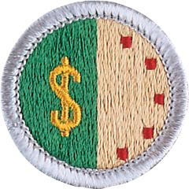

# Personal Management Merit Badge

## Overview

**Eagle required**

Personal management is about mapping a plan for your life that will involve setting short-range and long-range goals and investigating different ways to reach those goals. Education, training, and experience all help make your goals become a reality. To achieve your goals, you will choose the best path and make a commitment to it, while remaining flexible enough to deal with changes and new opportunities.

## Requirements

* Note: Always be sure to have proper permission before using the internet. It is strongly advised that Scouts view the Personal Safety Awareness videos before starting work. Find details at [www.scouting.org/training/youth-protection/scouts-bsa](http://www.scouting.org/training/youth-protection/scouts-bsa)
* NOTE:  The official merit badge pamphlets are now free and downloadable  [HERE](https://filestore.scouting.org/filestore/Merit_Badge_ReqandRes/Pamphlets/Personal%20Management.pdf) or can be purchased at the [Scout Shop.](https://www.scoutshop.org/)
* (1) Do the following:
    * (a) Choose an item that your family might want to purchase that is considered a major expense.
    * (b) Write a plan that tells how your family would save money for the purchase identified in requirement 1(a).
        * (1) Discuss the plan with your counselor.
        * (2) Discuss the plan with your family.
        * (3) Discuss how other family needs must be considered in this plan.

    * (c) Develop a written shopping strategy for the purchase identified in requirement 1(a).
        * (1) Determine the quality of the item or service (using consumer publications or rating systems.)
        * (2) Comparison shop for the item. Find out where you can buy the item for the best price. (Provide prices from at least two different price sources.) Call around; study ads. Look for a sale or discount coupon. Consider alternatives. Can you buy the item used? Should you wait for a sale?

* (2) Do the following:
    * (a) Prepare a budget reflecting your expected income (allowance, gifts, wages), expenses, and savings for a period of 13 consecutive weeks.
    * (b) Compare expected income with expected expenses.
        * (1) If expenses exceed budget income, determine steps to balance your budget.
        * (2) If income exceeds budget expenses, state how you would use the excess money (new goal, savings).

    * (c) Track and record your actual income, expenses, and savings for 13 consecutive weeks (the same 13-week period for which you budgeted). (You may use the forms provided in the Personal Management merit badge pamphlet, devise your own, or use a computer-generated version.) When complete, present the records showing the results to your counselor.
    * (d) Compare your budget with your actual income and expenses to understand when your budget worked and when it did not work. With your counselor, discuss what you might do differently the next time.

* (3) Discuss with your counselor FIVE of the following concepts:
    * (a) The emotions you feel when you receive money.
    * (b) Your understanding of how the amount of money you have with you affects your spending habits.
    * (c) Your thoughts when you buy something new and your thoughts about the same item three months later. Explain the concept of buyer's remorse.
    * (d) How hunger affects you when shopping for food items (snacks, groceries).
    * (e) Your experience of an item you have purchased after seeing or hearing advertisements for it. Did the item work as well as advertised?
    * (f) Your understanding of what happens when you put money into a savings account.
    * (g) Charitable giving. Explain its purpose and your thoughts about it.
    * (h) What you can do to better manage your money.

* (4) Explain the following to your counselor:
    * (a) The differences between saving and investing, including reasons for using one over the other.
    * (b) The concepts of return on investment and risk and how they are related.
    * (c) The concepts of simple interest and compound interest.
    * (d) The concept of diversification in investing.
    * (e) Why it is important to save and invest for retirement.

* (5) Explain to your counselor what the following investments are and  how each works:
    * (a) Common stocks
    * (b) Mutual funds
    * (c) Life insurance
    * (d) A certificate of deposit (CD)
    * (e) A savings account
    * (f) A U.S. savings bond.

* (6) Explain to your counselor why people might purchase the following types of insurance and how they work:
    * (a) Automobile
    * (b) Health
    * (c) Homeowner's/renter's
    * (d) Whole life and term life.

* (7) Explain to your counselor the following:
    * (a) What a loan is, what interest is, and how the annual percentage rate (APR) measures the true cost of a loan.
    * (b) The different ways to borrow money
    * (c) The differences between a charge card, debit card, and credit card. What are the costs and pitfalls of using these financial tools? Explain why it is unwise to make only the minimum payment on your credit card.
    * (d) Credit reports and how personal responsibility can affect your credit report.
    * (e) Ways to reduce or eliminate debt.

* (8) Demonstrate to your counselor your understanding of time management by doing the following:
    * (a) Write a "to do" list of tasks or activities, such as homework assignments, chores, and personal projects, that must be done in the coming week. List these in order of importance to you.
    * (b) Make a seven-day calendar or schedule. Put in your set activities, such as school classes, sports practices or games, jobs or chores, and/or Scout or place of worship or club meetings, then plan when you will do all the tasks from your "to do" list between your set activities.
    * (c) Follow the one-week schedule you planned. Keep a daily diary or journal during each of the seven days of this week's activities, writing down when you completed each of the tasks on your "to do" list compared to when you scheduled them.
    * (d) With your counselor, review your "to do" list, one-week schedule, and diary/journal to understand when your schedule worked and when it did not work. Discuss what you might do differently the next time.

* (9) Prepare a written project plan demonstrating the steps below, including the desired outcome. This is a project on paper, not a real-life project. Examples could include planning a camping trip, developing a community service project or a school or religious event, or creating an annual patrol plan with additional activities not already included in the troop annual plan. Discuss your completed project plan with your counselor.
    * (a) Define the project. What is your goal?
    * (b) Develop a timeline for your project that shows the steps you must take from beginning to completion.
    * (c) Describe your project.
    * (d) Develop a list of resources. Identify how these resources will help you achieve your goal.
    * (e) Develop a budget for your project.

* (10) Do the following:
    * (a) Choose a career you might want to enter after high school or college graduation. Discuss with your counselor the needed qualifications, education, skills, and experience.
    * (b) Explain to your counselor what the associated costs might be to pursue this career, such as tuition, school or training supplies, and room and board. Explain how you could prepare for these costs and how you might make up for any shortfall.

## Resources

- [Personal Management merit badge page](https://www.scouting.org/merit-badges/personal-management/)
- [Personal Management merit badge PDF](https://filestore.scouting.org/filestore/Merit_Badge_ReqandRes/Pamphlets/Personal%20Management.pdf) ([local copy](files/personal-management-merit-badge.pdf))
- [Personal Management merit badge pamphlet](https://www.scoutshop.org/personal-management-merit-badge-pamphlet-660208.html)
- [Personal Management merit badge workbook PDF](http://usscouts.org/mb/worksheets/Personal-Management.pdf)
- [Personal Management merit badge workbook DOCX](http://usscouts.org/mb/worksheets/Personal-Management.docx)

Note: This is an unofficial archive of Scouts BSA Merit Badges that was automatically extracted from the Scouting America website and may contain errors.