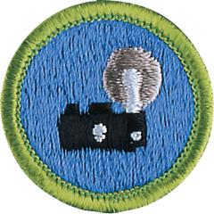

# Photography Merit Badge

## Overview

Beyond capturing family memories, photography offers a chance to be creative. Many photographers use photography to express their creativity, using lighting, composition, depth, color, and content to make their photographs into more than snapshots. Good photographs tell us about a person, a news event, a product, a place, a scientific breakthrough, an endangered animal, or a time in history.

## Requirements

- (1) Safety. Do the following:
  - (a) Explain to your counselor the most likely hazards you may encounter while working with photography and what you should do to anticipate, mitigate, prevent, and respond to these hazards. Explain how you would prepare for exposure to environmental situations such as weather, sun, and water.

    **Resources:** [Is Photography a Dangerous Career? (website)](https://www.coverhound.com/insurance-learning-center/is-photography-a-dangerous-career%20%20), [Health and Safety in a Photography Studio (website)](https://thephotocove.com/health-and-safety-in-a-photography-studio/), [9 Safety Tips for Landscape and Nature Photographers (website)](https://loadedlandscapes.com/safety-tips-nature-photography/)
  - (b) View the Personal Safety Awareness "Digital Safety" video (with your parent or guardian's permission).

    **Resources:** [Digital Safety (video)](https://filestore.scouting.org/filestore/YPSAT/YT%20Mod1%20Final%20Master%20Small.mp4)

- (2) Explain how the following elements and terms can affect the quality of a picture:

  **Resources:** [Easy to Understand Guide to Camera Settings for Beginners (website)](https://shotkit.com/camera-settings/), [Common Camera Settings for Beginners (website)](https://photographylife.com/common-camera-settings#camera-setup)

  - (a) Light—natural light (ambient/existing), low light (such as at night), and artificial light (such as from a flash)

    **Resources:** [Golden Hour Magic: Perfect Light for Stunning Photos (video)](https://youtu.be/FWcOshGthBI?si=Ft8P8g7G36BnSSle), [Artificial Lighting for Photography (So Much Easier Than You Think!) (video)](https://youtu.be/Z9znfhFQPbE?si=iynxep4eY2ZuuzNY), [Why Most Natural Light Photography is Flat (and How to Fix It) (video)](https://youtu.be/VgT4O6CclfA?si=Gw4HDf3VeGxeE6z7)
  - (b) Exposure—aperture (f-stops), shutter speed, ISO

    **Resources:** [Iso, Shutter Speed and Aperture Explained | Exposure Basics for Beginners (video)](https://youtu.be/Edvpu_939l4?si=lFqGf0-AJuUJR-v-), [Photography Basics in 10 Minutes (video)](https://youtu.be/V7z7BAZdt2M?si=0XATnG-lMciqFgr0)
  - (c) Depth of field

    **Resources:** [Depth of Field in 30 Seconds (video)](https://youtube.com/shorts/98B3dvdAX6c?si=a6zX8YPAisVYAszi)
  - (d) Composition—rule of thirds, leading lines, framing, depth

    **Resources:** [Basic Photography | Composition: The Only Rules You Need to Know (video)](https://youtu.be/eImryR3yKz8?si=ITbUmVHQYD9gR72Y), [Photography Composition: Master Leading Lines for Stunning Shots! (video)](https://youtu.be/2uAYj6WScJQ?si=SrzE5OUdOVWWH65y), [Master the Rule of Thirds for Better Photos (video)](https://youtube.com/shorts/Z1Wb8ZH0uvc?si=e6TjeQIgyqaYBcUr)
  - (e) Angle of view

    **Resources:** [Angle of View and Framing (video)](https://youtu.be/9SZy4ptc5ws?si=SfIb8MuYpZziiVaW)
  - (f) Stop action and blur motion

    **Resources:** [How to Shoot Motion Blur Photography Like a Pro (video)](https://youtu.be/5h4J8nZn1Sw?si=n6r01F0XG_ncDOxH), [Photography Tips: How to Do Stop Action Photography (video)](https://youtu.be/YtkIsA4VdRw?si=T0IV9u60N-evsqrl)
  - (g) Decisive moment (action or expression captured by the photographer)

    **Resources:** [Decisive Moment (video)](https://youtu.be/meeqJ58eSzk?si=lxhdmU83SSLCDxvw)

- (3) Explain the basic parts and operation of a camera. Explain how an exposure is made when you take a picture.

  **Resources:** [Photography Basics in 10 Minutes (video)](https://youtu.be/V7z7BAZdt2M?si=0XATnG-lMciqFgr0), [Parts of a Camera (video)](https://youtu.be/BsSjEhktkzU), [How Digital Cameras Work (video)](https://youtu.be/Ey6S3rKH_o4)

- (4) Do TWO of the following, then share your work with your counselor.
  - (a) Photograph one subject from two different angles or perspectives.

    **Resources:** [Pro Photo Secrets: Avoid Shadows & Master Poses (video)](https://youtube.com/shorts/o5yjHn56VtE?si=XC3OvPIABX276ZtY)
  - (b) Photograph one subject from two different light sources - artificial and natural.
  - (c) Photograph one subject with two different depth of fields.
  - (d) Photograph one subject with two different compositional techniques.

- (5) Photograph THREE of the following, then share your work with your counselor.
  - (a) Close-up of a person
  - (b) Two to three people interacting
  - (c) Action shot
  - (d) Animal shot
  - (e) Nature shot
  - (f) Picture of a person - candid, posed, or camera aware

- (6) Describe how software allows you to enhance your photograph after it is taken. Select a photo you have taken, then do ONE of the following, and share what you have done with your counselor:

  **Resources:** [PHOTO EDITING FOR BEGINNERS - 9 Simple Steps to Improve Your Photos (video)](https://youtu.be/KR7L2oSRlwY)

  - (a) Crop your photograph.
  - (b) Adjust the exposure or make a color correction.
  - (c) Show another way you could improve your picture for impact.

- (7) Using images other than those created for requirements 4, 5, and 6, produce a visual story to document an event to photograph OR choose a topic that interests you to photograph. Do the following:
  - (a) Plan the images you need to photograph for your photo story.

    **Resources:** [Storytelling in Photography (video)](https://youtu.be/UtMXpomDWlk?si=Zo4DOxTQMgshkjFA)
  - (b) Share your plan with your counselor, and get your counselor's input and approval before you proceed.
  - (c) Select eight to 12 images that best tell your story. Arrange your images in order and mount the prints on a poster board, OR create an electronic presentation. Share your visual story with your counselor.

    **Resources:** [How to Make a PowerPoint Photo Slideshow (video)](https://youtu.be/G-qyX_Ri17M?si=mFi7rrxZa1KDlNrT)

- (8) Identify three career opportunities in photography. Pick one and explain to your counselor how to prepare for such a career. Discuss what education and training are required, and why this profession might interest you.

  **Resources:** [Top 10 Careers For Photographers (video)](https://youtu.be/fEp_EDQE0IM?si=4IIC3sAbXyD1_6tK), [Indeed Career Guide (website)](https://www.indeed.com/career-advice/finding-a-job/list-of-careers-in-photography)

## Resources

- [Photography merit badge page](https://www.scouting.org/merit-badges/photography/)
- [Photography merit badge PDF](https://filestore.scouting.org/filestore/Merit_Badge_ReqandRes/Pamphlets/Photography.pdf) ([local copy](files/photography-merit-badge.pdf))
- [Photography merit badge pamphlet](https://www.scoutshop.org/photography-merit-badge-pamphlet-655192.html)
- [Photography merit badge workbook PDF](http://usscouts.org/mb/worksheets/Photography.pdf)
- [Photography merit badge workbook DOCX](http://usscouts.org/mb/worksheets/Photography.docx)

Note: This is an unofficial archive of Scouts BSA Merit Badges that was automatically extracted from the Scouting America website and may contain errors.