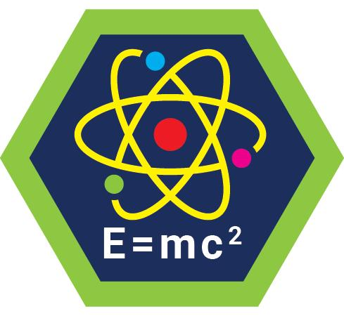

# Physics Merit Badge

## Overview

**Test Lab Merit Badge**, Verify current status at [Scouts BSA Test Lab](https://www.scouting.org/skills/merit-badges/test-lab/).

## Requirements

- (1) **Safety.** Before conducting any experiments, explain to your counselor the safety precautions and personal protective equipment necessary for working with physics-related equipment.

  **Resources:** [Video: Safely Using Materials & Equipment in Physics Experiments](https://youtu.be/u7epizT6jFg?si=m_0X5hm7DzD6PN93)

- (2) **What is Physics?** Define physics in your own words and discuss with your counselor various areas of physics.

  **Resources:** [What is Physics?](https://youtu.be/yWMKYID5fr8?si=Uh2jwfzvFxTLu66d), [Why study physics?](https://www.aps.org/careers/advice/why-study-physics), [The Map of Physics](https://youtu.be/ZihywtixUYo?si=hriOTCEfDbK6sleG)

- (3) **Fundamentals of Physics.** Explain these key physics concepts: force, motion, energy, and waves. Provide real-world examples demonstrating each principle.

  **Resources:** [All physics explained in 15 minutes (worth remembering)](https://youtu.be/TTHazQeM8v8?si=Aoz4C2lMhivngyDW)

- (4) **Hands-On Experimentation.** Conduct THREE  physics experiments, selecting from the following options. Each experiment must include: a hypothesis, materials used, safety precautions, observations, and conclusions based on results. Explain how each experiment demonstrates key physics principles. For each experiment, be sure to try variations/variables to test your hypothesis.
  - **Option A: Newton’s Laws in Action: Balloon-Powered Car.** Make and test a balloon-powered car to show how force and motion interact.

    **Resources:** [Science Max | How to Make a Balloon Powered Car | Science Experiments](https://youtu.be/SaKkjiIVccc?si=TGtbgJ1f2aw7TlN-)
  - **Option B: Momentum: Stacked Ball Drop.** Drop different-sized stacked balls to show momentum.

    **Resources:** [Stacked Ball Drop](https://youtu.be/2UHS883_P60?si=fU401fa8NRzZaxZ9), [Tennis ball + Basketball momentum // Homemade Science with Bruce Yeany](https://youtu.be/yhTz_6NFmV0?si=BcG21aMUoFaqrzm9)
  - **Option C: Centrifugal Force.** Make spinning toys to demonstrate centrifugal force.

    **Resources:** [Centrifugal spinning toys //. Homemade science](https://youtu.be/GDN38voYPNc?si=PfdgIWsJmJZcM-ni)
  - **Option D: Centripetal Force.** Swing a water bucket or tray filled with water glasses to demonstrate centripetal force.

    **Resources:** [Centripetal swinging tray,  improving an old demonstration](https://youtu.be/MTKUEMI2Rgo?si=99Sd4YhG4_Tmym7B)
  - **Option E: Balance.** Explore center of gravity, inertia, and harmonic motion using a Tweety Bopper.

    **Resources:** [Balancing toy physics….Tweety Boppers,  Inertia, Center of gravity, Harmonic motion](https://youtu.be/h_gGHAsG6Pg?si=pUm5qk_6ByywRZk6)
  - **Option F: Visualize Sound.** Visualize Chladni patterns using a tonoscope.

    **Resources:** [Making your own Tonoscope: Visualising Vibrations at Home](https://youtu.be/P5WAlKx8QJE?si=3PoxaKgxPDzNq6fq), [Sound Visualizer & Chladni Patterns  Formed on a Plastic Bucket // Homemade Science with Bruce Yeany](https://youtu.be/eskZ3OORfYM?si=jKTAz7sWlQvakwo2)
  - **Option G: Cartesian Diver.** Demonstrate buoyancy and the ideal gas law with Cartesian divers.

    **Resources:** [Physics of toys-Big Cartesian divers-part 2 // Homemade Science with Bruce Yeany](https://youtu.be/xRhRvI5gDjQ?si=nvM7N5w1852oZDtv)
  - **Option H: Air Pressure: Bernoulli’s principle and the Coandă Effect.** Balance different objects in a stream of air.

    **Resources:** [How to float a ping pong ball on air – The Coandă Effect](https://youtu.be/kR2Oi3XCX18?si=AbKgR6D0VIdOgoYk), [Ball in a funnel experiment..Bernoulli’s principle and the Coanda effect](https://youtu.be/tFjOUaB6uvE?si=aEqkrS1tnsLVn498)
  - **Option I: Electromagnet.** Make an electromagnet and explore how to increase its strength.

    **Resources:** [The Sci Guys: Science at Home – SE2 – EP8: Homemade Electromagnet](https://youtu.be/xVKIiCYTsmQ?si=ac6T5eHEZ4XTXpjy)

- (5) **Physics All Around You.** Discuss with your counselor:
  - (a)**Physics in Everyday Life.** Describe FIVE ways physics is applied in daily life, such as in transportation, sports, or household appliances. [**The Role of Physics in Everyday Life: Shocking Truths Revealed!**](https://youtu.be/XHouBbIlz6I?si=FRLe3mtXj8nv_UO1)
  - (b) **Physics in Space Exploration.** Describe how physics is used in space travel, satellite technology, or planetary exploration. **[The Rocket-Less Future of Space Travel | What the Physics?! | NOVA | PBS](https://youtu.be/mMyZGv_bwTg?si=0Yub7QM5_PPvShUU)** **[Why Don’t Satellites Fall Out of the Sky?](https://youtu.be/YSh_S2bHrHE?si=6lDxQmdupKqemKpa)** **[Future of Space Travel by Dr Michio Kaku #spaceexploration – YouTube](https://youtube.com/shorts/WQyNQNhAfyg?si=YhFxkQdSkklw7knC)** (c) **Physics in the Environment.** Explain how physics contributes to renewable energy, climate science, or environmental conservation. [**Renewable Energy Resources: Part 1 | GCSE Physics | Doodle Science**](https://youtu.be/MhEGS1zsApo?si=t5tp6G-F4qSM5Yq2) **[Renewable Energy Resources: Part 2 | GCSE Physics | Doodle Science](https://youtu.be/9W6S3FA-C6U?si=93dAWglNrroCKhvu)** **[How does the climate system work?](https://youtu.be/lrPS2HiYVp8?si=1pkiIfaiGIz92u-H)** (d)**Physics in Scouting.** Explain how physics is found in Scouting, such as knot tying, fire building, cooking, or pioneering. [**Why Knots? Knot Theory in Three Minutes**](https://youtu.be/WXVItJnZiWc?si=B_Mem9Rfw_gYjrv2) **[What Is Fire?](https://youtu.be/tMDKeBaLWDw?si=UeB_b-ZE8k1oInj_)** **[Have you ever wondered why smoke follows you around a camp fire? #camping #physics #fire](https://youtu.be/ji2UdtHQlzk?si=sZgu9YPqWh4Gt-Y0)** **[The Physics of Cooking](https://youtu.be/9RepBTXCiqQ?si=726q-e4EJBOhQAdK)** **[STEM Program Da Vinci Bridges (PDF)](https://scoutsvictoria.com.au/media/6052/program-da-vinci-bridges.pdf)**

- (6) **The Future of Physics.** Physicists try to explain the universe and apply these concepts to novel technologies. Discuss one option with your counselor:
  - **Option A: Unsolved Mysteries of Physics.** Discuss the following with your counselor:
    - (a) **Dark Matter & Dark Energy.** Scientists know it exists—but what is it?

      **Resources:** [Dark Matter vs. Dark Energy | How the Universe Works | Science Channel](https://youtu.be/x344JiX8BCE?si=nS8xzD4lCnCE3ESq)
    - (b) **Black Holes & Wormholes.** Can we harness their energy or travel through them?

      **Resources:** [Neil deGrasse Tyson Explains Wormholes and Black holes](https://youtu.be/PtA7O3AOCPU?si=kSqVYL3n6MBf2K3M)
  - **Option B: Quantum Mechanics & Computing.** Discuss the following with your counselor:
    - (a) **Quantum Computers.** How can super fast computers be made of atoms instead of microchips?

      **Resources:** [Quantum Computers Explained: How Quantum Computing Works](https://youtu.be/B3U1NDUiwSA?si=1ccrKBUmY9fYEscC), [Michio Kaku: Quantum computing is the next revolution](https://youtu.be/qQviI1d_hFA?si=A0O6YwbKEBFfk3-O)
    - (b) **Quantum Entanglement.** Can we communicate instantly across space?

      **Resources:** [Quantum Entanglement: Explained in REALLY SIMPLE Words](https://youtu.be/fkAAbXPEAtU?si=rSEwbp-ZDgYuiWMQ)
  - **Option C: Space Exploration & Astrophysics.** Discuss the following with your counselor:
    - (a) **Colonizing Mars.** How can physics help humans live on other planets?

      **Resources:** [Could we actually live on Mars? – Mari Foroutan](https://youtu.be/DMMPYkRrd4o?si=nvYJvMZ9S4iwn9Vv)
    - (b) **Interstellar Travel.** Can we reach other stars with warp drives or solar sails?

      **Resources:** [Spaceships pushed by LIGHT – the future of space travel?](https://youtu.be/oIuvIDhcs8E?si=Jxy1I1Uv0UhO5YQL), [Warp Drive Progress: NASA Moves Us Toward Faster-Than-Light Travel](https://youtu.be/wC38DvKPJtk?si=H34zH5_X-S4sMR-b)
  - **Option D: Advanced Theories & Future Discoveries.** Discuss the following with your counselor:
    - (a) **Time Travel.** Is it possible under extreme conditions?

      **Resources:** [Time Travel: Is It Possible? | Space’s Deepest Secrets | Science Channel](https://youtu.be/G4kWQk94TeI?si=7se4JsEN09wVlFmq)
    - (b) **Artificial Gravity.** Can we create Earth-like gravity in space stations?

      **Resources:** [Can We Create Artificial Gravity?](https://youtu.be/im-JM0f_J7s?si=Jk3zOPJM92iiIPY0)

- (7) **Engineering and Physics Challenge.** Solve a simple engineering problem using physics-based reasoning. Define the problem, allowable materials, and safety constraints. You may enlist friends or family in completing your challenge. All plans must be approved in advance by your counselor. Do ONE of the following options:

  **Resources:** [Rube Goldberg: The father of inventions](https://youtu.be/40AO2RdEixs?si=d1n23pkStmyjhj2k), [https://www.rubegoldberg.org/](https://www.rubegoldberg.org/), [How To Make Any Rube Goldberg Machine Using These 6 Simples Machines? Zach Contraptions](https://youtu.be/CBLZUGgvqiE?si=1a8sc-3SVQFv1U4M), [Revealing My 5 Step Formula to Build A Rube Goldberg Machine Quickly](https://youtu.be/HjWEgbslJ0M?si=jfsNnY7w6NrGqqrx), [Egg drop activity////Homemade Science with Bruce Yeany](https://youtu.be/tQssL9MbHF0?si=ZuouVAT0FCHwe9yl), [The Sci Guys: Science at Home – SE1 – EP18: Water Bottle Rockets](https://youtu.be/ii6D1R6lXVA?si=Ls0ZaRp5aj_G9h1j), [Newton’s Laws of Motion | Water Bottle Rockets](https://youtu.be/35lWVD5TtH0?si=Fh260-ZgNSeDcsvf)

  - **Option A: Fastest Pinewood Derby Car.** Build pinewood derby cars using physics principles to get the fastest time on the track.

    **Resources:** [Use Science to Build the Fastest Pinewood Derby Car](https://scoutlife.org/hobbies-projects/projects/138909/use-science-to-make-a-fast-pinewood-derby-car/), [The Science of Making the Fastest Pinewood Derby](https://youtu.be/a5A6SCE0eVw?si=elXC1X3pI1ImMPIC)
  - **Option B: Rube Goldberg Machine.** Build a machine using household materials to perform a simple task. You can use examples of tasks from the annual Rube Goldberg competition, or you can create your own task:

    **Resources:** [https://s3.amazonaws.com/www.rubegoldberg.org/documents/49239.jpg](https://s3.amazonaws.com/www.rubegoldberg.org/documents/49239.jpg)
  - **Option C: Egg Drop Challenge.** Explore the physics of energy and momentum by building a structure using household materials to prevent an egg from breaking when dropped from a significant height. The location of the egg drop must be approved by your counselor.
  - **Option D: Water Bottle Rockets.** Explore propulsion and Newton’s Third Law. The challenge is to land an air pressured rocket, using water as a propellant, exactly at a specific distance (for example, 70 m) from launch point, three times, with extra points for flight duration.
  - **Option E: Design your Own Physics Challenge.** Create a physics challenge with your counselor’s approval.

- (8) **Careers** Do ONE of the following:
  - (a) Explore careers related to this badge. Research one career to learn about the training and education needed, costs, job prospects, salary, job duties, and career advancement. Your research methods may include — with your parent or guardian’s permission — an internet or library search, an interview with a professional in the field, or a visit to a location where people in this career work. Discuss with your counselor both your findings and what about this profession might make it an interesting career. [**Career Options for Physicists**](https://www.aps.org/careers/options) **[10 Best Entry Level Jobs for Physics Majors](https://youtu.be/G60ujS-w3Ek?si=Q15XvwiwAc6B2cXz)** (b) Explore how you could use knowledge and skills from this badge to pursue a hobby or healthy lifestyle. Research any training needed, expenses, and organizations that promote or support it. Discuss with your counselor what short-term and long-term goals you might have if you pursued this. [**Physics as a Passion**](https://www.iloveit.net/passion/physics-as-a-passion-and-hobby/) **[9 Hobbies Related to Science](https://hobbyknowhow.com/hobbies-related-to-science/)**

- (9) **Complete the survey below to complete the test lab requirements**

## Resources

- [Physics merit badge page](https://www.scouting.org/skills/merit-badges/test-lab/physics/)

Note: This is an unofficial archive of Scouts BSA Merit Badges that was automatically extracted from the Scouting America website and may contain errors.