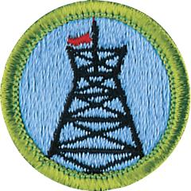

# Pioneering Merit Badge

## Overview

Pioneering—the knowledge of ropes, knots, and splices along with the ability to build rustic structures by lashing together poles and spars—is among the oldest of Scouting’s skills. Practicing rope use and completing projects with lashings also allow Scouts to connect with past generations, ancestors who used many of these skills as they sailed the open seas and lived in America’s forests and prairies.

## Requirements

* Note: All pioneering projects constructed for this merit badge must comply with height standards as outlined in the Guide to Safe Scouting.  Counselors should also ensure that Scouts follow the Leave No Trace Seven Principles and the Outdoor Code in their pioneering projects. Just as hiking and camping without a trace are signs of expert outdoorsmanship, protecting the environment is a mark of responsible pioneering. Minimize impacts to the land.
* (1) Do the following:
    * (a) Explain to your counselor the most likely hazards you might encounter while participating in pioneering activities and what you should do to anticipate, help prevent, mitigate, and respond to these hazards.
    * (b) Discuss the prevention of, and first-aid treatment for, injuries and conditions that could occur while working on pioneering projects, including rope splinters, rope burns, cuts, scratches, insect bites and stings, hypothermia, dehydration, heat exhaustion, heatstroke, sunburn, and falls.

* (2) Do the following:
    * (a) Demonstrate the West Country method of whipping a rope.
    * (b) Demonstrate how to tie a rope tackle and the following knots: clove hitch formed as two half hitches, clove hitch on a bight, butterfly knot, roundturn with two half hitches, and rolling hitch.
    * (c) Demonstrate and explain when to use the following lashings: square, diagonal, round, shear, tripod, and floor lashing.

* (3) Do the following:
    * (a) Using square and tripod lashings from requirement 2(c), build a Tripod Wash Station (or with your counselor's permission, another camp gadget of your own design).
    * (b) Using rolling hitches or roundturns with two half hitches, and round lashings from requirements 2(b) and 2(c), build a 15-foot Scout Stave Flagpole (or with your counselor's permission, another camp gadget of your own design).
    * (c) Using shear, square, and floor lashings, clove hitches on a bight, and rope tackles from requirements 2(b) and 2(c), build a Simple Camp Table (or with your counselor's permission, another camp gadget of your own design).

* (4) Explain the differences between synthetic ropes and natural-fiber ropes. Discuss which types of rope are suitable for pioneering work and why. Include the following in your discussion: breaking strength, safe working loads, and the care and storage of rope.
* (5) Explain the uses for the back splice, eye splice, and short splice. View a demonstration on forming each splice.
* (6) Using a rope-making device or machine, make a rope at least 6 feet long consisting of three strands, each having three yarns. Whip the ends.
* (7) Explain the importance of effectively anchoring a pioneering project. Describe to your counselor the 3-2-1 anchoring system and the log-and-stake  anchoring system.
* (8) Describe the lashings that are used when building a trestle, how the poles are positioned, and how X braces contribute to the overall structural integrity of a pioneering project.
* (9) Working in a group, (or individually with the help of your counselor) build a full size pioneering structure, using one of the following designs in the Pioneering merit badge pamphlet: - Double A-Frame Monkey Bridge - Single A-Frame Bridge - Single Trestle Bridge - Single Lock Bridge - 4x4 Square Climbing Tower - Four Flag Gateway Tower - Double Tripod Chippewa Kitchen - Another type of structure approved in advance by your counselorCarefully plan the project, assembling and organizing all the materials, referring to the points under Safe Pioneering, and complying with the height  restrictions in the Guide to Safe Scouting.

## Resources

- [Pioneering merit badge page](https://www.scouting.org/merit-badges/pioneering/)
- [Pioneering merit badge PDF](https://filestore.scouting.org/filestore/Merit_Badge_ReqandRes/Pamphlets/Pioneering.pdf) ([local copy](files/pioneering-merit-badge.pdf))
- [Pioneering merit badge pamphlet](https://www.scoutshop.org/pioneering-merit-badge-pamphlet-662419.html)

Note: This is an unofficial archive of Scouts BSA Merit Badges that was automatically extracted from the Scouting America website and may contain errors.