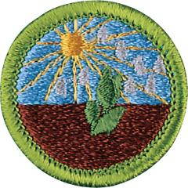

# Plant Science Merit Badge

## Overview

Plant scientists use their curiosity and knowledge to develop questions about the world of plants. Then they try to answer those questions with further observations and experiments in the laboratory and in the field. To earn this merit badge, Scouts will explore three of the most important plant science specialties: agronomy, horticulture, and field botany.

## Requirements

- (1) Make a drawing and identify five or more parts of a flowering plant. Tell what each part does.

  **Resources:** [Flower Dissection - Reproduction in Flowering Plants (video)](https://youtu.be/493WeySyf-8?si=u7d6_2RKO2h03wNo), [Flower Structures and Functions (video)](https://youtu.be/GkzFimUJdD8)

- (2) Explain photosynthesis and tell why this process is important. Tell at least five ways that humans depend on plants.

  **Resources:** [Photosynthesis and Cellular Respiration: (video)](https://youtu.be/WzOrF5W4l3Q), [Photosynthesis Light Reactions and the Calvin Cycle (video)](https://youtu.be/dAF5FngVa7A?si=cJyFp2gNf1uMiLqD), [Photosynthesis (website)](https://kids.britannica.com/students/article/photosynthesis/276411)

- (3) Explain how honeybees and other pollinating insects are important to plant life.

  **Resources:** [Animal Pollinators Other Than Bees (video)](https://youtu.be/gR3E2tGx2vc), [How do Bees Make Our Food? (video)](https://youtu.be/pRDcNhQGaeo), [Honeybees and Agriculture (video)](https://youtu.be/cwneYtj_Zk4)

- (4) Explain how water, light, air, temperature, and pests affect plants. Describe the nature and function of soil and explain its importance. Tell about the texture, structure, and composition of fertile soil. Tell how soil may be improved.

  **Resources:** [Learn the Various Factors That Affect Roots (video)](https://www.youtube.com/shorts/UxZCSsA2piU), [How Plants Grow (video)](https://www.youtube.com/shorts/KqNmyeIk688), [Soil and Soil Dynamics (video)](https://youtu.be/mg7XSjcnZQM), [Types of Soil (video)](https://youtu.be/UNqCBicHe6s)

- (5) Tell how to propagate plants by seeds, roots, cuttings, tubers, and grafting. Grow a plant by ONE of these methods.

  **Resources:** [How to Propagate Plants (video)](https://youtu.be/szcExpxPyXc), [How to Propagate Any Plant | Multiply Your Plants for Free! (video)](https://youtu.be/_taBmwyRSyc?si=j4U-9tDMrbONry6u)

- (6) List by common name at least 10 native plants and 10 cultivated plants that grow near your home. List five invasive non-native plants in your area and tell how they may be harmful. Tell how the spread of invasive plants may be avoided or controlled in ways that are not damaging to humans, wildlife, and the environment.

  **Resources:** [Getting Rid of Invasive Plants From Your Yard. Don't Plant These! (video)](https://youtu.be/QyxLJ1WZwxs), [How To Identify and Remove Invasive Plants (video)](https://youtu.be/zWty9EVuw4k), [How To Select Native Plants For Your Landscape: Determining Your Site Conditions (video)](https://youtu.be/CFwMWLAM5CE)

- (7) Do ONE of the following:
  - (a) Explore careers related to this merit badge. Research one career to learn about the training and education needed, costs, job prospects, salary, job duties, and career advancement. Your research methods may include—with your parent or guardian's permission—an internet or library search, an interview with a professional in the field, or a visit to a location where people in this career work. Discuss with your counselor both your findings and what about this profession might make it an interesting career.

    **Resources:** [A Day in the LIFE of an AGRONOMIST (video)](https://youtu.be/sbyuwd1nDVo), [10 Botany Jobs: Environmental Conservation Botany Jobs and Environmental Internships (video)](https://youtu.be/d1HGz04SA9U?si=zGMuF_gt8Tm5s368), [What's the Difference Between Horticulture and Agronomy (video)](https://youtu.be/d1HGz04SA9U?si=zGMuF_gt8Tm5s368)
  - (b) Explore how you could use knowledge and skills from this merit badge to pursue a hobby or healthy lifestyle. Research any training needed, expenses, and organizations that promote or support it. Discuss with your counselor what short-term and long-term goals you might have if you pursued this.

    **Resources:** [Fairy Gardens (video)](https://youtu.be/ZuQ6SvmYjtw?si=WVlIAlraQrSiwYHj), [Bonzai Tree Hobby (video)](https://youtu.be/ztx0fMF2rAA?si=08-Ef4YnEJsPHhvF), [Common Reasons for Keeping Honey Bees (video)](https://youtu.be/DUM3o2b7NUA?si=1aXCsEnClarmfKpK)

- (8) Choose ONE of the following options and complete each requirement:
  - **Option A—Agronomy.** Do ALL of the following:
  - (1) Describe how to prepare a seedbed.

    **Resources:** [How To Prepare Your Seedbed For Spring Planting (video)](https://youtu.be/YYbzM7halC0?si=UYbTPYp_l47celkS), [Plan Your Best Garden Ever: Testing Soil and Seeds (website)](https://www.growveg.com/guides/plan-your-best-garden-ever-testing-soil-and-seeds/)
  - (2) Make and use a seed germination tester to test 50 seeds of four of the following plants: corn, cotton, alfalfa, soybeans, clover, wheat, rice, rye, or barley. Determine the percentage of live seeds.

    **Resources:** [How to Do Seed Germination Test (video)](https://youtu.be/MOphmTH-WIA)
  - (3) Explain one important insect pest and one important disease that damage each of the following: corn, small grains, and cotton. Collect and name five weeds that compete with crops in your locality. Tell how to control these weeds without harming people, wildlife, or useful insects.

    **Resources:** [Different Types of Diseases in Corn (video)](https://youtu.be/lpIsRU63qIE), [Major Pest of Cotton (video)](https://youtu.be/Yt_Z3SJmw3c)
  - (4) On a map of the United States, identify the chief regions where corn, cotton, forage crops, small grain crops, and oil crops grow. Tell how the climate and location of these regions make them leaders in the production of these crops.

    **Resources:** [Major Crops of United States (video)](https://youtu.be/AHx27-1Qjxw), [Major Agricultural Crops in United States (video)](https://youtu.be/ulHKu0l0xds), [USDA - National Agricultural Statistics Service - Charts and Maps - Field Crops (website)](https://www.nass.usda.gov/Charts_and_Maps/Field_Crops/index.php)
  - (5) Do ALL of the requirements in ONE of the following alternatives:
  - (5) (a) **Corn**
  - (1) Grow a plot of corn and have your plot inspected by your counselor. Record seed variety or experimental code number.

    **Resources:** [The Incredible Logistics Behind Corn Farming (video)](https://youtu.be/R9pxFgJwxFE)
  - (2) Tell about modern methods of commercial corn farming and the contributions that corn makes to today's food and fuel supply.
  - (3) Tell about an insect that can damage corn, and explain how it affects corn production and how it is controlled.

    **Resources:** [Different Types of Diseases in Corn (video)](https://youtu.be/lpIsRU63qIE)
  - (5) (b) **Cotton**
  - (1) Grow a plot of cotton and have your plot inspected by your counselor.
  - (2) Tell about modern methods of commercial cotton farming, and about the uses of cotton fiber and seed and the economic value of this crop.

    **Resources:** [How American Farmers Produce 14.68 Million Bales Of Cotton - American Farming (video)](https://youtu.be/ODLRz9H_FLU)
  - (3) Tell about an insect that can damage cotton, and explain how it affects cotton production and how it is controlled.

    **Resources:** [Major Pest of Cotton (video)](https://youtu.be/Yt_Z3SJmw3c), [Insect Lockdown Pest Profiles: The Cotton Fleahopper (video)](https://youtu.be/B0ApDCtkdQk?si=mmYbeVgPAk-9o9DL)
  - (5) (c) **Forage Crops**
  - (1) Collect, count, and label samples of each for display: perennial grasses, annual grasses, legumes, and broadleaf weeds. Indicate how each grass and legume is used. Keep a log of the site where you found each sample and share it with your counselor.
  - (2) Explain how legumes can be used to enrich the soil and how they may deplete it under certain conditions. Explain how livestock may enrich or deplete the soil.

    **Resources:** [Importance of Legumes (video)](https://youtu.be/fUJXV-lHDKk), [The Science of Soil Health: Understanding the Value of Legumes and Nitrogen-Fixing Microbes (video)](https://youtu.be/0yRYdvEzXag?si=vcj8GD4Awd1EoLJZ)
  - (3) Name five poisonous plants that are dangerous to livestock, and tell the different ways of using forage crops as feed for livestock.

    **Resources:** [Local Veterinarian Explains What Plants Are Toxic to Large Animals (video)](https://youtu.be/vwrNGUx0TJ4)
  - (5) (d) **Small Grains**
  - (1) Give production figures for small grain crops listed in the U.S. Statistical Report or Agricultural Statistics Handbook for the latest year available.

    **Resources:** [USDA - National Agricultural Statistics Service - Charts and Maps - Field Crops (website)](https://www.nass.usda.gov/Charts_and_Maps/Field_Crops/index.php)
  - (2) Help in harvesting a crop of grain. Tell how to reduce harvesting losses and about modern methods of growing one small grain crop.

    **Resources:** [Growing and Harvesting Wheat on a Small Scale (video)](https://youtu.be/RYn_yUUpwSQ), [Reducing Soybean Harvest Losses | Michigan Soybean | Harvest Demonstration Video (video)](https://youtu.be/PEgONTJko6s)
  - (3) Visit a grain elevator, flour mill, cereal plant, feed or seed company. Talk with the operator. Take notes, and describe the processes used and tell your patrol, troop, or class about your visit.

    **Resources:** [The Journey: Wheat into Flour (video)](https://youtu.be/PYP6AnNQjNo?si=mL4eQyG6nOPebuk5), [Everything About Grain Bins (Farmers are Geniuses) (video)](https://youtu.be/ywBV6M7VOFU?si=ngV-w_iXGlnwjTox), [How Does a Seed Company Work? (video)](https://youtu.be/zFzQE7kKAck?si=TaPtU3MhtTWMCv_Q)
  - (5) (e) **Oil Crops**
  - (1) Grow a plot of soybeans and have your plot inspected by your counselor.

    **Resources:** [How to Produce Millions Of Tons Of Soybeans | Modern Agricultural Technology | Soy milk Processing (video)](https://youtu.be/1olmtb3MpME)
  - (2) Tell about modern methods of growing soybeans on a commercial scale, and discuss the contributions soybeans make to our food supply.

    **Resources:** [Soybeans and Oil Crops - Oil Crops Sector at a Glance | Economic Research Service (website)](https://www.ers.usda.gov/topics/crops/soybeans-and-oil-crops/oil-crops-sector-at-a-glance)
  - (3) Explain why a hard frost can be dangerous to soybeans just after emergence.

    **Resources:** [Soybean School: Assessing the Impact of Frost (video)](https://youtu.be/x86tt8PPwiA)
  - **Option B—Horticulture.** Do ALL of the following:
  - (1) Visit one of the following places and tell what you learned about horticulture there: public garden, arboretum, retail nursery, wholesale nursery, production greenhouse, or conservatory greenhouse.

    **Resources:** [Horticulture Center Tour (video)](https://youtu.be/8M5Pb6XWMcE)
  - (2) Explain the following terms: hardiness zone, shade tolerance, pH, moisture requirement, native habitat, texture, cultivar, ultimate size, disease resistance, habit, evergreen, deciduous, annual, and perennial. Find out what hardiness zone you live in and list 10 landscape plants you like that are suitable for your climate, giving the common name and scientific name for each.

    **Resources:** [US Plant Zones: Explained // Garden Answer (video)](https://youtu.be/O6AM0pNiUOs), [Glossary - Grow Native! (website)](https://grownative.org/learn/glossary/), [USDA Plant Hardiness Zone Map (website)](https://planthardiness.ars.usda.gov/)
  - (3) Do ONE of the following:
  - (a) Explain the difference between vegetative and sexual propagation methods, and tell some horticultural advantages of each. Grow a plant from a stem or root cutting or graft.

    **Resources:** [How to Propagate Plants: 4 Methods to Master (video)](https://youtu.be/WHiv1OvXGcI), [Vegetative Propagation-Asexual Reproduction in Plants-Leaving Cert Biology (video)](https://youtu.be/7sr1Sd8T2YU?si=lJ1gbe9HuKIyzFim), [Propagation Techniques for Prolific Plants - Growing Spaces Greenhouses (video)](https://youtu.be/qH1tJcoTxJM?si=eCtTyCOJHOmnAr4M)
  - (b) Transplant 12 seedlings or rooted cuttings to larger containers and grow them for at least one month.

    **Resources:** [How to Transplant Seedlings to Bigger Pots (video)](https://youtu.be/60jGd-9RP3E?si=sNCzM86umQrpvytg)
  - (c) Demonstrate good pruning techniques and tell why pruning is important.

    **Resources:** [Everything You Need to Know to Start Pruning | Gardening 101 (video)](https://youtu.be/nuF411tf1x0?si=yc53pSsJi6z2aQF7)
  - (d) After obtaining permission, plant a tree or shrub properly in an appropriate site.

    **Resources:** [How to Properly Plant a Tree (video)](https://youtu.be/z30jQa8-Lvg?si=FJ4sW01BFP8g6kBH)
  - (4) Do the following:
  - (a) Explain the importance of good landscape design and selection of plants that are suitable for particular sites and conditions.

    **Resources:** [How to Pick the Right Plants for  Stunning Landscaping - A Botanical Bliss Guide (video)](https://youtu.be/fpI_A_F7U50?si=r0VZS0UHwFOQ8ZiY)
  - (b) Tell why it is important to know how big a plant will grow.

    **Resources:** [How to Know the Height, Width & Size a Plant or Tree Will Grow to at Maturity (website)](https://www.wilsonbrosgardens.com/how-to-know-how-tall-a-plant-will-grow-when-mature.html)
  - (c) Tell why slower-growing landscape plants are sometimes a better choice than faster-growing varieties.

    **Resources:** [Choosing Slow-Growing Plants for Greater Longevity (website)](https://livetoplant.com/choosing-slow-growing-plants-for-improved-longevity/)
  - (5) Do ALL of the requirements in ONE of the following alternatives:
  - (5) (a) **Bedding Plants**
  - (1) Grow bedding plants appropriate for your area in pots or flats from seed or cuttings in a manufactured soil mix. Explain why you chose the mix and tell what is in it.
  - (2) Transplant plants to a bed in the landscape and maintain the bed until the end of the growing season. Record your activities, observations, materials used, and costs.

    **Resources:** [Transplanting Ferns & Other Plants: A Guide to Success (video)](https://youtu.be/vd3w_hmtm9A?si=ryWERSwz8LEQQssw)
  - (3) Demonstrate mulching, fertilizing, watering, weeding, and deadheading, and tell how each practice helps your plants.

    **Resources:** [The Big Five - Weeding, Pruning, Fertilizing, Mulching, Watering (video)](https://youtu.be/mgviGaoWO1w)
  - (4) Tell some differences between gardening with annuals and perennials.

    **Resources:** [The Difference Between Annuals and Perennials (video)](https://youtu.be/-jQsd1fNFA8), [Annuals or Perennials? Which Is Best, and How Do I Choose? (video)](https://youtu.be/nbJJMwsp0TM?si=eweSHAYVtUPc8cs4)
  - (5) (b) **Fruit, Berry, and Nut Crops**
  - (1) Plant five fruit or nut trees, grapevines, or berry plants that are suited to your area. Take full care of fruit or nut trees, grapevines, or berry plants through one season.
  - (2) Prune a tree, vine, or shrub properly. Explain why pruning is necessary.

    **Resources:** [Why You Should Prune Your Shrubs and Trees (video)](https://youtu.be/nZ4Fn1_rVRo)
  - (3) Demonstrate one type of graft and tell why this method is useful.

    **Resources:** [How Plant Grafting Actually Works and Why It's So Cool (video)](https://youtu.be/NN1Y_giTMeE?si=NHHCKRuR32-NH0pa)
  - (4) Describe how one fruit, nut, or berry crop is processed for use.

    **Resources:** [How Pecans Are Manufactured | How It's Made (video)](https://youtu.be/EhqW-eZ9Vtg?si=HBV3u_RDnqeAiGbI), [How Are Raisins Made - Sun-Dried or Machine-Made? (video)](https://youtu.be/QfyUcGuc8ww?si=1hEFDzcQt-kf2uBA)
  - (5) (c) **Woody Ornamentals**
  - (1) Plant five or more trees or shrubs in a landscape setting. Take full care of the trees or shrubs you have planted for one growing season.
  - (2) Prune a tree or shrub properly. Explain why pruning is necessary.

    **Resources:** [Ask an Arborist: Why Do I Need to Prune? (video)](https://youtu.be/-RjCGdgF7Jo?si=TFYAJs23hB21ewOn), [Ask an Arborist: What Are the Rules of Pruning? (video)](https://youtu.be/O1UBV35JAxI?si=v9bsuqKs9l5Tdjj8), [Ask an Arborist: The ABC's of Pruning (video)](https://youtu.be/IQhmIK-0HOc?si=owIKfbXa8G-lcX1q)
  - (3) List 10 trees (in addition to those listed in general requirement 6 above) and tell your counselor how each is used in the landscape. Give the common and scientific names.

    **Resources:** [10 Most Popular Ornamental Trees for Your Garden (video)](https://youtu.be/pTcQTifb6lI?si=JzJ9j6xsPbckdtjW)
  - (4) Describe the size, texture, color, flowers, leaves, fruit, hardiness, cultural requirements, and any special characteristics that make each type of tree or shrub attractive or interesting.
  - (5) Tell five ways trees help improve the quality of our environment.

    **Resources:** [The Importance of Trees for Our Environment and Health (video)](https://youtu.be/E6VvooVLgq4?si=wpybhPMXwOSnZ8y5), [6 Ways Trees Benefit All of Us (website)](https://www.nature.org/en-us/what-we-do/our-priorities/build-healthy-cities/cities-stories/benefits-of-trees-forests/)
  - (5) (d) **Home Gardening**
  - (1) Design and plant a garden or landscape that is at least 10 by 10 feet.

    **Resources:** [How to Design the Perfect Landscape | Landscape Design 101 (video)](https://youtu.be/e-wO-LqEQb4?si=_RjhdI1Bh7eIlgd-), [10 Plants for a Bird-Friendly Yard | Audubon (website)](https://www.audubon.org/news/10-plants-bird-friendly-yard)
  - (2) Plant 10 or more different types of plants in your garden. Tell why you selected particular varieties of vegetables and flowers. Take care of the plants in your garden for one season.

    **Resources:** [Caring for a Vegetable Garden | HowStuffWorks (website)](https://home.howstuffworks.com/caring-for-a-vegetable-garden.htm)
  - (3) Demonstrate soil preparation, staking, watering, weeding, mulching, composting, fertilizing, pest management, and pruning. Tell why each technique is used.

    **Resources:** [Remove Weeds Using These Effective Methods | Gardening 101 (video)](https://youtu.be/3zNij-aGpVw?si=_alv-L6QxChk5Ukk), [How to Mulch Your Garden: A Step-by-Step Guide (video)](https://youtu.be/gy6q5f75O7k?si=HJltpHrtGxdpt2i_), [Composting For Beginners (video)](https://youtu.be/1LZzgi1k9aA?si=8UAYVwjNPRBB90g5)
  - (4) Tell four types of things you could provide to make your home landscape or park a better place for birds and wildlife. List the common and scientific names of 10 kinds of native plants that are beneficial to birds and wildlife in your area.

    **Resources:** [Get to Know These 20 Common Types of Native Plants (website)](https://www.audubon.org/news/get-know-these-20-common-types-native-plants), [Native Plant Recommendations | United States Botanic Garden (website)](https://www.usbg.gov/native-plant-recommendations)
  - **Option C—Field Botany.** Do ALL of the following:
  - (1) Visit a park, forest, Scout camp, or other natural area near your home. While you are there:
  - (a) Determine which species of plants are the largest and which are the most abundant. Note whether they cast shade on other plants.
  - (b) Using information from maps, textbooks, or the internet, describe the environmental factors that may influence the presence of plants on your site, including latitude, climate, air and soil temperature, soil type and pH, geology, hydrology, and topography.

    **Resources:** [Environmental Factors Affecting Plant Growth  (website)](https://extension.oregonstate.edu/gardening/techniques/environmental-factors-affecting-plant-growth)
  - (c) Record any differences in the types of plants you see at the edge of a forest, near water, in burned areas, or near a road or railroad.
  - (2) Select a study site that is at least 100 by 100 feet. Make a list of 10 woody plants (trees and shrubs) and 10 non-woody plants in the study site. Find out which of these are native plants and which are exotic (or nonnative).

    **Resources:** [Native Plants vs Exotic Plants | Which Are More Beneficial to the Ecosystem (video)](https://youtu.be/Af80dnhp2QY)
  - (3) Tell how an identification key works and use a simple key to identify 10 kinds of plants (in addition to those in general requirement 5 above). Tell the difference between common and scientific names and tell why scientific names are important.

    **Resources:** [Scientific vs Common Names (video)](https://youtu.be/WVaxMwcPVEY), [How to Key Out a Plant (video)](https://youtu.be/AAx3ZsNfoIM?si=3DATJ-glDsjVHJjM)
  - (4) After gaining permission, collect, identify, press, mount, and label 10 different plants that are common in your area. Tell why voucher specimens are important for documentation of a field botanist's discoveries.

    **Resources:** [Pressing Plants for Herbarium Study (video)](https://youtu.be/zEevM61u4Ew)
  - (5) Obtain a list of rare plants of your state. Tell what is being done to protect rare plants and natural areas in your state. Write a paragraph about one of the rare plants in your state.

    **Resources:** [Rare Plant Profiles (website)](https://www.fs.usda.gov/wildflowers/Rare_Plants/profiles/index.php), [Find Rare Plants Near You (website)](https://saveplants.org/rare-plants-near-me/)
  - (6) Do ALL of the requirements in ONE of the following alternatives:
  - (a) **Tree Inventory**
  - (1) Identify the trees of your neighborhood, a park, a section of your town, or a Scout camp.

    **Resources:** [How to Use Twigs to Identify Trees (video)](https://youtu.be/X2TDSiaqfbQ?si=h0rb2-D_5zUSTcgN)
  - (2) Collect, press, and label leaves, flowers, or fruits to document your inventory.
  - (3) List the types of trees by scientific name and give common names. Note the number and size (diameter at 4½ feet above ground) of trees observed and determine the largest of each species in your study area.
  - (4) Show two or more people how to use a leaf or twig key to identify at least five species of trees or shrubs.
  - (b) **Transect Study**
  - (1) Visit two sites, at least one of which is different from the one you visited for Field Botany requirement 1.
  - (2) Use the transect method to study the two different kinds of plant communities. The transects should be at least 500 feet long.

    **Resources:** [Weekly Science Challenge #5: Create a Transect (video)](https://youtu.be/hbhR8hgFqG0?si=nlHaeSRLkK4NzRFs)
  - (3) At each site, record observations about the soil and other influencing factors AND do the following. Then make a graph or chart to show the results of your studies.
  - (a) Identify each tree within 10 feet of the transect line.
  - (b) Measure the diameter of each tree at 4½ feet above the ground, and map and list each tree.
  - (c) **Nested Plot**
  - (1) Visit two sites, at least one of which is different from the one you visited for Field Botany requirement 1.
  - (2) Mark off nested plots and inventory two different kinds of plant communities.
  - (3) At each site, record observations about the soil and other influencing factors AND do the following. Then make a graph or chart to show the results of your studies.
  - (a) Identify, measure, and map each tree in a 100-by-100-foot plot. (Measure the diameter of each tree larger than 3 inches in diameter at 4½ feet above the ground.)
  - (b) Identify and count all trees and shrubs in a 10-by-10-foot plot within each of the larger areas.

    **Resources:** [Tree Identification | Ask the Arborist (video)](https://youtu.be/7M4PUM_eIIQ)
  - (c) Identify and count all broad-leaved plants (trees, shrubs, vines, and herbaceous plants) all plants (wildflowers, ferns, grasses, mosses, etc.) of a 4-by-4-foot plot within the 10-by-10-foot plot.
  - (d) **Herbarium Visit**
  - (1) Write ahead and arrange to visit an herbarium at a university, park, or botanical garden; OR, visit an herbarium website (with your parent or guardian's permission).

    **Resources:** [What Is a Herbarium? The Scientific and Historical Treasures of the Cambridge University Herbarium (video)](https://youtu.be/wQkEYZAlnGw?si=LnLjPuh2pyMQpdAF)
  - (2) Tell how the specimens are arranged and how they are used by researchers. If possible, observe voucher specimens of a plant that is rare in your state.
  - (3) Tell how a voucher specimen is mounted and prepared for permanent storage. Tell how specimens should be handled so that they will not be damaged.

    **Resources:** [Pressing Plants for Herbarium Study (video)](https://youtu.be/zEevM61u4Ew)
  - (4) Tell about the tools and references used by botanists in an herbarium.

    **Resources:** [How Herbarium Specimens Are Prepared at the Cambridge University Herbarium (video)](https://youtu.be/fpfmfTZV4G4?si=W6olcrOUEL6u1VTA)
  - (e) **Plant Conservation Organization Visit**
  - (1) Write ahead and arrange to visit a private conservation organization or government agency that is concerned with protecting rare plants and natural areas.
  - (2) Tell about the activities of the organization in studying and protecting rare plants and natural areas.
  - (3) If possible, visit a nature preserve managed by the organization. Tell about land management practices such as controlled burning, or measures to eradicate invasive (nonnative) plants or other threats to the plants that are native to the area.

- (9) Discuss the importance of the Leave No Trace Seven Principles and the Outdoor Code as they relate to plant science. Explain how you have followed the Leave No Trace Seven Principles and the Outdoor Code while in natural areas during field observation, specimen collection, and identification.

  **Resources:** [Leave No Trace Basics (video)](https://vimeo.com/1115216743/63b20c0b33?share=copy), [Leave No Trace Outdoor Ethics (video)](https://www.youtube.com/watch?v=jXO1uY0MvmQ)

## Resources

- [Plant Science merit badge page](https://www.scouting.org/merit-badges/plant-science/)
- [Plant Science merit badge PDF](https://filestore.scouting.org/filestore/Merit_Badge_ReqandRes/Pamphlets/Plant%20Science.pdf) ([local copy](files/plant-science-merit-badge.pdf))
- [Plant Science merit badge pamphlet](https://www.scoutshop.org/bsa-plant-science-merit-badge-pamphlet-boy-scouts-of-america-660055.html)
- [Plant Science merit badge workbook PDF](http://usscouts.org/mb/worksheets/Plant-Science.pdf)
- [Plant Science merit badge workbook DOCX](http://usscouts.org/mb/worksheets/Plant-Science.docx)

Note: This is an unofficial archive of Scouts BSA Merit Badges that was automatically extracted from the Scouting America website and may contain errors.