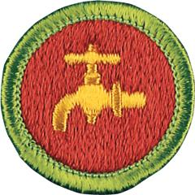

# Plumbing Merit Badge

## Overview

Plumbing, including pipe fitting, is an important and well-paid occupation. The industry is quite broad. It covers installations and repairs in homes, commercial properties, and factories. Plumbing pipelines are used for water supply, waste drainage, natural-gas heating, and many other purposes.

## Requirements

* NOTE:  The official merit badge pamphlets are now free and downloadable  [HERE](https://filestore.scouting.org/filestore/Merit_Badge_ReqandRes/Pamphlets/Plumbing.pdf) or can be purchased at the [Scout Shop.](https://www.scoutshop.org/)
* (1) Do the following:
    * (a) Describe how a properly working plumbing system protects your family's health and safety. Resource: [How Plumbing Transformed Public Health (video)](https://youtu.be/MVGgjYigmDE?si=nwaqXmHn2CuYYAnK)
    * (b) List five important local health regulations related to plumbing and tell how they protect health and safety.
    * (c) Describe the safety precautions you must take when making home plumbing repairs. Resource: [Plumbing Safety Tips (video)](https://youtu.be/gyWrbmQp5a0?si=mSS8s25KUFkV39Z5)

* (2) Do the following: Resource: [How Your Home Plumbing Works (From Start to Finish)  (video)](https://youtu.be/8jxRn-T_LCs?si=pwjNJvf0MCXM5gdY)
    * (a) Make a drawing and explain how a home hot- and cold-water supply system works. Tell how you would make it safe from freezing.
    * (b) Make a drawing and explain the drainage system of the plumbing in a house. Show and explain the use of drains and vents.

* (3) Show how to use five important plumber's tools. Resource: [6 Essential Plumbing Hand Tools...and Others to Keep Around! (video)](https://youtu.be/uppuvS8BShU?si=a2SBD-wzgASkoSy2)
* (4) Identify and explain the following terms: washer, retaining nut, plunger (rubber force cup), solder, flux, elbow, tee, nipple, coupling, plug, union, trap, drainpipe, and water meter.
* (5) Name the kinds of pipe that are used most often in a plumbing system. Explain why these pipes are used. Resource: [Four Types of Pipes Explained! (video)](https://youtu.be/OJkj4T9_X9I?si=b2eBR2WGlANFrxyF)
* (6) Do FOUR of the following, each under the supervision of a knowledgeable adult:
    * (a) Visit the plumbing section of a hardware store or home center and identify:
        * (1) PVC pipe and fittings
        * (2) CPVC pipe and fittings
        * (3) PEX pipe and fittings
        * (4) Copper pipe and fittings
        * (5) Steel pipe and fittings
        * (6) Specialty plumbing tools.

    * (b) Cut, clean (debur), PVC or CPVC pipe; solvent weld at least three connections to include a coupling, tee, and elbow. Resource: [How To Cut, Prime & Cement PVC Pipe & Fittings Like A PRO (How To Bond PVC) Solvent Weld PVC (video)](https://youtu.be/gSNlq7QK8lc?si=DhCkTPDDKnnF_d0R)
    * (c) Cut PEX pipe; make at least one connection using either a quick-connect fitting or a crimp fitting (using specialized tools). Resource: [How To Cut And Crimp Pex - From A Professional (video)](https://youtu.be/vpnp3RayEPI?si=iieOezZIhF4ePAB-)
    * (d) Solder a copper connection using a gas torch. Resource: [Copper Pipe Soldering-How to Solder for Beginners Video  (video)](https://youtu.be/TOtOpixWTXE?si=Jl_jeHOlvComjB_k)
    * (e) Replace a kitchen or lavatory faucet. Resource: [Women's DIY Bathroom Remodel (video)](https://youtu.be/hyTeVMYgRM0?si=Vjs95F0m6dK-Ae11)
    * (f) Remove, clean or replace, and reinstall a sink or lavatory drain trap. Resource: [How To Install P-Trap And Bathroom Sink Drain Piping | Easy Installation For Beginners!  (video)](https://youtu.be/OFui97xhln0?si=0j-wNeNigMTLVJHt)
    * (g) Properly apply pipe thread tape to a pipe or a plumbing connector. Resource: [How to Apply Teflon Tape Like a Plumbing Pro (video)](https://youtu.be/KJoO87dW30U?si=zlN2wJ1V8ciBaLEt)

* (7) Identify three career opportunities that would use skills and knowledge in plumbing. Pick one and research the training, education, certification requirements, experience, and expenses associated with entering the field. Research the prospects for employment, starting salary, advancement opportunities and career goals associated with this career. Discuss what you learned with your counselor and whether you might be interested in this career.  Resources: [Why Plumbing is the Best Job Ever (video)](https://youtu.be/6cmAKvZScrQ?si=TbI4S2w6b0DMWN8A) [Plumbing Jobs Explained: From Odd Jobs to Owning a Small Business (video)](https://youtu.be/vIr4tUV9YNk?si=Gq8NZD-MQVrOokGr)

## Resources

- [Plumbing merit badge page](https://www.scouting.org/merit-badges/plumbing/)
- [Plumbing merit badge PDF](https://filestore.scouting.org/filestore/Merit_Badge_ReqandRes/Pamphlets/Plumbing.pdf) ([local copy](files/plumbing-merit-badge.pdf))
- [Plumbing merit badge pamphlet](https://www.scoutshop.org/plumbing-merit-badge-pamphlet-655690.html)
- [Plumbing merit badge workbook PDF](http://usscouts.org/mb/worksheets/Plumbing.pdf)
- [Plumbing merit badge workbook DOCX](http://usscouts.org/mb/worksheets/Plumbing.docx)

Note: This is an unofficial archive of Scouts BSA Merit Badges that was automatically extracted from the Scouting America website and may contain errors.