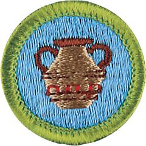

# Pottery Merit Badge

## Overview

The Pottery merit badge provides an introduction to pottery making, enabling Scouts to gain skill and understanding from actually creating pottery. Completing the requirements will include hands-on production of a work of art, from start to finish.

## Requirements

* NOTE:  The official merit badge pamphlets are now free and downloadable  [HERE](https://filestore.scouting.org/filestore/Merit_Badge_ReqandRes/Pamphlets/Pottery.pdf) or can be purchased at the [Scout Shop.](https://www.scoutshop.org/)
* (1) Explain to your counselor the precautions that must be followed for the safe use and operation of a potter's tools, equipment, and other materials. Resource: [6 Steps to a Safe Pottery Studio (video)](https://youtu.be/6kH2KWwFW4w?si=cUxiSFBWOp3k5yA0)
* (2) Do the following:
    * (a) Explain the properties and ingredients of a good clay body for the following: Resource: [Best Clay for Pottery: Hand-Building, Wheel Throwing & Sculpting Explained (video)](https://youtu.be/d2l-Aup2QMM?si=WqEsE2JrVKcD5MIK)
        * (1) Making sculpture using the hand-building method
        * (2) Throwing on the wheel

    * (b) Tell how three different kinds of potter's wheels work. Resources: [Selecting a Potter's Wheel (PDF)](https://select.schoolspecialty.com/wcsstore/SSICatalogAssetStore/ideas-resources/V2182323.pdf) [Pottery Wheels - a Buyers Guide (website)](https://ceramic.school/pottery-wheels/)

* (3) Make two drawings of pottery forms, each on an 8 1/2-by-11-inch sheet of paper. One must be a historical pottery style. The other must be of your own design. Resource: [Ancient Greek Pottery Shapes: The Pure and Useful Forms of Greek Vases (website)](https://thedelphiguide.com/ancient-greek-pottery-shapes/)
* (4) Explain the meaning of the following pottery terms: bat, wedging, throwing, leather hard, bone dry, greenware, bisque, terra-cotta, grog, slip, score, earthenware, stoneware, porcelain, pyrometric cone, and glaze. Resources: [Ceramics 101: Clay Vocabulary and Processes (video)](https://youtu.be/OdUBdRI3Iyw?si=agyum4noQ3XJTzH7)  [Ceramic and Pottery Glossary (website)](https://lakesidepottery.com/HTML%20Text/Tips/A%20pottery%20glossary.htm)
* (5) Do the following: Each piece is to be painted, glazed, or otherwise decorated by you.
    * (a) Make a slab pot, a coil pot, and a pinch pot. Resources: [How to Make a Slab-Built Cup (video)](https://youtu.be/du2pWU4XlCk?si=fYc1HdnMT21PbSsr) [How to Use the Coil Hand Building Technique With Clay (video)](https://youtu.be/OdUBdRI3Iyw?si=PHYczPOJsfQ_9C38) [How to Make a Pinch Pot (video)](https://youtu.be/yCjClGmWHt4?si=WywL7M7feecMBBRV)
    * (b) Make a human or animal figurine or decorative sculpture. Resources: [How to Sculpt a Human Face in Clay (video)](https://youtu.be/zIe2V-AtIfQ?si=1CqS59GVptHlrq4e) [Make a Dragon Out of Clay (video)](https://youtu.be/8-8qc9HVIuc?si=u2wvvvGST9de2HzA) [Clay Owl (video)](https://youtu.be/-ngZTmN4PPs?si=6sCuAga1MoAgSqRi) [Top 5 Sculpting Animals That Look Hard but Super Easy to Make (video)](https://youtu.be/vtYWm2fdy1Q?si=KdT-_SaoAVEzRvgi)
    * (c) Throw a functional form on a potter's wheel. Resources: [5 Steps to Centering Clay on the Wheel (video)](https://youtu.be/5rGbj7JEAGI?si=2Rm_QlRq27ulOBNA) [How to Throw a Cylinder on the Potters Wheel (video)](https://youtu.be/I8OKU1hdTz8?si=cnPC0C2fSVEPGaD-)
    * (d) Help an experienced adult to load and fire a kiln OR describe in detail how to load and fire a kiln. Resources: [Loading Your Ceramics Kiln for Beginners (video)](https://youtu.be/RszdMD1WvwI?si=2yPatqCDUwON687Y) [How to Load a Kiln (PDF)](https://select.schoolspecialty.com/wcsstore/SSICatalogAssetStore/ideas-resources/V2182479.pdf)

* (6) Explain the scope of the ceramic industry in the United States. Tell some things made other than craft pottery. Resource: [What Are Ceramics? (website)](https://ceramics.org/about/what-are-ceramics/)
* (7) With your parent or guardian's permission and your counselor's approval, do ONE of the following:
    * (a) Visit the kiln yard at a local college or other craft school. Learn how the different kinds of kilns work, including low fire electric, gas or propane high fire, wood or salt/soda, and raku. Resource: [Types of Kilns (website)](https://www.kilncontrol.com/blog/types-of-kilns/)
    * (b) Visit a museum, art exhibit, art gallery, artists' co-op, or artist's studio that features pottery. After your visit, share with your counselor what you have learned. Resource: [Ceramics in the US (website)](https://ceramic.school/location/united-states/)
    * (c) Using resources from the library, magazines, the internet (with your parent or guardian's permission), and other outlets, learn about the historical and cultural importance of pottery. Share what you discover with your counselor. Resources: [Why Pottery Is a Cornerstone of Human History (website)](https://craftedinclay.com/history-culture/why-pottery-is-a-cornerstone-of-human-history/) [History Behind Southwestern Arts: Pottery (video)](https://youtu.be/DredVZ9901c?si=t1q5qHJoiZYXT1sZ) [Artifact Exploration: Greek Vases (video)](https://youtu.be/lEtUExELKWM?si=t-eV0aXrNOoIlyB5)

* (8) Find out about career opportunities in pottery. Pick one and find out the education, training, and experience required for this profession. Discuss this with your counselor, and explain why this profession might interest you. Resources: [Dream Jobs - Potter (video)](https://youtu.be/g6oEMTTDMj8?si=3zvLwHwlvCqg-bsP)  [Jobs for Potters (website)](https://interviewguy.com/jobs-for-potters/)

## Resources

- [Pottery merit badge page](https://www.scouting.org/merit-badges/pottery/)
- [Pottery merit badge PDF](https://filestore.scouting.org/filestore/Merit_Badge_ReqandRes/Pamphlets/Pottery.pdf) ([local copy](files/pottery-merit-badge.pdf))
- [Pottery merit badge pamphlet](https://www.scoutshop.org/mbp-4c-pottery-638107.html)
- [Pottery merit badge workbook PDF](http://usscouts.org/mb/worksheets/Pottery.pdf)
- [Pottery merit badge workbook DOCX](http://usscouts.org/mb/worksheets/Pottery.docx)

Note: This is an unofficial archive of Scouts BSA Merit Badges that was automatically extracted from the Scouting America website and may contain errors.