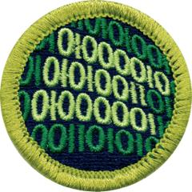

# Programming Merit Badge

## Overview

Programming merit badge will take you “behind the screen” for a look at the complex codes that make digital devices useful and fun.

## Requirements

* (1) Safety. Do the following:
    * (a) View the [Personal Safety Awareness "Digital Safety" video](https://www.scouting.org/training/youth-protection/scouts-bsa/) (with your parent or guardian's permission.)
    * (b) Discuss first aid and prevention for the types of injuries that could occur during programming activities, including repetitive stress injuries and eyestrain.

* (2) History. Discuss with your counselor the history of programming and the evolution of programming languages, including at least three milestones related to the advancement or development of programming over time.
* (3) General Knowledge. Do the following:
    * (a) Create a list of five popular programming languages in use today and describe which industry or industries they are primarily used in and why.
    * (b) Describe three different programmed devices you rely on every day.

* (4) Intellectual Property. Do the following:
    * (a) Explain the four types of intellectual property used to protect computer programs.
    * (b) Describe the difference between licensing and owning software.
    * (c) Describe the differences between freeware, open source, and commercial software, and why it is important to respect the terms of use of each.

* (5) Project. With your counselor's guidance, select three different programming languages and development environments.  For each sub-requirement below, do the following: Write or modify a program using the indicated programming language and development environment.  The program must take input and produce output based on computations and decisions made on the input.  Debug and demonstrate the program to your counselor.  Explain how each program processes inputs, makes decisions based on those inputs, and provides outputs based on computations and decision making.
    * (a) In the first language and environment, write or modify a program, debug and demonstrate, and explain as above.
    * (b) In the second language and environment, write or modify a program, debug and demonstrate, and explain as above.
    * (c) In the third language and environment, write or modify a program, debug and demonstrate, and explain as above.

* (6) Careers. Find out about three career opportunities that require knowledge in programming. Pick one and find out the education, training, and experience required. Discuss this with your counselor and explain why this career might be of interest to you.

## Resources

- [Programming merit badge page](https://www.scouting.org/merit-badges/programming/)
- [Programming merit badge PDF](https://filestore.scouting.org/filestore/Merit_Badge_ReqandRes/Pamphlets/Programming.pdf) ([local copy](files/programming-merit-badge.pdf))
- [Programming merit badge pamphlet](https://www.scoutshop.org/bsa-programming-merit-badge-pamphlet-661584.html)

Note: This is an unofficial archive of Scouts BSA Merit Badges that was automatically extracted from the Scouting America website and may contain errors.